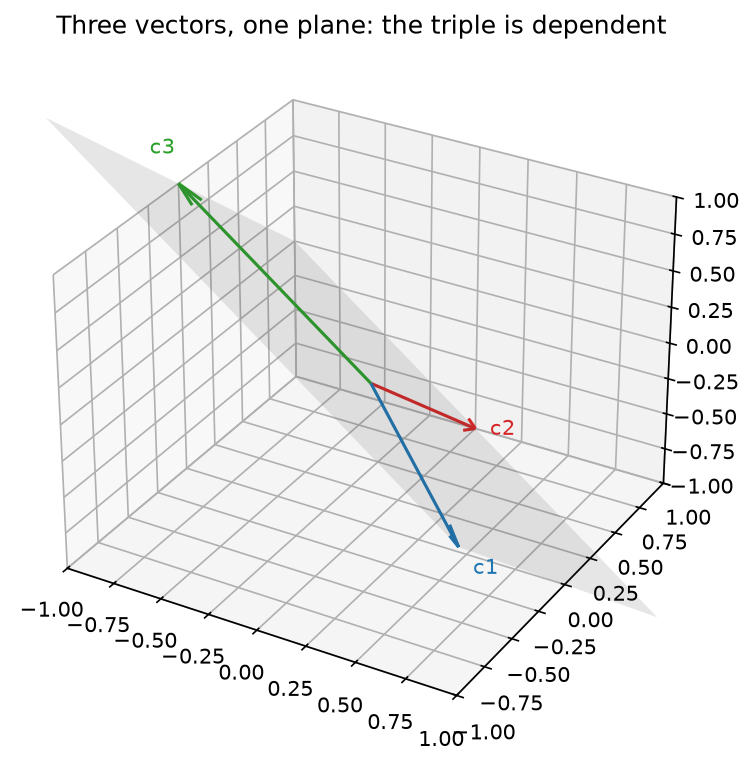

<!-- DRAFT (RETROFIT-2, 2026-07-12): Josh's inked census applied. Claims not
     Propositions; Strang-way support (arguments in footnotes); lenses named;
     the 25 yellow rewrites; 1.4 redesigned; data-matrix section moved to Ch 2.
     Companion notebook: clae-code/ch01/ch01.ipynb produces every figure and
     number here. -->

# Chapter 1: Vectors and Linear Combinations

## 1.0 In `axpy` we trust

Modern artificial intelligence rests on a single, simple operation: scale a vector by a number, and add it to another vector. That is the whole of the operation. The libraries that perform it ten billion times a second call it **axpy**, for "a times x plus y." This book calls it the **linear combination**. A language model, underneath the chat window, is arithmetic at colossal scale, and the arithmetic is this: numbers organized into long lists, the lists scaled, the scaled lists added. The layers, the billions of parameters, the warehouses of silicon are structure built around that one move. The plain timber the whole edifice hangs on is axpy.

The architectures came and went, and the operation stayed. The neural networks that read text one word at a time carried a running summary forward as a list of numbers, and every update to the summary scaled what the network held and added what it just read. The paper that ended their era was titled "Attention Is All You Need," and the attention it announced is a weighted sum of vectors, which is a linear combination. The famous title decodes to something quieter: the linear combination is all you need.

That it is foundational you might take on faith. That it is also the operation your computer runs faster than almost anything else, you should not. Let me show you what I mean. 

### `numpy`

NumPy is not math in Python. Python is a high-level wrapper around C, and NumPy is a high-level wrapper around the compiled numerical libraries beneath it, BLAS and LAPACK chief among them, that the whole numerical stack rests on. The same shape repeats one deck up: PyTorch and TensorFlow are high-level wrappers around CUDA kernels running the same operations on graphics hardware. When you write NumPy you are writing a short note that says: have the fast code do this. NumPy is the handle that lets you hold axpy at arm's length. You write the expression and stay in mathematics, while the fiddly bits, allocating the memory, walking the strides, dispatching the right kernel, calling into Fortran BLAS, happen out of sight. That is the bargain: the speed of the compiled code without having to write it.

We will compute axpy itself, on real arrays: two vectors $\mathbf{x}$ and $\mathbf{y}$ of ten million numbers each, and a single scalar $a$,

$$a\,\mathbf{x} + \mathbf{y}.$$

Through the computational lens, the question is time. We compute the same expression two ways and put a clock on both: a pure-Python list comprehension over the entries, and NumPy's vectorized call.

```python
import time
import numpy as np

def list_comp_in_python(a, x, y):
    return [a * xi + yi for xi, yi in zip(x, y)]

def vectorized_in_numpy(a, x, y):
    return a * x + y
```

```python
a = 2.5
rng = np.random.default_rng(0)
x, y = rng.random(10_000_000), rng.random(10_000_000)

t0 = time.perf_counter(); list_comp_in_python(a, x, y)
t_loop = time.perf_counter() - t0
t0 = time.perf_counter(); vectorized_in_numpy(a, x, y)
t_vec = time.perf_counter() - t0

print(f'list comprehension: {t_loop:5.2f} s')
print(f'vectorized:         {t_vec * 1e3:5.0f} ms')
print(f'factor:             {t_loop / t_vec:5.0f}x')
```

```text
list comprehension:  6.21 s
vectorized:           103 ms
factor:                60x
```

Both return the same numbers; they do not take the same time. The list comprehension is dozens of times slower, and the gap only widens with $n$. A gap that large is worth chasing.

Every figure and number in this book is produced by the companion notebooks at [github.com/joshuacook/clae-code](https://github.com/joshuacook/clae-code), run on a 4-vCPU cloud virtual machine with no GPU. Your own machine will print different numbers, and the gap will still be there, about this size.


> **Figure 1.1.** Wall-clock time of `list_comp_in_python` against `vectorized_in_numpy`, swept over $n$ from a thousand to ten million, with a log x-axis and a linear y-axis. The vectorized call stays flat against the floor while the list comprehension's cost climbs away.

The loop is slow because Python is doing far more than arithmetic. For each of the ten million entries the interpreter resolves types, boxes and unboxes objects, checks bounds, and dispatches the operators, and only underneath all of that does it finally multiply and add. NumPy skips every bit of that per-entry overhead: the whole array goes to a compiled loop the interpreter never re-enters. That is where the gap comes from. It is a software win, not a hardware trick.[^gpu]

[^gpu]: The GPU version of this sentence is the hardware trick. Run the same expression on graphics hardware and thousands of arithmetic units take the entries in parallel; that is a different machine, not better software on this one. Everything in this book runs on an ordinary CPU, and every speedup you will see is software finding the silicon it already had.

The operation that compiled loop is built around is axpy, and it is among the most carefully tuned routines in numerical computing. At the very bottom axpy is a single hardware instruction, the fused multiply-add, that modern processors run many of at once. So it is software the whole way down to one operation the silicon was built to do in a single step: scale, and add.

So look again at the operation we opened with. To scale a vector by a number and add it to another is to form a linear combination, and you have just watched your machine treat it as the most important thing it knows how to do. That is not a coincidence. We poured decades of engineering into axpy precisely because nearly everything we wanted to compute was built out of it. Least squares finds the combination of features closest to a price. Principal component analysis finds the combinations that carry the most variation. The Kalman filter blends a prediction and a measurement into one combination and calls it an estimate. This book teaches you to recognize the combination inside each of those, and then to choose its weights.

## 1.1 The Contract

Linear algebra runs on a contract, and the contract is short. You need objects that can be scaled and added, and you need the results to stay in the family. Displayed, because everything else in the book stands on these two lines:

**Property 1 (closure under scaling).** For any vector $\mathbf{v}$ in the space and any number $c$, the vector $c\mathbf{v}$ is in the space.

**Property 2 (closure under addition).** For any vectors $\mathbf{v}$ and $\mathbf{w}$ in the space, the vector $\mathbf{v} + \mathbf{w}$ is in the space.

Closure is the entire price of admission, and axpy is another spell in the mysticism of linearity: remain closed under the two operations and you also get axpy, since $a\mathbf{x} + \mathbf{y}$ is one application of each. What the contract buys is out of all proportion to what it costs. Honor it and you inherit the whole suite: regression, eigen dynamics, Fourier analysis, and, by Chapter 3, the fact that electron orbitals are a basis. Each of those is the same small set of moves applied to a new family of objects that kept its end of the deal.

The parties to the contract need names, and here a word about how this book states things. Every definition gets looked at through more than one lens: the **algebraic lens** (entries and formulas), the **geometric lens** (arrows and pictures), the **computational lens** (code and clock time), and the **data lens** (1,460 houses, shortly). The lens in use gets named as we go, because which lens you are holding changes what a definition means to you.

> **Definition 1.1 (vector).** A **vector** is an ordered list of $n$ real numbers, $\mathbf{v} = (v_1, \ldots, v_n)$. The set of all such vectors is $\mathbb{R}^n$.

Through the algebraic lens, a list. Through the geometric lens, an arrow from the origin, whenever $n$ is small enough to draw. You have already met vectors in $\mathbb{R}^{10{,}000{,}000}$: the arrays `x` and `y` of Section 1.0. A column of 1,460 sale prices is a vector in $\mathbb{R}^{1460}$.

> **Definition 1.2 (vector space, working version).** A **vector space** is a collection of vectors satisfying Properties 1 and 2.[^axioms]

[^axioms]: The full definition has eight axioms governing how the two operations behave: vector addition commutes and associates; a zero vector exists; every vector has an additive inverse; scalar multiplication associates with number multiplication; the scalar 1 leaves vectors alone; and scalar multiplication distributes over vector addition and over scalar addition. $\mathbb{R}^n$ satisfies all eight, every space in this book satisfies all eight, and we will not check them again. For the axioms given a first-class treatment, Sheldon Axler, *Linear Algebra Done Right*, ch. 1.

### Scaling and adding, drawn

Through the geometric lens, scalar multiplication is stretching. Multiply a vector by $c$ and its arrow grows or shrinks along its own line through the origin; a negative $c$ flips it to point the other way down the same line. Through the algebraic lens it is entrywise:

$$c\mathbf{v} = (cv_1, cv_2, \ldots, cv_n)$$

```python
import matplotlib.pyplot as plt

def plot_vector(v, color='blue', label=None):
    plt.quiver(0, 0, v[0], v[1], angles='xy', scale_units='xy', scale=1,
               color=color, label=label)

v = np.array([2, 1])
plot_vector(2 * v, 'purple', '2v')
plot_vector(v, 'blue', 'v')
plot_vector(-v, 'red', '-v')
plt.show()
```


> **Figure 1.2.** Scalar multiplication. `v`, `2v`, and `-v` all lie on the single line through the origin: multiplying by `c` slides the arrow along that line, and flips it to the far side when `c` is negative.

Addition, through the geometric lens, is tip to tail. Walk out along the first arrow; from where you land, walk out along the second; the sum is the single arrow from where you started to where you finished. Algebraically, entrywise again:

$$\mathbf{v} + \mathbf{w} = (v_1 + w_1, \ldots, v_n + w_n)$$

```python
def vector_addition(v1, v2):
    plot_vector(v1, 'blue', 'v1'); plot_vector(v2, 'red', 'v2')
    plot_vector(v1 + v2, 'green', 'v1 + v2')
    plt.show()

vector_addition(np.array([1, 2]), np.array([3, 1]))
```


> **Figure 1.3.** `vector_addition(v1, v2)`: `v1` and `v2` from the origin, with `v2` carried to the tip of `v1` (faded), and the tip-to-tail sum `v1 + v2` in green.

Put the two operations together:

$$c\mathbf{v} + d\mathbf{w}$$

The numbers $c$ and $d$ are the **weights**. Work one by hand, once. Take $\mathbf{v} = (1, 2)$, $\mathbf{w} = (3, 1)$, and form $2\mathbf{v} + \mathbf{w}$. Scale first: $2\mathbf{v} = (2, 4)$. Add entrywise: $(2 + 3,\; 4 + 1) = (5, 5)$. That is the arithmetic your machine ran ten million times in Section 1.0, once per entry, at sixty times your interpreter's speed.

### The claim on the table

Now the data lens, and a real dataset to look through it at. The **Ames housing data** records 1,460 home sales from Ames, Iowa, assembled by Dean De Cock from the county assessor's records: eighty features per sale, from square footage and overall quality to roof style and neighborhood, alongside the price each home actually sold for. It is the running dataset of this book, and it enters now.

```python
import pandas as pd

zoning  = pd.read_csv('data/zoning.csv')
listing = pd.read_csv('data/listing.csv')
sale    = pd.read_csv('data/sale.csv')
housing = pd.merge(zoning, listing, on='Id')
housing = pd.merge(housing, sale, on='Id').set_index('Id')
```

Through the data lens, a feature is a vector. `GrLivArea`, the above-ground living area, is a column of 1,460 numbers, one per home: a vector in $\mathbb{R}^{1460}$. `OverallQual`, the assessor's one-to-ten quality rating, is another. And `SalePrice`, what a buyer actually paid, is a third. Estimation makes one claim about these three vectors: some scaled copy of the first, plus some scaled copy of the second, lands near the third,

$$\texttt{SalePrice} \approx w_1 \cdot \texttt{GrLivArea} + w_2 \cdot \texttt{OverallQual}.$$

Read the right-hand side. Scale a vector, scale a vector, add. The claim of estimation is that a linear combination of feature columns approximates the price column, and the entire question is which weights. Here is the answer first.

```python
X = housing[['GrLivArea', 'OverallQual']].to_numpy(float)
y = housing['SalePrice'].to_numpy(float)

w, *_ = np.linalg.lstsq(X, y, rcond=None)
print('w:', np.round(w, 2))
```

```text
w: [   51.87 17604.21]
```

About $51.87 per square foot of living area and about $17,604 per point of overall quality, delivered by `np.linalg.lstsq`, a function this book exists to open up. By Chapter 11 you will have built it from parts. And the prediction it powers is this chapter's operation, written out in full:

```python
prediction = w[0] * X[:, 0] + w[1] * X[:, 1]
print(f'house {housing.index[1]}: actual {y[1]:,.0f}   '
      f'predicted {prediction[1]:,.0f}')
```

```text
house 2: actual 181,500   predicted 171,085
```

Look at the first line. Scale a column, scale a column, add. The prediction for all 1,460 homes at once is one axpy pass, and it prices house 2 within six percent of its actual sale.

## 1.2 Span and subspace

Hold $\mathbf{v}$ and $\mathbf{w}$ fixed, and let the weights range over every value they can take. What do you get?

> **Definition 1.3 (span).** The **span** of a set of vectors is the collection of all their linear combinations.

Through the geometric lens, the degenerate case first. If $\mathbf{w} = 2\mathbf{v}$, every combination $c\mathbf{v} + d\mathbf{w} = (c + 2d)\mathbf{v}$ is a stretch of $\mathbf{v}$: the span is $\mathbf{v}$'s line, and the second ingredient bought nothing. If $\mathbf{w}$ points off the line, the combinations fill an entire plane: two arrows, through nothing but scaling and adding, generate a two-dimensional world. The computational lens draws it, and the code contains the word "every," spelled `meshgrid`: every $c$ in the sweep, crossed with every $d$.

```python
v = np.array([2, 1]); w = np.array([1, 3])
C, D = np.meshgrid(np.linspace(-2, 2, 25), np.linspace(-2, 2, 25))
span = C.ravel()[:, None] * v + D.ravel()[:, None] * w
plt.scatter(span[:, 0], span[:, 1], s=4, alpha=0.4)
plot_vector(v, 'blue', 'v'); plot_vector(w, 'red', 'w'); plt.legend(); plt.show()
```


> **Figure 1.4.** The cloud of $c\mathbf{v} + d\mathbf{w}$ for weights swept from $-2$ to $2$: the sampled patch of the plane spanned by `v` and `w`. Widen the sweep and the cloud grows without bound; the plane is what it is filling in.

Membership in a span is a concrete question, so work one by hand. Is $\mathbf{b} = (4, 7)$ in the span of $\mathbf{v} = (2, 1)$ and $\mathbf{w} = (1, 3)$? Asking is the same as solving for weights: find $c, d$ with $c(2,1) + d(1,3) = (4,7)$, which is the little system $2c + d = 4$ and $c + 3d = 7$. The first equation gives $d = 4 - 2c$; substitute into the second and $c + 12 - 6c = 7$, so $c = 1$, then $d = 2$. The recipe exists, $\mathbf{b} = 1\mathbf{v} + 2\mathbf{w}$, and $(4, 7)$ is in the span. Membership questions are recipe questions.

> **Definition 1.4 (subspace).** A **subspace** is a set of vectors that contains the origin and satisfies Properties 1 and 2: scale or add inside it and you stay inside it.

> **Claim 1.5 (a span is a subspace).** The span of any set of vectors is a subspace.

The one-breath reason: a scaled combination is a combination, a sum of two combinations is a combination, and all-zero weights give the origin.[^footnotes] Span and subspace are two descriptions of one object. Span builds it from ingredients; subspace states the property the built thing has.

[^footnotes]: That breath was the whole argument, written small: $a(c\mathbf{v} + d\mathbf{w}) = (ac)\mathbf{v} + (ad)\mathbf{w}$, and two combinations add weight by weight. A note about this book's footnotes, since this is its first claim: the fuller arguments live down here and in the references, on purpose. The text above is for you. It is not for the gatekeepers who keep mathematics behind subscript fiddliness, and a proof performed as ritual is gatekeeping. When a reason is cheap you will get it in a breath; when it is a real theorem you will get the name of someone who proved it properly.

Two vectors span at most a plane. That stays true in three dimensions, in 1,460, in a googol: the reach of the operation is bounded by the number of ingredients, never by the size of the space the ingredients live in. Nobody can picture $\mathbb{R}^{1460}$, and nobody needs to. Every question we ask about two vectors happens inside the at-most-a-plane they span, so a drawing on this page is exact for the 1,460-dimensional case, no metaphor involved.[^precise]

[^precise]: The precise statement is Claim 1.10, once dimension is on the table.

Here is what that buys us with the houses. `GrLivArea` and `OverallQual` are two vectors, so their span is at most a plane: a flat two-dimensional sheet through the origin of $\mathbb{R}^{1460}$. Draw it. The sheet, and the price vector $\mathbf{y}$ as an arrow whose tip hovers just off it. Every prediction the two features can make, every choice of $w_1$ and $w_2$, lands somewhere on the sheet; the subspace a set of feature columns spans is called the **column space**, and it is the complete inventory of what those features can say. Can the sheet reach $\mathbf{y}$ exactly? Almost never. The tip hovers off the sheet, and the gap between the tip and the nearest point on the sheet gets its name in Chapter 11. The picture arrives now: keep the hovering tip and the sheet below it.

Two ingredients reach a plane. Toss in a third: does the reach grow? Only sometimes, and the difference is the next idea.

## 1.3 Independence, basis, and the recipe

Take the plane spanned by two vectors and toss in a third. Either it lands in the plane, already a combination of the first two, and the reach does not grow; or it points out of the plane, and combinations of the three now fill three-dimensional space.

> **Definition 1.6 (linear independence).** A set of vectors is **linearly independent** when none of them is a linear combination of the others.[^zerotest]

[^zerotest]: The equivalent test, often easier to run: the only combination equal to the zero vector is the one with every weight zero. Move any vector across that equation and the two phrasings trade places.

Dependence you can exhibit. Take $\mathbf{c}_1 = (1, -1, 0)$, $\mathbf{c}_2 = (0, 1, -1)$, $\mathbf{c}_3 = (-1, 0, 1)$, and look through the geometric lens first: Figure 1.5 draws all three living in a single plane through the origin. Three arrows, a two-dimensional reach. The algebraic lens confirms what the picture says, entry by entry:

$$\mathbf{c}_1 + \mathbf{c}_2 + \mathbf{c}_3 = \begin{pmatrix} 1 + 0 - 1 \\ -1 + 1 + 0 \\ 0 - 1 + 1 \end{pmatrix} = \begin{pmatrix} 0 \\ 0 \\ 0 \end{pmatrix}$$

A combination with weights $(1, 1, 1)$ produced the zero vector, so any one of the three is a combination of the other two. The set is dependent.



> **Figure 1.5.** The triple $\mathbf{c}_1, \mathbf{c}_2, \mathbf{c}_3$, drawn in three-dimensional space with the plane $x + y + z = 0$ shaded. All three arrows lie in the plane: three ingredients, a two-dimensional reach.

```python
c1 = np.array([1, -1, 0])
c2 = np.array([0, 1, -1])
c3 = np.array([-1, 0, 1])
print('c1 + c2 + c3 =', c1 + c2 + c3)
```

```text
c1 + c2 + c3 = [0 0 0]
```

> **Definition 1.7 (basis, dimension).** A **basis** of a subspace is a linearly independent set that spans it. All bases of a given subspace have the same size,[^samesize] and that shared size is the subspace's **dimension**.

[^samesize]: A theorem, not an observation. The standard argument swaps the vectors of one basis into the other one at a time without losing the span, so an independent set can never outnumber a spanning set. Axler ch. 2 or Strang ch. 3 for the bookkeeping.

> **Claim 1.8 (unique recipe).** If $\mathbf{b}_1, \ldots, \mathbf{b}_k$ is a basis, every vector in its span is a combination of the basis in exactly one way.

Witness it small. The set $\{(1, 0), (1, 1)\}$ is a basis of $\mathbb{R}^2$. To build $(3, 5)$, the second entry forces the weight on $(1, 1)$ to be $5$; the first entry then forces the weight on $(1, 0)$ to be $-2$. Forced twice over: no other recipe exists. The one-breath reason it always works: two different recipes for the same vector would subtract to a zero combination with nonzero weights, and independence forbids it.

> **Definition 1.9 (coordinates).** The **coordinates** of a vector with respect to a basis are the unique weights of its recipe in that basis.

> **Claim 1.10 (span of the question).** The span of $k$ vectors is a subspace of dimension at most $k$, whatever the dimension of the ambient space.[^discard]

[^discard]: If the $k$ ingredients are independent they are a basis of their span and the dimension is exactly $k$. If not, discard dependent ingredients one at a time until what remains is independent; the span never shrinks and the count only falls.

Now the payoff. A basis spans, so every vector is a combination of it. A basis is independent, so that combination is unique. The unique weights are the coordinates. Watch what this does to the most familiar object in the subject:

```python
e1, e2, e3 = np.eye(3)
a, b, c = 5, -2, 7
print(a*e1 + b*e2 + c*e3)
```

```text
[ 5. -2.  7.]
```

The list $(5, -2, 7)$ was $5\mathbf{e}_1 - 2\mathbf{e}_2 + 7\mathbf{e}_3$ all along. The list was never the vector; it was the recipe, written in a basis so familiar we forgot it was a choice.

## 1.4 Length, angle, and the dot product

We can build vectors. To estimate we must also measure them, and the geometric lens goes first. How long is the arrow $(3, 4)$? Walk three east and four north; the straight-line distance back to the origin is the hypotenuse, and Pythagoras says five. The vectors of length one form the unit circle, and every nonzero vector is a stretched copy of exactly one of them.

> **Definition 1.11 (norm, magnitude and direction).** The **norm** of a vector is $\|\mathbf{v}\| = \sqrt{v_1^2 + \cdots + v_n^2}$, its length. Every nonzero vector factors into magnitude times direction: $\mathbf{v} = \|\mathbf{v}\| \cdot \dfrac{\mathbf{v}}{\|\mathbf{v}\|}$, where the second factor is the unit vector carrying $\mathbf{v}$'s direction.

Magnitude and direction is the vocabulary this section runs on, because the next instrument measures direction agreement.

> **Definition 1.12 (dot product, angle, orthogonality).** The **dot product** of two vectors is $\mathbf{v} \cdot \mathbf{w} = v_1 w_1 + \cdots + v_n w_n$. The **angle** $\theta$ between nonzero vectors satisfies $\cos\theta = \dfrac{\mathbf{v}\cdot\mathbf{w}}{\|\mathbf{v}\|\,\|\mathbf{w}\|}$, and two vectors are **orthogonal** when their dot product is zero.

You likely know the formula already; the job here is what it means. Through the geometric lens the dot product is a direction-agreement machine. Two vectors pointing the same way score as high as their lengths allow. Perpendicular vectors score zero, each invisible to the other's measure. Opposite vectors score as negative as possible. The cosine formula is the calibration: divide the raw score by both lengths and what remains is pure agreement, a number between $-1$ and $1$.

Work the machine by hand. Take $\mathbf{v} = (3, 1)$ and $\mathbf{w} = (2, 3)$: the score is $3 \cdot 2 + 1 \cdot 3 = 9$, the lengths are $\sqrt{10}$ and $\sqrt{13}$, and the agreement is $9/\sqrt{130} \approx 0.789$, an angle of about $38$ degrees. Mostly agreeing. The machine concurs:

```python
v = np.array([3, 1]); w = np.array([2, 3])
v @ w
np.linalg.norm(v)
np.degrees(np.arccos((v @ w) / (np.linalg.norm(v) * np.linalg.norm(w))))
```

For the cosine to deserve its name, the calibrated score must never leave $[-1, 1]$. That guarantee is the **Cauchy–Schwarz inequality**: $|\mathbf{v} \cdot \mathbf{w}| \leq \|\mathbf{v}\|\,\|\mathbf{w}\|$, with equality exactly when one vector is a stretched copy of the other.[^cs] At desk scale you can check it on any pair you like; here it is holding at housing scale, on two real columns of 1,460 entries:

[^cs]: The one-breath argument: $\|\mathbf{v} - t\mathbf{w}\|^2$ is a quadratic in $t$ that is never negative, so its discriminant cannot be positive, and writing that discriminant out is the inequality.

```python
a = housing['GrLivArea'].to_numpy(float)
b = housing['OverallQual'].to_numpy(float)
print(f'|a.b|   = {abs(a @ b):,.0f}')
print(f'|a||b|  = {np.linalg.norm(a) * np.linalg.norm(b):,.0f}')
```

```text
|a.b|     = 14,123,976
|a||b|    = 14,645,262
lhs/rhs   = 0.9644   (must be <= 1)
```

The inequality holds with room to spare, and the ratio is itself the finding: 0.9644 is the direction agreement between living area and overall quality across 1,460 homes. Bigger houses rate better, overwhelmingly, and one number said so. When Chapter 6 centers these columns and computes the same ratio, it will be called correlation.

Orthogonality is the case the book keeps returning to. Recall the hovering tip from Section 1.2: the price vector just off the sheet of reachable predictions. The gap between the tip and the nearest point of the sheet meets the sheet at a right angle, a dot product of zero against everything reachable, and that single perpendicularity is what Chapter 11 uses to find the best weights. Direction agreement, measured; direction agreement zero, exploited.

## 1.5 Summary and exercises

A vector is a thing you can scale and add. The act is the linear combination, axpy to the libraries that run it. The span is everything the act can reach; a span is always a subspace (Claim 1.5); and the reach is bounded by the number of ingredients, never the ambient space (Claim 1.10). A basis is an independent set that spans, its recipe for any vector is unique (Claim 1.8), and the unique weights are coordinates, which is what a list of numbers is. The norm measures magnitude, the dot product measures direction agreement, Cauchy–Schwarz keeps the agreement honest, and agreement zero is orthogonality. On the houses: feature columns are vectors, their span is the column space, the price vector hovers just off it, and `lstsq` handed us weights whose prediction is one axpy pass.

The question the book answers is now posed. Of all the linear combinations available, which one is the estimate, and how do we earn it?

**Exercises**

1. *(pencil)* Compute $3(1, -1, 2) + (0, 4, -1)$ entrywise. Then write the result as a combination of $\mathbf{e}_1, \mathbf{e}_2, \mathbf{e}_3$ and check that the weights are exactly the entries.
2. *(keyboard)* Time `list_comp_in_python` against `vectorized_in_numpy` on your own machine, over a sweep of sizes. Explain the gap you measure in terms of what the interpreter does per entry and what BLAS does per array.
3. *(pencil)* Is $(5, 5)$ in the span of $(2, 1)$ and $(1, 3)$? Exhibit the recipe or show that none exists, using the two-equation method of Section 1.2.
4. *(pencil)* Show that the line $\{t\mathbf{v} : t \in \mathbb{R}\}$ through the origin is a subspace: check the origin and both closure Properties.
5. *(pencil, then keyboard)* Choose three vectors in $\mathbb{R}^3$ and decide independence: exhibit a combination equal to zero, or argue none exists. Check yourself in code by computing the combination you exhibited.
6. *(pencil)* Using the basis $\{(1, 0), (1, 1)\}$ of $\mathbb{R}^2$, find the coordinates of $(7, 2)$, and verify your recipe by expanding it.
7. *(pencil)* Verify Cauchy–Schwarz directly for $(1, 2)$ and $(3, 4)$: compute both sides. Then find a pair where it holds with equality, and say why yours works.
8. *(keyboard, bridge → Ch 6)* Pick two numeric Ames features. Compute the angle between their *centered* columns (subtract each column's mean first). Relate what you find near 0 degrees and near 90 degrees to the idea of correlation.
9. *(keyboard, bridge → Ch 11)* Rerun the `lstsq` cell from 1.1 with a third feature of your choosing added, and write the new prediction as an explicit three-term axpy. Did house 2's predicted price improve?
10. *(pencil, bridge → Ch 2)* Write the two-feature claim $w_1 \cdot \texttt{GrLivArea} + w_2 \cdot \texttt{OverallQual}$ as a rectangular array of numbers multiplying a column of weights. Which part is the recipe? You have just invented the next chapter.
11. *(keyboard)* Rebuild the span cloud of Figure 1.4 with `w = 2 * v`, and describe what happens to the cloud. Which case of Section 1.2 did you just draw?
