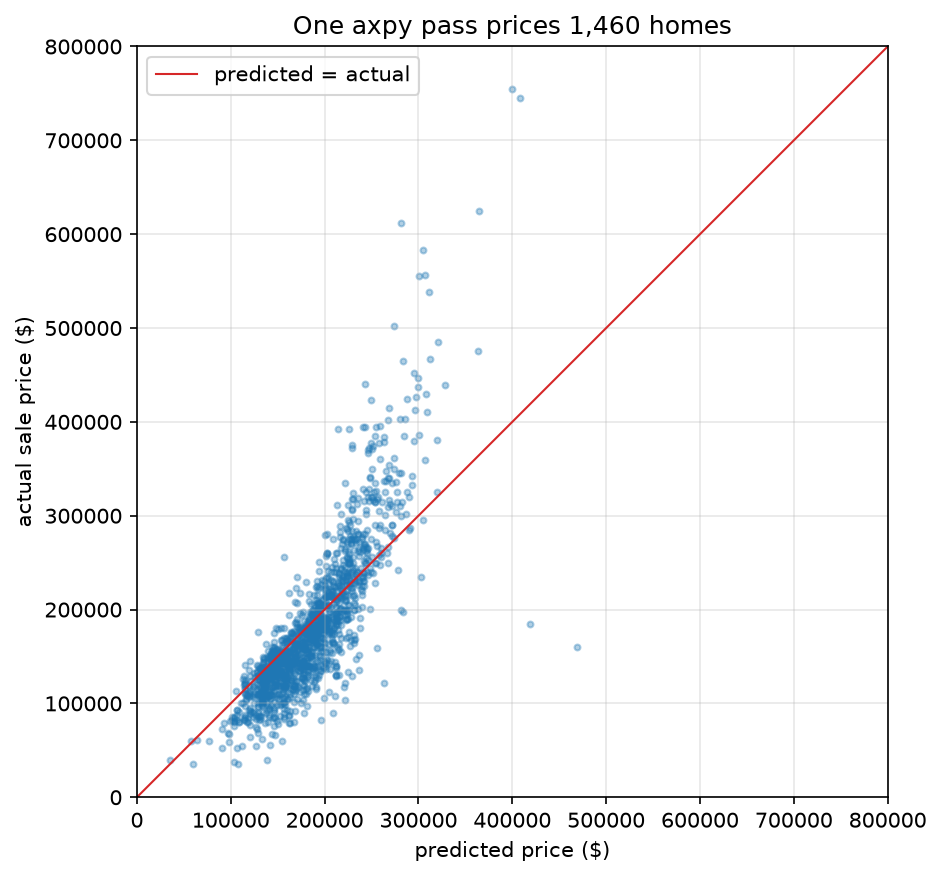
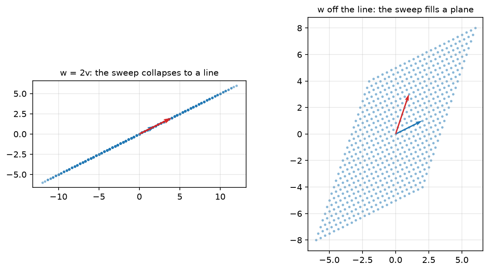
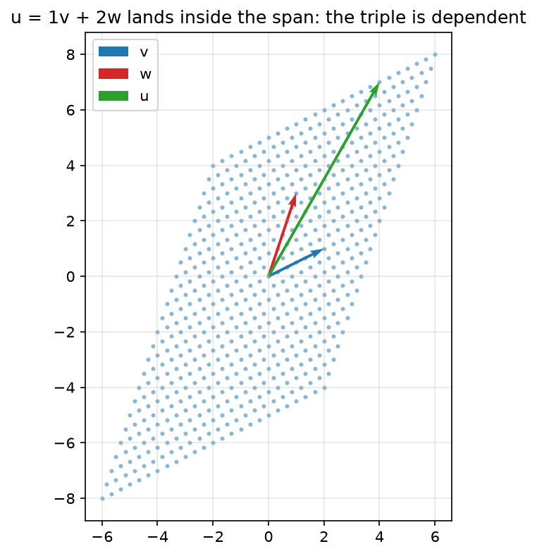

<!-- DRAFT (INK PASS, 2026-07-13): the ruled census applied (verified census
     chapter_notes/ch01-r1-ink-verified.md, 79 approved cards + rulings 2/3/5
     + continuity ruling). axpy/linear-combination/weights are Definitions;
     lenses inherited from the preface with \lensmark margin tags at every
     switch; all worked examples in numbered aligns; listings numbered and
     titled; the Ames claim has its own section (grounded: align, real
     numbers, 10-house table, plot, explicit axpy); span shown by meshgrid
     in 2D both ways; claims boxed WITH explanations; 3-D figure replaced;
     magnitude-and-direction vocabulary unified; unit circle restored;
     orthogonality introduced; the uniqueness license arrives from the
     preface. Card #60 (one variable) answered by the one-feature hover
     drawing; the claim itself stays two-feature.
     Companion notebook: clae-code/ch01/ch01.ipynb produces every figure and
     number here.
     Words: 5791 prose / 6362 total (auto: tools/wordcount.py)-->

# Chapter 1: Vectors and Linear Combinations

## 1.0 In `axpy` we trust

Modern artificial intelligence rests on a single, simple operation: scale a vector by a number, and add it to another vector. That is the whole of the operation. The libraries that perform it ten billion times a second call it axpy, for "a times x plus y." This book calls it the linear combination, and both names deserve their definitions up front.

> **Definition 1.1 (linear combination, weights).** A **linear combination** of vectors $\mathbf{v}_1, \ldots, \mathbf{v}_k$ is
>
> $$c_1\mathbf{v}_1 + c_2\mathbf{v}_2 + \cdots + c_k\mathbf{v}_k,$$
>
> the vectors scaled by numbers and the results added. The numbers $c_1, \ldots, c_k$ are the **weights**.

> **Definition 1.2 (axpy).** For a number $a$ and vectors $\mathbf{x}$ and $\mathbf{y}$, **axpy** is the linear combination $a\mathbf{x} + \mathbf{y}$: one scaling, one addition. It is the workhorse form, and the name of the compiled routine that runs it.

The vector itself gets its formal definition in Section 1.1. For now it is what it has always been to you, a list of numbers.

A language model, underneath the chat window, is arithmetic at colossal scale, and the arithmetic is this: numbers organized into long lists, the lists scaled, the scaled lists added. The layers, the billions of parameters, the warehouses of silicon are structure built around that one move. The plain timber the whole edifice hangs on is axpy.

Architectures turn over every few years. The operation does not. The recurrent networks that read text one word at a time carried a running summary forward as a list of numbers, and every update to that summary scaled what the network held and added what it had just read. The paper that retired them is titled "Attention Is All You Need," and attention is a weighted sum of vectors, which is Definition 1.1. The architecture died. The operation is still here.

Foundational is a big claim, and you do not have to take it on faith, because half of it is measurable: your computer runs this operation faster than almost anything else it does. Put a clock on it.

### `numpy`

NumPy is not just math in Python. Python is a high-level wrapper around C. NumPy is a high-level wrapper around the compiled numerical libraries beneath it, BLAS and LAPACK chief among them, and the whole numerical stack rests on those libraries. The same shape repeats at the next layer of the stack, where PyTorch and TensorFlow wrap CUDA kernels running the same operations on graphics hardware. When you write NumPy you are writing a short note that says: have the fast code do this. NumPy is the handle that lets you hold axpy at arm's length. You write the expression and stay in mathematics, while the fiddly bits, allocating the memory, walking the strides, dispatching the right kernel, calling into Fortran BLAS, happen out of sight. You focus on the ideas and let the machine do the computing. That is the bargain. You get the speed of the compiled code without writing it.

\lensmark{algebraic} Before the machine gets the operation, run it once by hand. Take $a = 2$, $\mathbf{x} = (1, 2, 3)$, $\mathbf{y} = (10, 20, 30)$. Scale, then add, entry by entry:

\begin{align}
a\,\mathbf{x} + \mathbf{y} \;=\; 2\,(1, 2, 3) + (10, 20, 30) \;=\; (2, 4, 6) + (10, 20, 30) \;=\; (12, 24, 36)
\end{align}

That is everything axpy does. Now the same operation on arrays too long for a pencil: two vectors $\mathbf{x}$ and $\mathbf{y}$ of ten million numbers each, and a single scalar $a$. \lensmark{computational} Through the computational lens the question is time. **Listing 1.1 (axpy two ways)** computes the same expression as a pure-Python list comprehension over the entries and as NumPy's vectorized call.

```python
import time
import numpy as np

def list_comp_in_python(a: float, x: np.ndarray, y: np.ndarray) -> list:
    return [a * xi + yi for xi, yi in zip(x, y)]

def vectorized_in_numpy(a: float, x: np.ndarray, y: np.ndarray) -> np.ndarray:
    return a * x + y
```

**Listing 1.2 (the race)** puts a clock on both and prints the gap.

```python
a = 2.5
rng = np.random.default_rng(0)
x, y = rng.random(10_000_000), rng.random(10_000_000)

t0 = time.perf_counter(); list_comp_in_python(a, x, y)
t_loop = time.perf_counter() - t0
t0 = time.perf_counter(); vectorized_in_numpy(a, x, y)
t_vec = time.perf_counter() - t0

print(f'list comprehension: {t_loop:5.2f} s')
print(f'vectorized:         {t_vec * 1e3:5.0f} ms')
print(f'factor:             {t_loop / t_vec:5.0f}x')
```

```text
list comprehension:  6.21 s
vectorized:           103 ms
factor:                60x
```

Both return the same numbers; they do not take the same time.[^machine] The list comprehension is dozens of times slower, and the gap only widens with $n$. Figure 1.1 sweeps the race across sizes.

[^machine]: Every figure and number in this book is produced by the companion notebooks at [github.com/joshuacook/clae-code](https://github.com/joshuacook/clae-code), run on a 4-vCPU cloud virtual machine with no GPU. Your own machine will print different numbers, and the gap will still be there, about this size.


> **Figure 1.1.** Wall-clock time of `list_comp_in_python` against `vectorized_in_numpy`, swept over $n$ from a thousand to ten million, with a log x-axis and a linear y-axis. The vectorized call stays flat against the floor while the list comprehension's cost climbs away.

The loop is slow because Python is doing far more than arithmetic. For each of the ten million entries the interpreter resolves types, boxes and unboxes objects, checks bounds, and dispatches the operators, and only underneath all of that does it finally multiply and add. NumPy skips every bit of that per-entry overhead: the whole array goes to a compiled loop the interpreter never re-enters. That is where the gap comes from. It is a software win, not a hardware trick.[^gpu]

[^gpu]: The GPU version of this sentence is the hardware trick. Run the same expression on graphics hardware and thousands of arithmetic units take the entries in parallel; that is a different machine, not better software on this one. Everything in this book runs on an ordinary CPU, and every speedup you will see is software finding the silicon it already had.

The operation that compiled loop is built around is axpy, and it is among the most carefully tuned routines in numerical computing. At the very bottom axpy is a single hardware instruction, the fused multiply-add, that modern processors run many of at once. So it is software the whole way down to one operation the silicon was built to do in a single step: scale, and add.

So look again at the operation we opened with. To scale a vector by a number and add it to another is to form a linear combination, and you have just watched your machine treat it as the most important thing it knows how to do. That is not a coincidence. We poured decades of engineering into axpy precisely because nearly everything we wanted to compute was built out of it.

Least squares finds the combination of features closest to a price. Principal component analysis finds the combinations that carry the most variation. The Kalman filter blends a prediction and a measurement into one combination and calls it an estimate. This book teaches you to recognize the combination inside each of those, and then to choose its weights. The preface promised a song. These are the opening bars.

## 1.1 The contract

Two operations run everything in this book. You can scale a vector, and you can add two vectors, and both results stay in the space you started in. The guarantees have standard names, displayed because everything else stands on them.

**Property 1 (closure under scaling).** For any vector $\mathbf{v}$ in the space and any number $c$, the vector $c\mathbf{v}$ is in the space.

**Property 2 (closure under addition).** For any vectors $\mathbf{v}$ and $\mathbf{w}$ in the space, the vector $\mathbf{v} + \mathbf{w}$ is in the space.

\lensmark{algebraic} Keep both properties and axpy comes free, because $a\mathbf{x} + \mathbf{y}$ is one application of each. Watch closure hand it over. Scaling keeps $a\mathbf{x}$ in the space $S$; addition then keeps the sum in too:

\begin{align}
\mathbf{x} \in S \;\Longrightarrow\; a\mathbf{x} \in S, \qquad\quad a\mathbf{x} \in S,\; \mathbf{y} \in S \;\Longrightarrow\; a\mathbf{x} + \mathbf{y} \in S
\end{align}

Repeat the two moves and every linear combination of vectors in $S$ lands in $S$. Two guarantees in, the whole of Definition 1.1 out.

What the two properties buy is out of all proportion to what they cost. Assume linearity and here are the spells: axpy at compiled speed, regression (Chapter 11), principal component analysis (Chapter 10), Fourier analysis (Chapter 13), and, by Chapter 3, the fact that electron orbitals are a basis. Each one is the same small set of moves applied to a new family of objects that kept the two properties.

The four lenses from the preface start work in this chapter, and the margin keeps the promise made there: a small tag at every switch, so you always know which way of looking is doing the work. Pictures before procedures, actions before formulas, nothing hidden.

> **Definition 1.3 (vector).** A **vector** is an ordered list of $n$ real numbers,[^complex] $\mathbf{v} = (v_1, \ldots, v_n)$. The set of all such vectors is $\mathbb{R}^n$.

[^complex]: Real by decree, not by necessity. Everything in Part I works unchanged with complex entries, and $\mathbb{C}^n$ takes over when signal processing requires it in Chapter 13. Until then the reals carry the book.

\lensmark{algebraic} Through the algebraic lens, a list. \lensmark{geometric} Through the geometric lens, an arrow from the origin, whenever $n$ is small enough to draw. You have already met vectors in $\mathbb{R}^{10{,}000{,}000}$: the arrays `x` and `y` of Section 1.0. A column of 1,460 sale prices is a vector in $\mathbb{R}^{1460}$.

> **Definition 1.4 (vector space, working version).** A **vector space** is a collection of vectors satisfying Properties 1 and 2.[^axioms]

[^axioms]: The full definition has eight axioms governing how the two operations behave: vector addition commutes and associates; a zero vector exists; every vector has an additive inverse; scalar multiplication associates with number multiplication; the scalar 1 leaves vectors alone; and scalar multiplication distributes over vector addition and over scalar addition. $\mathbb{R}^n$ satisfies all eight, every space in this book satisfies all eight, and we will not check them again. For the axioms given a first-class treatment, Sheldon Axler, *Linear Algebra Done Right*, ch. 1.

### Scaling and adding, drawn

\lensmark{geometric} Through the geometric lens, scalar multiplication is stretching. Multiply a vector by $c$ and its arrow grows or shrinks along its own line through the origin; a negative $c$ flips it to point the other way down the same line. \lensmark{algebraic} Through the algebraic lens it is entrywise, small enough to do whole:

\begin{align}
3\,(2, 1) = (3 \cdot 2,\; 3 \cdot 1) = (6, 3), \qquad\quad c\,\mathbf{v} = (c v_1,\, c v_2,\, \ldots,\, c v_n)
\end{align}

\lensmark{computational} **Listing 1.3 (drawing scalar multiples)** puts three multiples of one vector on the same axes; Figure 1.2 is its output.

```python
import matplotlib.pyplot as plt

def plot_vector(v, color='blue', label=None):
    plt.quiver(0, 0, v[0], v[1], angles='xy', scale_units='xy', scale=1,
               color=color, label=label)

v = np.array([2, 1])
plot_vector(2 * v, 'purple', '2v')
plot_vector(v, 'blue', 'v')
plot_vector(-v, 'red', '-v')
plt.show()
```


> **Figure 1.2.** Scalar multiplication. `v`, `2v`, and `-v` all lie on the single line through the origin: multiplying by `c` slides the arrow along that line, and flips it to the far side when `c` is negative.

\lensmark{geometric} Addition, through the geometric lens, is tip to tail. Walk out along the first arrow; from where you land, walk out along the second; the sum is the single arrow from where you started to where you finished. \lensmark{algebraic} Entrywise again:

\begin{align}
(1, 2) + (3, 1) = (4, 3), \qquad\quad \mathbf{v} + \mathbf{w} = (v_1 + w_1,\, \ldots,\, v_n + w_n)
\end{align}

\lensmark{computational} **Listing 1.4 (tip to tail)** draws a sum; Figure 1.3 is its output.

```python
def vector_addition(v1, v2):
    plot_vector(v1, 'blue', 'v1'); plot_vector(v2, 'red', 'v2')
    plot_vector(v1 + v2, 'green', 'v1 + v2')
    plt.show()

vector_addition(np.array([1, 2]), np.array([3, 1]))
```


> **Figure 1.3.** `vector_addition(v1, v2)`: `v1` and `v2` from the origin, with `v2` carried to the tip of `v1` (faded), and the tip-to-tail sum `v1 + v2` in green.

Put the two operations together and the object of the book appears. Take $\mathbf{v} = (1, 2)$ and $\mathbf{w} = (3, 1)$ and form the combination $2\mathbf{v} + \mathbf{w}$, scale first, then add:

\begin{align}
2\,(1, 2) + (3, 1) = (2, 4) + (3, 1) = (5, 5)
\end{align}

That is the arithmetic your machine ran ten million times in Section 1.0, once per entry, at sixty times your interpreter's speed.

## 1.2 The claim on the table

\lensmark{data} Now the data lens, and a dataset to look through it at. The **Ames housing data** records 1,460 home sales from Ames, Iowa, assembled by Dean De Cock from the county assessor's office.[^decock] Each sale carries eighty features, square footage, overall quality, roof style, neighborhood, alongside the price the home actually sold for. It is the running dataset of this book. Every estimation idea between here and Chapter 14 gets tried against these houses, and the move we just practiced on arrows, scale and add, is about to price real estate. **Listing 1.5 (assembling the houses)** builds the table.

[^decock]: Dean De Cock, "Ames, Iowa: Alternative to the Boston Housing Data as an End of Semester Regression Project," *Journal of Statistics Education* 19(3), 2011. He assembled it to replace the worn-out Boston housing dataset, and it has been pricing the same 1,460 homes in classrooms ever since.

```python
import pandas as pd

zoning  = pd.read_csv('data/zoning.csv')
listing = pd.read_csv('data/listing.csv')
sale    = pd.read_csv('data/sale.csv')
housing = pd.merge(zoning, listing, on='Id')
housing = pd.merge(housing, sale, on='Id').set_index('Id')
```

Through the data lens, a feature is a vector. `GrLivArea`, the above-ground living area, is a column of 1,460 numbers, one per home: a vector in $\mathbb{R}^{1460}$. `OverallQual`, the assessor's one-to-ten quality rating, is another. And `SalePrice`, what a buyer actually paid, is a third. Estimation makes one claim about these three vectors: some scaled copy of the first, plus some scaled copy of the second, lands near the third,

\begin{align}
\texttt{SalePrice} \;\approx\; w_1 \cdot \texttt{GrLivArea} \;+\; w_2 \cdot \texttt{OverallQual}
\end{align}

Read the right-hand side against Definition 1.1. Two vectors, scaled by weights, added. The claim of estimation is that a linear combination of feature columns approximates the price column, and the entire question is which weights. **Listing 1.6 (asking for the weights)** gets the answer first and owes you the method.

```python
X = housing[['GrLivArea', 'OverallQual']].to_numpy(float)
y = housing['SalePrice'].to_numpy(float)

w, *_ = np.linalg.lstsq(X, y, rcond=None)
print('w:', np.round(w, 2))
```

```text
w: [   51.87 17604.21]
```

About $51.87 per square foot of living area and about $17,604 per point of overall quality, delivered by `np.linalg.lstsq`. Chapter 11 builds that function from parts.

\lensmark{algebraic} The claim says those two numbers price houses, so price one by hand. House 2 has 1,262 square feet of living area and a quality rating of 6. Its prediction is Definition 1.1 with the weights filled in, worked term by term:

\begin{align}
\hat{y}_2 \;&=\; 51.87 \cdot 1262 \;+\; 17{,}604.21 \cdot 6 \notag\\
            &=\; 65{,}460 \;+\; 105{,}625 \notag\\
            &=\; 171{,}085
\end{align}

The actual sale was \$181,500. Scale, scale, add, and the estimate lands within six percent of the price a buyer really paid. The operation is axpy with house numbers in it, the same scale-and-add Section 1.0 put a clock on. Run the same arithmetic down the first ten rows of the table:

| Id | GrLivArea | OverallQual | predicted | actual |
|---:|---:|---:|---:|---:|
| 1 | 1,710 | 7 | 211,927 | 208,500 |
| 2 | 1,262 | 6 | 171,085 | 181,500 |
| 3 | 1,786 | 7 | 215,869 | 223,500 |
| 4 | 1,717 | 7 | 212,290 | 140,000 |
| 5 | 2,198 | 8 | 254,844 | 250,000 |
| 6 | 1,362 | 5 | 158,668 | 143,000 |
| 7 | 1,694 | 8 | 228,701 | 307,000 |
| 8 | 2,090 | 7 | 231,637 | 200,000 |
| 9 | 1,774 | 7 | 215,247 | 129,900 |
| 10 | 1,077 | 5 | 143,885 | 118,000 |

Some predictions land close (houses 1, 2, 5). Some miss badly (houses 4 and 9 sold far under their features; house 7 far over). Two features cannot know about a gutted interior or a bidding war. \lensmark{computational} Figure 1.4 prices all 1,460 homes the same way, one axpy pass, and plots predicted against actual.



> **Figure 1.4.** Predicted price, $w_1 \cdot \texttt{GrLivArea} + w_2 \cdot \texttt{OverallQual}$, against actual sale price for all 1,460 homes, with the line predicted $=$ actual for reference. The cloud tracks the line, misses and all. Two features, two weights, and the shape of the market is already visible.

## 1.3 Span and subspace

Hold $\mathbf{v}$ and $\mathbf{w}$ fixed, and let the weights range over every value they can take. What do you get?

> **Definition 1.5 (span).** The **span** of a set of vectors is the collection of all their linear combinations.

\lensmark{geometric} Through the geometric lens, the degenerate case first. If $\mathbf{w} = 2\mathbf{v}$, every combination collapses onto one line, because

\begin{align}
c\,\mathbf{v} + d\,(2\mathbf{v}) = (c + 2d)\,\mathbf{v},
\end{align}

a stretch of $\mathbf{v}$ no matter what $c$ and $d$ do. The span is $\mathbf{v}$'s line, and the second ingredient bought nothing. If $\mathbf{w}$ points off the line, the combinations fill an entire plane.

\lensmark{computational} Both cases are drawable by brute force, and NumPy has a function whose whole job is the word *every*. `meshgrid` takes a sweep of values for $c$ and a sweep for $d$ and crosses them, every $c$ paired with every $d$. **Listing 1.7 (sweeping the span)** runs the same sweep twice, once with $\mathbf{w}$ on $\mathbf{v}$'s line and once with $\mathbf{w} = (1, 3)$ off it; Figure 1.5 shows both results side by side.

```python
def span_cloud(v: np.ndarray, w: np.ndarray, ax) -> None:
    C, D = np.meshgrid(np.linspace(-2, 2, 25), np.linspace(-2, 2, 25))
    cloud = C.ravel()[:, None] * v + D.ravel()[:, None] * w
    ax.scatter(cloud[:, 0], cloud[:, 1], s=4, alpha=0.4)

v = np.array([2, 1])
fig, (left, right) = plt.subplots(1, 2, figsize=(9, 4))
span_cloud(v, 2 * v, left)               # w on v's line
span_cloud(v, np.array([1, 3]), right)   # w off the line
plt.show()
```



> **Figure 1.5.** The same weight sweep, $c$ and $d$ each from $-2$ to $2$, crossed by `meshgrid`. Left: $\mathbf{w} = 2\mathbf{v}$, and every one of the 625 combinations lands on $\mathbf{v}$'s line. Right: $\mathbf{w} = (1, 3)$ points off the line, and the identical sweep fills a patch of plane. Widen the sweep and the patch grows without bound; the plane is what it is filling in.

Membership in a span is a concrete question, so work one by hand. Is $\mathbf{b} = (4, 7)$ in the span of $\mathbf{v} = (2, 1)$ and $\mathbf{w} = (1, 3)$? Asking is the same as asking for weights, $c\,\mathbf{v} + d\,\mathbf{w} = \mathbf{b}$, which is a little system, which is windmill work from the preface. Eliminate and substitute:

\begin{align}
\begin{aligned} 2c + d &= 4 \\ c + 3d &= 7 \end{aligned}
\qquad\longrightarrow\qquad
\begin{aligned} d &= 4 - 2c \\ c + 3(4 - 2c) &= 7 \end{aligned}
\qquad\Longrightarrow\qquad c = 1,\; d = 2
\end{align}

Now check the candidate directly: $1\,(2, 1) + 2\,(1, 3) = (2, 1) + (2, 6) = (4, 7)$. It verifies, so $(4, 7)$ is in the span, recipe in hand. The check is not a formality. Verifying a candidate is a licensed method in this book, and the license arrives with Claim 1.10. Membership questions are recipe questions.

> **Definition 1.6 (subspace).** A **subspace** is a set of vectors that contains the origin[^origin] and satisfies Properties 1 and 2: scale or add inside it and you stay inside it.

[^origin]: Why the origin is not optional: scaling by $c = 0$ is allowed, and it sends every vector to $\mathbf{0}$. A set closed under scaling therefore already contains the origin, so demanding it costs nothing; what it buys is a shared anchor. Every subspace of $\mathbb{R}^n$ passes through one common point, and every drawing in this book hangs off it.

> **Claim 1.7 (a span is a subspace).** The span of any set of vectors is a subspace.
>
> The one-breath reason: a scaled combination is a combination, a sum of two combinations is a combination, and all-zero weights give the origin.[^footnotes] Span and subspace are two descriptions of one object. Span builds it from ingredients; subspace states the property the built thing has.

[^footnotes]: That breath was the whole argument, written small: $a(c\mathbf{v} + d\mathbf{w}) = (ac)\mathbf{v} + (ad)\mathbf{w}$, and two combinations add weight by weight. A note about this book's footnotes, since this is its first claim: the fuller arguments live down here and in the references, on purpose. The text above is for you. It is not for the gatekeepers who keep mathematics behind subscript fiddliness, and a proof performed as ritual is gatekeeping. When a reason is cheap you will get it in a breath; when it is a real theorem you will get the name of someone who proved it properly.

Two vectors span at most a plane. That stays true in three dimensions, in 1,460, in a googol: the reach of the operation is bounded by the number of ingredients, never by the size of the space the ingredients live in. Nobody can picture $\mathbb{R}^{1460}$, and nobody needs to. Every question we ask about two vectors happens inside the at-most-a-plane they span, so a drawing on this page is exact for the 1,460-dimensional case, no metaphor involved.[^precise]

[^precise]: The precise statement is Claim 1.12, once dimension is on the table.

\lensmark{data} Here is what that buys us with the houses, one feature first. `GrLivArea` alone is a single vector in $\mathbb{R}^{1460}$, so its span is a line through the origin, and every one-feature prediction $w \cdot \texttt{GrLivArea}$ lands on that line. The price vector $\mathbf{y}$ does not lie on it. Its tip hovers just off, and the best the one weight can do is reach the nearest point of the line.

\begin{center}
\begin{tikzpicture}[scale=1.1]
  \draw[gray!60, thick] (-1.4,-0.7) -- (3.2,1.6);
  \node[gray, anchor=west] at (2.4,0.9) {\scriptsize the span of \texttt{GrLivArea}};
  \coordinate (O) at (0,0);
  \coordinate (Y) at (1.4,1.9);
  \coordinate (P) at (1.84,0.92);
  \draw[->, very thick] (O) -- (Y) node[above] {$\mathbf{y}$};
  \draw[dashed, thick] (Y) -- (P);
  \fill (P) circle (1.6pt);
\end{tikzpicture}
\end{center}

It is the drawing from the preface, a vector hanging just off a subspace, now with names on it.[^tikznote] Add `OverallQual` and the span grows to a sheet, at most a plane through the origin of $\mathbb{R}^{1460}$, and the sheet is where every two-feature prediction of Section 1.2 lives, including all ten rows of the table. The tip of $\mathbf{y}$ still hovers off it. Almost every real price vector does, and the gap between the tip and the nearest point of the sheet gets its name in Chapter 11.

[^tikznote]: A note on the drawings. Geometry in this book is drawn in place, as line art. Anything with measured numbers in it comes from the companion notebooks in matplotlib. If a figure could not exist without running code, code made it, and you can rerun it.

The span of a set of feature columns earns a permanent name. It is called the **column space**, and it is the complete inventory of what those features can say: every prediction any choice of weights can make, and nothing else. Chapter 2 stacks the columns into a matrix and the name turns literal.

## 1.4 Independence, basis, and the recipe

Take the plane spanned by two vectors and bring in a third. Either it lands in the plane, already a combination of the first two, and the reach does not grow; or it points out of the plane, and combinations of the three now fill three-dimensional space.

> **Definition 1.8 (linear independence).** A set of vectors is **linearly independent** when none of them is a linear combination of the others.[^zerotest]

[^zerotest]: The equivalent test, usually easier to run: the only combination equal to the zero vector is the one with every weight zero. The two phrasings convert by moving one vector across the equals sign,
\begin{align}
\mathbf{u} = c\,\mathbf{v} + d\,\mathbf{w} \quad\Longleftrightarrow\quad c\,\mathbf{v} + d\,\mathbf{w} - \mathbf{u} = \mathbf{0},
\end{align}
a combination-of-the-others on the left, a zero combination with a live weight (the $-1$ on $\mathbf{u}$) on the right.

\lensmark{algebraic} Both verdicts are pencil work, so render one of each. The pair $\mathbf{v} = (2, 1)$, $\mathbf{w} = (1, 3)$ is independent: set a combination to zero and elimination forces both weights to die,

\begin{align}
\begin{aligned} 2c + d &= 0 \\ c + 3d &= 0 \end{aligned}
\qquad\longrightarrow\qquad
d = -2c,\quad c + 3(-2c) = -5c = 0
\qquad\Longrightarrow\qquad c = d = 0
\end{align}

Now bring in $\mathbf{u} = (4, 7)$. Section 1.3 already found the recipe $\mathbf{u} = 1\,\mathbf{v} + 2\,\mathbf{w}$, so the triple is dependent, and moving $\mathbf{u}$ across the equals sign exhibits the zero combination with live weights:

\begin{align}
1\,\mathbf{v} + 2\,\mathbf{w} - 1\,\mathbf{u} = (2, 1) + (2, 6) - (4, 7) = (0, 0)
\end{align}

\lensmark{geometric} Figure 1.6 draws the verdict: $\mathbf{u}$ lands inside the cloud $\mathbf{v}$ and $\mathbf{w}$ already reach. Three arrows, a two-dimensional reach, and the third ingredient bought nothing.



> **Figure 1.6.** The span cloud of $\mathbf{v} = (2,1)$ and $\mathbf{w} = (1,3)$ with the third vector $\mathbf{u} = (4,7)$ drawn on top. The tip of $\mathbf{u}$ sits inside the swept patch: it is reachable, the triple is dependent, and the reach did not grow.

> **Definition 1.9 (basis, dimension).** A **basis** of a subspace is a linearly independent set that spans it. All bases of a given subspace have the same size,[^samesize] and that shared size is the subspace's **dimension**.

[^samesize]: A theorem, not an observation. The standard argument swaps the vectors of one basis into the other one at a time without losing the span, so an independent set can never outnumber a spanning set. Axler ch. 2 or Strang ch. 3 for the bookkeeping.

> **Claim 1.10 (unique recipe).** If $\mathbf{b}_1, \ldots, \mathbf{b}_k$ is a basis, every vector in its span is a combination of the basis in exactly one way.
>
> Witness it small. The set $\{(1, 0), (1, 1)\}$ is a basis of $\mathbb{R}^2$. To build $(3, 5)$, the second entry forces the weight on $(1, 1)$ to be $5$; the first entry then forces the weight on $(1, 0)$ to be $-2$. Forced twice over: no other recipe exists. The one-breath reason it always works: two different recipes for the same vector would subtract to a zero combination with nonzero weights, and independence forbids it.

Why this claim earns a box is a story about permission. Jim, the professor from the preface, opened his first lecture with uniqueness, before teaching us to solve anything. It seemed like a strange place to start. It is the perfect place to start, because uniqueness is a license. If the answer is one of a kind, then any way of finding it is legitimate, including the oldest and most poo-pooed method in mathematics, guess and check. Find a candidate however you like, verify it, and uniqueness does the rest. The membership check of Section 1.3 already ran on this license, and Claim 1.10 is what makes it legal. This book runs on it.

> **Definition 1.11 (coordinates).** The **coordinates** of a vector with respect to a basis are the unique weights of its recipe in that basis.

> **Claim 1.12 (span of the question).** The span of $k$ vectors is a subspace of dimension at most $k$, whatever the dimension of the ambient space.[^ambient][^discard]

[^ambient]: **Ambient space**: the $\mathbb{R}^n$ the vectors happen to live in, as opposed to the subspace they generate. Two feature columns live in the ambient $\mathbb{R}^{1460}$ and generate an at-most-two-dimensional sheet; the 1,460 is the address, the 2 is the substance. The word will do quiet work for the rest of the book, so it gets its footnote now.

[^discard]: If the $k$ ingredients are independent they are a basis of their span and the dimension is exactly $k$. If not, discard dependent ingredients one at a time until what remains is independent; the span never shrinks and the count only falls.

Now the payoff. A basis spans, so every vector is a combination of it. A basis is independent, so that combination is unique. The unique weights are the coordinates. \lensmark{algebraic} Apply that to the most familiar objects in the subject, the standard basis $\mathbf{e}_1 = (1,0,0)$, $\mathbf{e}_2 = (0,1,0)$, $\mathbf{e}_3 = (0,0,1)$, and watch a plain list of numbers come apart:

\begin{align}
5\,\mathbf{e}_1 - 2\,\mathbf{e}_2 + 7\,\mathbf{e}_3
= (5, 0, 0) + (0, -2, 0) + (0, 0, 7)
= (5, -2, 7)
\end{align}

The list $(5, -2, 7)$ was $5\mathbf{e}_1 - 2\mathbf{e}_2 + 7\mathbf{e}_3$ all along. The list was never the vector; it was the recipe, written in a basis so familiar we forgot it was a choice.

## 1.5 Magnitude, direction, and the dot product

We can build vectors. To estimate we must also measure them, and the geometric lens goes first. \lensmark{geometric} Measurement starts on the **unit circle**: the vectors of magnitude one form a circle of radius one around the origin, one vector for every direction there is. The circle is the catalog of directions, and every nonzero vector is a stretched copy of exactly one entry in the catalog. Take $\mathbf{v} = (3, 4)$. Walk three east and four north; the straight-line distance back to the origin is the hypotenuse, and Pythagoras says 5. Divide the vector by its own 5 and you land on the circle:

\begin{align}
(3, 4) = 5 \cdot (0.6,\, 0.8), \qquad\quad \sqrt{0.6^2 + 0.8^2} = \sqrt{0.36 + 0.64} = 1
\end{align}

Magnitude 5, direction $(0.6, 0.8)$. Every nonzero vector factors this way, and the factorization is the whole geometry of a vector.

\begin{center}
\begin{tikzpicture}[scale=1.35]
  \draw[gray!60] (0,0) circle (1);
  \draw[gray!40, ->] (-1.35,0) -- (1.6,0);
  \draw[gray!40, ->] (0,-1.2) -- (0,1.5);
  \coordinate (O) at (0,0);
  \coordinate (V) at (1.05,1.4);
  \coordinate (U) at (0.6,0.8);
  \draw[->, very thick] (O) -- (V) node[above right] {$\mathbf{v} = (3,4)$};
  \fill (U) circle (1.3pt);
  \node[anchor=west] at (0.62,0.66) {\scriptsize $(0.6, 0.8)$};
  \node[gray, anchor=north west] at (0.62,-0.62) {\scriptsize the unit circle};
\end{tikzpicture}
\end{center}

> **Definition 1.13 (norm, magnitude and direction).** The **norm** of a vector is $\|\mathbf{v}\| = \sqrt{v_1^2 + \cdots + v_n^2}$, its magnitude. Every nonzero vector factors into magnitude times direction, $\mathbf{v} = \|\mathbf{v}\| \cdot \dfrac{\mathbf{v}}{\|\mathbf{v}\|}$, where the second factor is the unit vector carrying $\mathbf{v}$'s direction.

Magnitude and direction is the vocabulary from here on, and the next instrument measures how much two directions agree.

Directions can also disagree completely. On the unit circle, $(1, 0)$ and $(0, 1)$ meet at a right angle, and multiplying their entries pairwise and adding gives $1 \cdot 0 + 0 \cdot 1 = 0$. Perpendicular directions score zero against each other, and that perpendicularity is important enough to carry a name through the whole book.

> **Definition 1.14 (dot product, direction agreement, orthogonality).** The **dot product** of two vectors is $\mathbf{v} \cdot \mathbf{w} = v_1 w_1 + \cdots + v_n w_n$. For nonzero vectors, the **direction agreement** is the calibrated score $\cos\theta = \dfrac{\mathbf{v}\cdot\mathbf{w}}{\|\mathbf{v}\|\,\|\mathbf{w}\|}$, where $\theta$ is the angle their directions enclose. Two vectors are **orthogonal** when their dot product is zero.

You likely know the formula already; the job here is what it means. \lensmark{geometric} Through the geometric lens the dot product is a direction-agreement machine. Two vectors pointing the same way score as high as their magnitudes allow. Orthogonal vectors score zero, each invisible to the other's measure. Opposite vectors score as negative as possible. The cosine is the calibration: divide the raw score by both magnitudes and what remains is pure agreement, a number between $-1$ and $1$.

\lensmark{algebraic} Work the machine by hand on $\mathbf{v} = (3, 1)$ and $\mathbf{w} = (2, 3)$:

\begin{align}
\mathbf{v} \cdot \mathbf{w} = 3 \cdot 2 + 1 \cdot 3 = 9,
\qquad\quad
\cos\theta = \frac{9}{\sqrt{10}\,\sqrt{13}} = \frac{9}{\sqrt{130}} \approx 0.789
\end{align}

An agreement of 0.789, about 38 degrees between the two directions. Mostly agreeing. \lensmark{computational} **Listing 1.8 (the machine concurs)** runs the same three numbers.

```python
v = np.array([3, 1]); w = np.array([2, 3])
score = v @ w
agreement = score / (np.linalg.norm(v) * np.linalg.norm(w))
print(score, round(agreement, 3), round(np.degrees(np.arccos(agreement))))
```

```text
9 0.789 38
```

For the cosine to deserve its name, the calibrated score must never leave $[-1, 1]$. That guarantee is the **Cauchy–Schwarz inequality**: $|\mathbf{v} \cdot \mathbf{w}| \leq \|\mathbf{v}\|\,\|\mathbf{w}\|$, with equality exactly when one vector is a stretched copy of the other.[^cs] At desk scale you can check it on any pair you like. \lensmark{data} **Listing 1.9 (Cauchy–Schwarz at housing scale)** checks it on two real columns of 1,460 entries.

[^cs]: The one-breath argument: $\|\mathbf{v} - t\mathbf{w}\|^2$ is a quadratic in $t$ that is never negative, so its discriminant cannot be positive, and writing that discriminant out is the inequality.

```python
a = housing['GrLivArea'].to_numpy(float)
b = housing['OverallQual'].to_numpy(float)
lhs = abs(a @ b)
rhs = np.linalg.norm(a) * np.linalg.norm(b)
print(f'|a.b|   = {lhs:,.0f}')
print(f'|a||b|  = {rhs:,.0f}')
print(f'lhs/rhs = {lhs / rhs:.4f}   (must be <= 1)')
```

```text
|a.b|   = 14,123,976
|a||b|  = 14,645,262
lhs/rhs = 0.9644   (must be <= 1)
```

The inequality holds with room to spare, and the ratio is itself the finding: 0.9644 is the direction agreement between living area and overall quality across 1,460 homes. Bigger houses rate better, overwhelmingly, and one number said so. When Chapter 6 centers these columns and computes the same ratio, it will be called correlation.

Orthogonality is the case the book keeps returning to. Recall the hovering tip from Section 1.3, the price vector just off the sheet of reachable predictions. The gap between the tip and the nearest point of the sheet meets the sheet at a right angle, a dot product of zero against everything reachable, and that single perpendicularity is what Chapter 11 uses to find the best weights. Direction agreement, measured; direction agreement zero, exploited.

## 1.6 Summary and exercises

A vector is a thing you can scale and add. The act is the linear combination (Definition 1.1), axpy to the libraries that run it. The span is everything the act can reach; a span is always a subspace (Claim 1.7); and the reach is bounded by the number of ingredients, never the ambient space (Claim 1.12). A basis is an independent set that spans, its recipe for any vector is unique (Claim 1.10), and the unique weights are coordinates, which is what a list of numbers is. The norm measures magnitude, the dot product measures direction agreement, Cauchy–Schwarz keeps the agreement honest, and agreement zero is orthogonality. On the houses: feature columns are vectors, their span is the column space, the price vector hovers just off it, and `lstsq` handed us weights whose prediction is one axpy pass.

The question the book answers is now posed. Of all the linear combinations available, which one is the estimate, and how do we earn it?

**Exercises**

A few of these are quiz-shaped on purpose.

1. *(pencil)* Compute $3(1, -1, 2) + (0, 4, -1)$ entrywise. Then write the result as a combination of $\mathbf{e}_1, \mathbf{e}_2, \mathbf{e}_3$ and check that the weights are exactly the entries.
2. *(keyboard)* Time `list_comp_in_python` against `vectorized_in_numpy` on your own machine, over a sweep of sizes. Explain the gap you measure in terms of what the interpreter does per entry and what BLAS does per array.
3. *(pencil)* Is $(5, 5)$ in the span of $(2, 1)$ and $(1, 3)$? Exhibit the recipe or show that none exists, using the elimination of Section 1.3, and verify your candidate.
4. *(pencil)* Show that the line $\{t\mathbf{v} : t \in \mathbb{R}\}$ through the origin is a subspace: check the origin and both closure Properties.
5. *(pencil, then keyboard)* Choose three vectors in $\mathbb{R}^3$ and decide independence: exhibit a combination equal to zero, or argue none exists. Check yourself in code by computing the combination you exhibited.
6. *(pencil)* Using the basis $\{(1, 0), (1, 1)\}$ of $\mathbb{R}^2$, find the coordinates of $(7, 2)$, and verify your recipe by expanding it.
7. *(pencil)* Verify Cauchy–Schwarz directly for $(1, 2)$ and $(3, 4)$: compute both sides. Then find a pair where it holds with equality, and say why yours works.
8. *(keyboard, bridge → Ch 6)* Pick two numeric Ames features. Compute the direction agreement between their *centered* columns (subtract each column's mean first). Relate agreement near 1 and agreement near 0 to the idea of correlation.
9. *(keyboard, bridge → Ch 11)* Rerun the `lstsq` cell from Section 1.2 with a third feature of your choosing added, and write the new prediction as an explicit three-term linear combination. Did house 2's predicted price improve?
10. *(pencil, bridge → Ch 2)* Write the two-feature claim $w_1 \cdot \texttt{GrLivArea} + w_2 \cdot \texttt{OverallQual}$ as a rectangular array of numbers multiplying a column of weights. Which part is the recipe? You have just invented the next chapter.
11. *(keyboard)* Rebuild the right panel of Figure 1.5 with `w = 2 * v`, and describe what happens to the cloud. Which case of Section 1.3 did you just draw?
