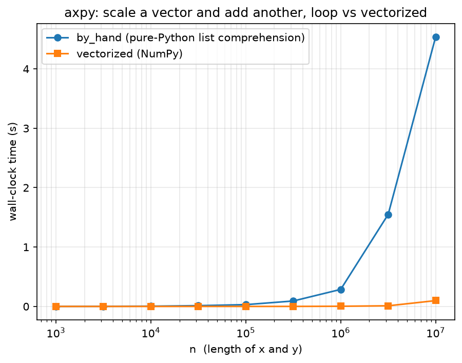
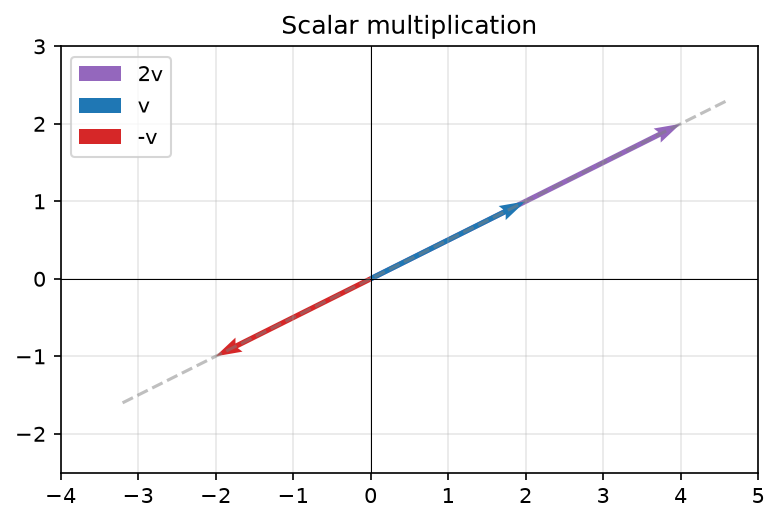
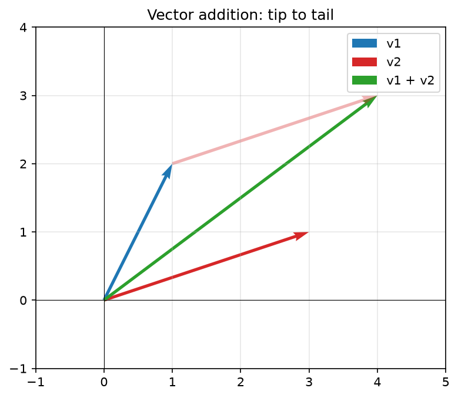
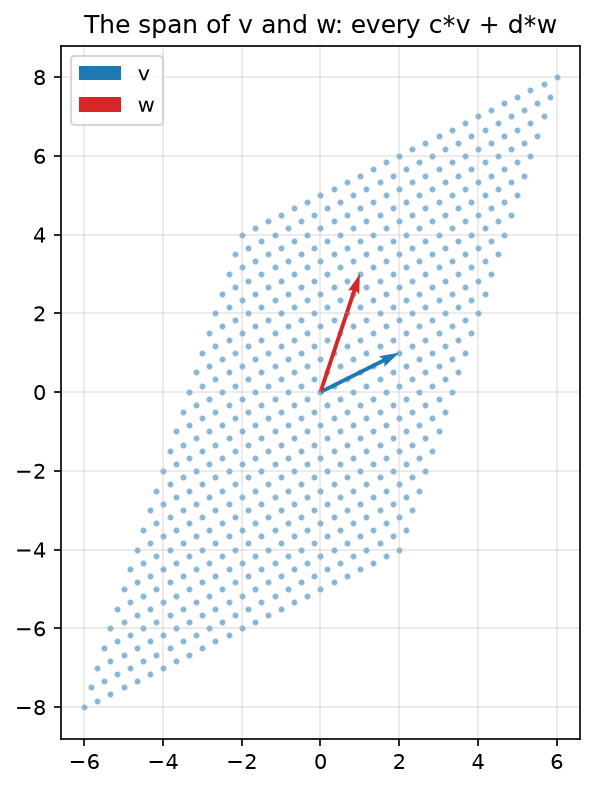

<!-- DRAFT (Claude, 2026-07-11) for Josh's edit. §1.0 is Josh's text, untouched.
     Companion notebook: clae-code/ch01/ch01.ipynb produces every figure and
     number here. -->

# Chapter 1: Vectors and Linear Combinations

## 1.0 In `axpy` we trust

Modern artificial intelligence rests on a single, simple operation: scale a vector by a number, and add it to another vector. That is the whole of the operation. The libraries that perform it ten billion times a second call it **axpy**, for "a x plus y." This book calls it the **linear combination**. Everything else, the layers and the attention heads and the billions of parameters and the warehouses of silicon, is structure built around this one move. The plain timber the whole edifice hangs on is axpy.

The architectures came and went, and the operation stayed. A recurrent network folded a sequence up one step at a time, and each step was a linear combination of the state so far and the next input. Then a single paper announced that attention is all you need, and attention turned out to be a weighted sum of vectors, which is to say a linear combination. The famous title decodes to something quieter: the linear combination is all you need.

That it is foundational you might take on faith. That it is also the operation your computer runs faster than almost anything else, you should not. Let me show you what I mean. 

### `numpy`

NumPy is not math in Python. Python is a high-level wrapper around C, and NumPy is a high-level wrapper around the compiled numerical libraries beneath it, BLAS chief among them, that the whole numerical stack rests on, the models we train and run included. When you write NumPy you are writing a short note that says: have the fast code do this. NumPy is the handle that lets you hold axpy at arm's length. You write `a * x + y` and stay in mathematics, while the fiddly bits, allocating the memory, walking the strides, dispatching the right kernel, calling into Fortran BLAS, happen out of sight. That is the bargain: the speed of the compiled code without having to write it.

We will compute axpy itself, on real arrays: two vectors `x` and `y` of ten million numbers, and a single scalar `a`. We compute it two ways and time both: a pure-Python list comprehension over the entries, and NumPy's vectorized expression.

```python
import time
import numpy as np

def by_hand(a, x, y):       # pure Python, a list comprehension over the entries
    return [a * xi + yi for xi, yi in zip(x, y)]

def vectorized(a, x, y):    # NumPy, the whole array at once
    return a * x + y
```

```python
a = 2.5
rng = np.random.default_rng(0)
x, y = rng.random(10_000_000), rng.random(10_000_000)

t0 = time.perf_counter(); by_hand(a, x, y)
t_loop = time.perf_counter() - t0
t0 = time.perf_counter(); vectorized(a, x, y)
t_vec = time.perf_counter() - t0

print(f'list comprehension: {t_loop:5.2f} s')
print(f'vectorized:         {t_vec * 1e3:5.0f} ms')
print(f'factor:             {t_loop / t_vec:5.0f}x')
```

```text
list comprehension:  4.34 s
vectorized:           138 ms
factor:                32x
```

Both return the same numbers; they do not take the same time. The list comprehension is dozens of times slower, and the gap only widens with `n`. A gap that large is worth chasing.

Every figure and number in this book is produced by the companion notebooks at [github.com/joshuacook/clae-code](https://github.com/joshuacook/clae-code), run on a 4-vCPU cloud virtual machine with no GPU. Your own machine will print different numbers; the shape of the gap will not.



> **Figure 1.1.** Wall-clock time of `by_hand` (a pure-Python list comprehension) against `vectorized` (NumPy) for axpy, swept over `n` from a thousand to ten million, with a log x-axis and a linear y-axis. The vectorized call stays flat against the floor while the list comprehension's cost climbs away.

The loop is slow because Python is doing far more than arithmetic. For each of the ten million entries the interpreter resolves types, boxes and unboxes objects, checks bounds, and dispatches the operators, and only underneath all of that does it finally multiply and add. NumPy's `a * x + y` skips every bit of that per-entry overhead: the whole array goes to a compiled loop the interpreter never re-enters. That is where the gap comes from. It is a software win, not a hardware trick.

The operation that compiled loop is built around is axpy, and it is among the most carefully tuned routines in numerical computing. At the very bottom axpy is a single hardware instruction, the fused multiply-add, that modern processors run many of at once. So it is software the whole way down to one operation the silicon was built to do in a single step: scale, and add.[^alphatensor]

[^alphatensor]: DeepMind's AlphaTensor (2022) and AlphaEvolve (2025) did find faster algorithms, but for matrix *multiplication*: ways to combine many multiply-adds with fewer scalar multiplications than Strassen. The atomic axpy is not what they improved; it is already the irreducible step.

So look again at the operation we opened with. To scale a vector by a number and add it to another is to form a linear combination, and you have just watched your machine treat it as the most important thing it knows how to do. That is not a coincidence. We poured decades of engineering into axpy precisely because nearly everything we wanted to compute was built out of it. Least squares finds the combination of features closest to a price; principal component analysis finds the combinations that carry the most variation; the Kalman filter blends a prediction and a measurement into one combination and calls it an estimate. Learn to see linear combinations everywhere, and the rest of the book is commentary.

## 1.1 Two operations, one contract

Linear algebra runs on a contract, and the contract is short. You need objects that can be scaled and added, and you need the results to stay in the family: scale a vector and you have a vector, add two vectors and you have a vector. Closure under those two operations is the entire price of admission. There are formally eight axioms standing behind that sentence; we wave at them once, here, and move on.

What the contract buys is out of all proportion to what it costs. Honor it and you inherit the whole suite: regression, eigen dynamics, Fourier analysis, and, by Chapter 3, the fact that electron orbitals are a basis. Each of those is the same small set of moves applied to a new family of objects that kept its end of the deal. That is an enormous claim, so let us put something real on the table.

### The claim on the table

The Ames housing data records 1,460 home sales in Ames, Iowa: square footage, quality ratings, sale prices, eighty features in all. Estimation only ever says one sentence about data like this:

$$\texttt{SalePrice} \approx w_1 \cdot \texttt{GrLivArea} + w_2 \cdot \texttt{OverallQual} + \cdots$$

Read it again. Scale a vector by a number, add it to another vector. The one sentence estimation ever says is axpy. The weights are unknown, and this book exists to earn them. But there is no reason you should wait two hundred pages to hear the song, so here is the answer first.

```python
import pandas as pd

zoning  = pd.read_csv('data/zoning.csv')
listing = pd.read_csv('data/listing.csv')
sale    = pd.read_csv('data/sale.csv')          # SalePrice (the target) lives here
housing = pd.merge(zoning, listing, on='Id')
housing = pd.merge(housing, sale, on='Id').set_index('Id')

X = housing[['GrLivArea', 'OverallQual']].to_numpy(float)
y = housing['SalePrice'].to_numpy(float)

w, *_ = np.linalg.lstsq(X, y, rcond=None)        # the unearned answer
print('w:', np.round(w, 2))
print(f'house {housing.index[1]}: actual {y[1]:,.0f}   predicted {(X @ w)[1]:,.0f}')
```

```text
w: [   51.87 17604.21]
house 2: actual 181,500   predicted 171,085
```

There they are: about $51.87 per square foot of living area, about $17,604 per point of overall quality, and the recipe prices house 2 within six percent of its actual sale. Those weights were delivered by a function you did not build and do not yet deserve. Most readers of this book have called `lstsq` or one of its cousins professionally; the mystery was never getting the answer, it is why the answer works and when to trust it. By Chapter 11 you will have built that function yourself, from parts, and every part is made of the two operations in the contract. This chapter starts the collection.

### Scaling and adding

The two operations deserve their pictures, geometry first in both cases.

Scalar multiplication is stretching. Multiply a vector by `c` and its arrow grows or shrinks along its own line through the origin; a negative `c` flips it to point the other way down the same line. That is the entire geometric content. The algebra just carries it out entrywise:

$$c\mathbf{v} = (cv_1, cv_2, \ldots, cv_n)$$

```python
import matplotlib.pyplot as plt

def plot_vector(v, color='blue', label=None):
    plt.quiver(0, 0, v[0], v[1], angles='xy', scale_units='xy', scale=1,
               color=color, label=label)

v = np.array([2, 1])
plot_vector(2 * v, 'purple', '2v')    # stretch
plot_vector(v, 'blue', 'v')
plot_vector(-v, 'red', '-v')          # flip
plt.show()
```



> **Figure 1.2.** Scalar multiplication. `v`, `2v`, and `-v` all lie on the single line through the origin: multiplying by `c` slides the arrow along that line, and flips it to the far side when `c` is negative.

Addition is tip to tail. Walk out along the first arrow; from where you land, walk out along the second; the sum is the single arrow from where you started to where you finished. Entrywise again:

$$\mathbf{v} + \mathbf{w} = (v_1 + w_1, \ldots, v_n + w_n)$$

```python
def vector_addition(v1, v2):
    plot_vector(v1, 'blue', 'v1'); plot_vector(v2, 'red', 'v2')
    plot_vector(v1 + v2, 'green', 'v1 + v2')
    plt.show()

vector_addition(np.array([1, 2]), np.array([3, 1]))
```



> **Figure 1.3.** `vector_addition(v1, v2)`: `v1` and `v2` from the origin, with `v2` carried to the tip of `v1` (faded), and the tip-to-tail sum `v1 + v2` in green.

Put the two operations together and you have the only move this book ever makes:

$$c\mathbf{v} + d\mathbf{w}$$

The numbers `c` and `d` are the **weights**. You have seen this sentence before; it priced a house a page ago. And it hands us the question that drives the next section. Hold `v` and `w` fixed, and let the weights range over every value they can take. What do you get?

## 1.2 Span and subspace

Collect every `c*v + d*w` as `c` and `d` run over all real numbers. That set is the **span** of `v` and `w`. If `w` lies on `v`'s line, scaling and adding never escape the line, and the span is just that line. If it does not, the combinations fill an entire plane: two arrows, through nothing but scaling and adding, generate a two-dimensional world.

```python
v = np.array([2, 1]); w = np.array([1, 3])
C, D = np.meshgrid(np.linspace(-2, 2, 25), np.linspace(-2, 2, 25))
span = C.ravel()[:, None] * v + D.ravel()[:, None] * w   # every c*v + d*w
plt.scatter(span[:, 0], span[:, 1], s=4, alpha=0.4)
plot_vector(v, 'blue', 'v'); plot_vector(w, 'red', 'w'); plt.legend(); plt.show()
```



> **Figure 1.4.** The cloud of `c*v + d*w` for weights swept from -2 to 2: the sampled patch of the plane spanned by `v` and `w`. Widen the sweep and the cloud grows without bound; the plane is what it is filling in.

The span has two properties worth naming. Scale anything inside it and you stay inside; add any two things inside it and you stay inside. And it always contains the origin, because `c = d = 0` is a legal choice of weights. A set with those properties is a **subspace**. Span and subspace are two descriptions of one object: span builds it from ingredients, subspace states the property the built thing has.

Here is why you care. In a dataset the feature columns are vectors, and the subspace they span is the **column space**: every vector the features can build, which is to say every prediction a linear model can possibly make. Now the question from 1.1 sharpens. Can `GrLivArea` and `OverallQual` reach `SalePrice`? Almost never exactly. The target `y` is a vector too, and it does not generally lie in the plane those two columns span. The gap between `y` and the closest point the columns can reach has a name, and the name is two hundred pages away; for now, hold the picture of a vector hanging just off a plane. Fitting Ames prices in Chapter 11 will mean choosing the point of the column space that best accounts for `y`, and nothing more.

## 1.3 Independence, basis, and the recipe

Take a plane spanned by two vectors and toss in a third. One of two things happens. Either it lands in the plane, in which case it was already a combination of the first two and adds nothing new, or it points out of the plane, and combinations of the three now fill three-dimensional space. The first case is **linear dependence**; the second is **linear independence**. Formally, a set is independent when no vector in it is a combination of the others; equivalently, when the only combination that produces the zero vector is the one with every weight equal to zero.

The test is mechanical enough to hand to the machine.

```python
# a dependent set: c3 is a combination of c1, c2
c1 = np.array([1, -1, 0]); c2 = np.array([0, 1, -1]); c3 = np.array([-1, 0, 1])
print("-c1 + c2:", -c1 + c2)     # -> [-1  0  1] == c3, so c3 adds nothing new

# independence test by rank
def are_independent(vectors):
    matrix = np.column_stack(vectors)
    return np.linalg.matrix_rank(matrix) == len(vectors)

are_independent([c1, c2, c3])                                          # False
are_independent([np.array([1,0,0]), np.array([0,1,0]), np.array([0,0,1])])  # True
```

Independence tells us when a vector earns its place. A **basis** is an independent set that spans: nothing wasted, nothing missing, the smallest kit whose combinations build the whole space. Every subspace has one. All bases of a given subspace have the same size, and that shared size is the **dimension**.

Now the payoff, and it is the best sentence in the chapter. A basis spans, so every vector is a combination of it. A basis is independent, so that combination is unique. The unique weights are the **coordinates**. Watch what this does to the most familiar object in the subject:

```python
# the list of numbers IS a linear combination of the standard basis
e1, e2, e3 = np.eye(3)
a, b, c = 5, -2, 7
print(a*e1 + b*e2 + c*e3)        # -> [5. -2. 7.] == (a, b, c)
```

The list `(5, -2, 7)` was `5*e1 - 2*e2 + 7*e3` all along. The list was never the vector; it was the recipe, written in a basis so familiar we forgot it was a choice. In Chapter 2 a matrix will form a linear combination of its columns, with the input vector as the recipe, and you will find you have already met the idea.

## 1.4 Length, angle, and the dot product

We can build vectors by combining them. To estimate we must also measure them: how long is this vector, how aligned are these two? One operation answers both questions. The **dot product** multiplies matching entries and sums the results, one number out.

$$\mathbf{v} \cdot \mathbf{w} = v_1 w_1 + v_2 w_2 + \cdots + v_n w_n$$

```python
v = np.array([3, 1]); w = np.array([2, 3])
v @ w                       # dot product
np.linalg.norm(v)           # length = sqrt(v @ v)
np.degrees(np.arccos((v @ w) / (np.linalg.norm(v) * np.linalg.norm(w))))  # angle, degrees
```

Length comes from dotting a vector with itself, and angle comes from comparing the dot product against the lengths:

$$\|\mathbf{v}\| = \sqrt{\mathbf{v}\cdot\mathbf{v}}, \qquad \cos\theta = \frac{\mathbf{v}\cdot\mathbf{w}}{\|\mathbf{v}\|\,\|\mathbf{w}\|}$$

The length is the Pythagorean distance from origin to tip. The cosine formula turns the dot product into an angle between any two vectors, in any number of dimensions. The dot product is symmetric, and it respects linear combinations in each slot; we will lean on that compatibility constantly and mostly without comment.

One case deserves a flag now, though its payoff is chapters away. When the dot product of two vectors is zero they are **orthogonal**: perpendicular, each invisible to the other's measure. Recall the vector hanging just off the plane at the end of 1.2. When a measurement cannot be reached by any combination of our features, the closest reachable point leaves an error that is orthogonal to everything reachable. That single condition is least squares, in Chapter 11. The same dot product applied to centered data columns is covariance, in Chapter 6. One operation, two of the biggest ideas in the book.

## 1.5 A dataset is a matrix of vectors

One vector is one record. A dataset is many records stacked, and the stack is a matrix. Real data rarely arrives as one clean table; the Ames data ships as three files, zoning, listing, and sale, joined on a shared `Id` into a single matrix. We built it in 1.1 to ask the estimation question. Here is the shape of what we built.

```python
housing.shape                                    # (1460, 80) -- 1460 homes, 80 features
```

A data matrix reads two ways, and both matter. Across the rows: each row is one home, a single point in an eighty-dimensional feature space, one dot in a cloud of 1,460. Down the columns: each column is one feature measured across every home, a vector with 1,460 entries.

```python
housing.loc[2]                                   # row 2: a sample (one home)
numeric = housing.select_dtypes(include='number')
numeric['GrLivArea']                             # a column: one feature over 1460 homes
```

The column reading connects to everything this chapter built. Feature columns are vectors. Their span is the column space. Their linear combinations are exactly the predictions a linear model can make, and the weights of the winning combination are what `lstsq` handed us, unearned, back in 1.1. Some features (neighborhood, roof style) are words rather than numbers; they become numeric vectors in due time, with standardization in Chapter 2 and covariance in Chapter 6. One convention holds for the whole book: rows are samples, columns are features. In Chapter 2 the matrix stops being a container and becomes an action.

## 1.6 Summary and exercises

A vector is a thing you can scale and add. That act is the linear combination: axpy at the bottom of your machine, and the one sentence estimation ever says at the top of it. Taking the act seriously produced everything else in this chapter. The span is everything the act can reach. The subspace is the property of what it reaches. The basis is the minimal kit, the coordinate list is a recipe written in a chosen basis, the dot product is the measuring tool, and the data matrix is 1,460 vectors standing in formation.

The question the book answers is now fully posed. Of all the linear combinations available, which one is the estimate, and how do we earn it?

**Exercises**

1. Time `by_hand` against `vectorized` axpy on your own machine, over a sweep of sizes. Explain the gap you measure in terms of what the interpreter does per entry and what BLAS does per array.
2. Given three vectors, decide independence two ways: by hand, exhibiting a combination or arguing none exists, and by machine with `are_independent`.
3. Load the Ames data and report the shape of the data matrix. Pull one row (a home) and one column (a feature). Identify five features that are categorical rather than numeric.
4. Pick two numeric Ames features. Compute the angle between their centered columns. Relate what you find near 0 degrees and near 90 degrees to the idea of correlation (a preview of Chapter 6).
5. Rerun the `lstsq` cell from 1.1 with a third feature of your choosing added. Report the new weights and whether house 2's predicted price improved. You are not yet expected to explain what `lstsq` did; you are expected to notice that the sentence it completes is still axpy.
