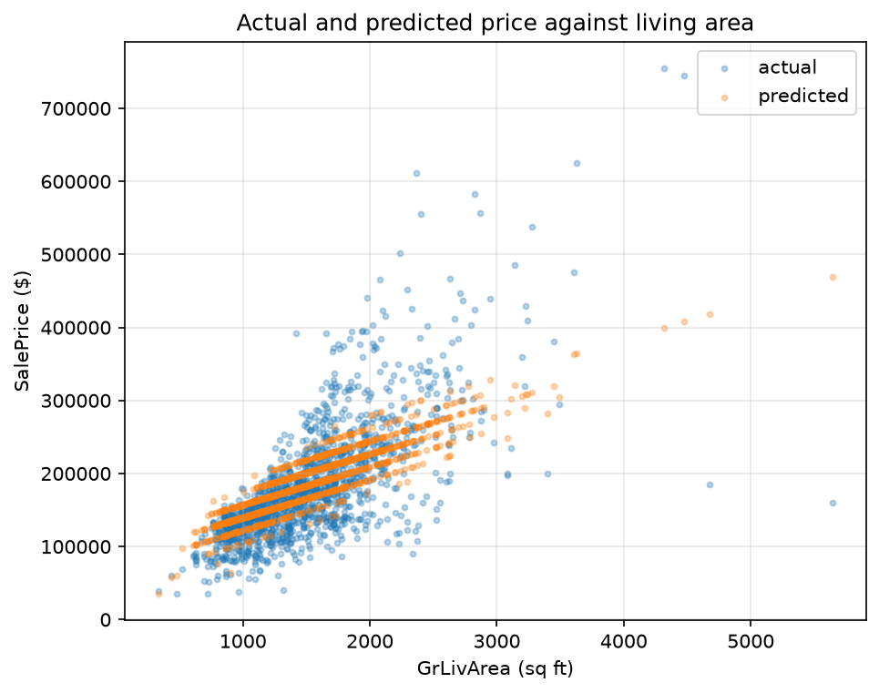

<!-- DRAFT V3 (2026-07-13): the ordered-rewrite pass. Inputs: the 62-note
     census (chapter_notes/ch01-inkpass-ink-notes.md) + lens rulings.
     Structural: NEW 1.0 "The Method" opens the chapter (ruling 3: what a
     vector IS in each lens before anything else; notes 3, 20, 21); LLM
     material to a footnote (4); foundational-claim leads the race section
     (5); concept units run picture -> align -> machine -> Ames (ruling 4)
     with written transitions (24) and TikZ leading the geometric beats
     (22, 35, 37, 39, 51); listings split definition/execution throughout
     (11, 41); footnote-about-footnotes debuts at the chapter's first claim
     region (46); span section is ABOUT SPAN, hover/projection preview and
     column-space naming removed to Ch 2 (47-50); existence and uniqueness
     named at the membership solve (43); standard basis defined (55); unit
     circle defined formally, extended to n dimensions with Pythagoras, and
     walked into cosine similarity (57-61); CAUCHY-SCHWARZ DROPPED per note
     62, one naming footnote only (unit-circle-to-preface question stays
     open for discussion); pink inventory deleted; note-56 metaphor purged.
     Spells approved (ruling 5) and glued in chapter order (13, 17,
     19). Companion notebook: clae-code/ch01/ch01.ipynb NEEDS A SYNC PASS
     (fig_pred_vs_actual becomes fig_price_vs_sqft; C-S cell dropped;
     listing splits).
     Words: 6800 prose / 7598 total (auto: tools/wordcount.py)-->

# Chapter 1: Vectors and Linear Combinations

## 1.0 The Method

The preface christened four lenses. This book keeps its promises immediately, so here is its first object, a vector, seen through all four before anything else happens to it.

\lensmark{geometric} Through the geometric lens, a vector is an arrow from the origin. The arrow $(2, 1)$ walks two east and one north:

\begin{figure}[!htb]
\centering
\begin{tikzpicture}[scale=1.1]
  \draw[gray!40, ->] (-0.5,0) -- (3.0,0);
  \draw[gray!40, ->] (0,-0.5) -- (0,1.8);
  \draw[gray!25] (0,0) grid[step=1] (2.6,1.6);
  \draw[->, very thick] (0,0) -- (2,1) node[above right] {$(2, 1)$};
\end{tikzpicture}
\caption{A vector through the geometric lens. The arrow $(2, 1)$ walks two east and one north from the origin.}
\end{figure}

\lensmark{algebraic} Through the algebraic lens, the same vector is an ordered list of numbers, an object with rules for pencil work.

> **Definition 1.1 (vector).** A **vector** is an ordered list of $n$ real numbers,[^complexnote] $\mathbf{v} = (v_1, \ldots, v_n)$. The set of all such vectors is $\mathbb{R}^n$.

[^complexnote]: Real by decree, not by necessity. Everything in Part I works unchanged with complex entries, and $\mathbb{C}^n$ takes over when signal processing requires it in Chapter 13. Until then the reals carry the book.

The arrow above is $(2, 1)$ in $\mathbb{R}^2$. Three dimensions work the same way with one more entry: $(1, 0, 2)$, $(3, -1, 4)$, and $(0, 0, 1)$ all live in $\mathbb{R}^3$, arrows in space instead of on a page. Past three dimensions the drawing gives out and the list keeps going.

\lensmark{computational} Through the computational lens, a vector is an array, a contiguous block of memory the compiled libraries can run over at full speed. **Listing 1.1 (a vector in the machine)** puts one in $\mathbb{R}^2$ and one in $\mathbb{R}^3$ into memory.

```python
import numpy as np
v = np.array([2, 1])
u = np.array([1, 0, 2])     # a vector in R^3
```

\lensmark{data} And through the data lens, a vector is a column of measurements. In the dataset this book lives with, 1,460 home sales from Ames, Iowa, the above-ground living area of every home is one vector with 1,460 entries, and each home's full record is another vector, eighty entries long. Section 1.3 unpacks both.

One object, four appearances: an arrow, a list with rules, an array in memory, a column of measurements. Every concept in this book will make the same tour, the margin announcing each lens as it takes over, and the tour will always run in the creed's order where it can. Picture first, pencil second, machine third, houses last.

Now the operation. Modern artificial intelligence rests on a single, simple move. Scale a vector by a number, and add it to another vector.[^llm] That is the whole of the operation, and it carries both of its names into a definition.

[^llm]: The claim is not rhetorical. A language model, underneath the chat window, is arithmetic at colossal scale: numbers organized into long lists, the lists scaled, the scaled lists added. Architectures turn over every few years and the operation does not. The recurrent networks that read text one word at a time carried a running summary forward, scaling what they held and adding what they read. The paper that retired them is titled "Attention Is All You Need," and attention is a weighted sum of vectors, which is Definition 1.2. The architecture died. The operation is still here.

> **Definition 1.2 (linear combination, weights).** A **linear combination** of vectors $\mathbf{v}_1, \ldots, \mathbf{v}_k$ is
>
> $$c_1\mathbf{v}_1 + c_2\mathbf{v}_2 + \cdots + c_k\mathbf{v}_k,$$
>
> the vectors scaled by numbers and the results added. The numbers $c_1, \ldots, c_k$ are the **weights**.

Concretely, in $\mathbb{R}^3$, $2\,(1, 0, 2) + 3\,(3, -1, 4) = (2, 0, 4) + (9, -3, 12) = (11, -3, 16)$ is a linear combination of two vectors with weights $2$ and $3$, and $5\,(0, 0, 1)$ is a linear combination of one.

> **Definition 1.3 (axpy).** For a number $a$ and vectors $\mathbf{x}$ and $\mathbf{y}$, **axpy** is the linear combination $a\mathbf{x} + \mathbf{y}$, one scaling and one addition.

The strange name is a working credential. Deep in the compiled numerical libraries that every scientific computing stack calls down into, the routine that computes $a\mathbf{x} + \mathbf{y}$ has been named `axpy`, "a times x plus y," since the 1970s. When this book says axpy, it means the operation and it gestures at the machinery. That routine is the most heavily engineered few lines of arithmetic in numerical computing. The claim that axpy is foundational you have just read. The claim that your computer runs it faster than almost anything else it does is measurable, so the next section measures it.

## 1.1 In `axpy` we trust

\lensmark{algebraic} Run the operation once by hand before the machine gets it. Take $a = 2$, $\mathbf{x} = (1, 2, 3)$, $\mathbf{y} = (10, 20, 30)$, and do the two moves in order, scale then add:

\begin{align}
a\,\mathbf{x} &= 2\,(1, 2, 3) = (2, 4, 6) \notag \\
a\,\mathbf{x} + \mathbf{y} &= (2, 4, 6) + (10, 20, 30) = (12, 24, 36)
\end{align}

\lensmark{computational} That is everything axpy does. **Listing 1.2 (the same axpy, in NumPy)** hands the identical three-vector computation to the machine, which agrees.

```python
a, x, y = 2, np.array([1, 2, 3]), np.array([10, 20, 30])
print(a * x + y)
```

```text
[12 24 36]
```

The machine's real advantage appears at scale, and NumPy is the doorway to it. NumPy is not just math in Python. Python is a high-level wrapper around C. NumPy is a high-level wrapper around the compiled numerical libraries beneath it, BLAS and LAPACK chief among them,[^blas] and the whole numerical stack rests on those libraries. When you write NumPy you are writing a short note that says, "have the fast code do this." You write the expression and stay in mathematics. The fiddly bits happen out of sight: allocating the memory, walking the strides, dispatching the right kernel, calling into Fortran BLAS. You focus on the ideas and let the machine do the computing.[^gpu]

[^blas]: BLAS, the [Basic Linear Algebra Subprograms](https://www.netlib.org/blas/), is the standardized set of vector and matrix routines (axpy among them) that hardware vendors tune for their chips. LAPACK, the [Linear Algebra PACKage](https://www.netlib.org/lapack/), builds the higher operations, solving systems, factorizations, eigenproblems, on top of BLAS. Both are Fortran, both date to the era the preface's tradition grew from, and both are almost certainly on your machine right now.

[^gpu]: The same shape repeats at the next layer of the stack, where the software tricks meet the hardware trick. PyTorch and TensorFlow are high-level wrappers around CUDA kernels running these same operations on graphics hardware, thousands of arithmetic units taking the entries in parallel. Everything in this book runs on an ordinary CPU, and every speedup you will see is software finding the silicon it already had.

Now the measurement. The same expression on arrays too long for a pencil, two vectors of ten million entries, computed two ways with a clock on both. **Listing 1.3 (axpy two ways, defined)** writes each version as a function.

```python
import time

def list_comp_in_python(a: float, x: np.ndarray, y: np.ndarray) -> list:
    return [a * xi + yi for xi, yi in zip(x, y)]

def vectorized_in_numpy(a: float, x: np.ndarray, y: np.ndarray) -> np.ndarray:
    return a * x + y
```

**Listing 1.4 (the race)** runs both on the ten-million-entry arrays and prints the gap.

```python
a = 2.5
rng = np.random.default_rng(0)
x, y = rng.random(10_000_000), rng.random(10_000_000)

t0 = time.perf_counter(); list_comp_in_python(a, x, y)
t_loop = time.perf_counter() - t0
t0 = time.perf_counter(); vectorized_in_numpy(a, x, y)
t_vec = time.perf_counter() - t0

print(f'list comprehension: {t_loop:5.2f} s')
print(f'vectorized:         {t_vec * 1e3:5.0f} ms')
print(f'factor:             {t_loop / t_vec:5.0f}x')
```

```text
list comprehension:  6.09 s
vectorized:            79 ms
factor:                77x
```

Both return the same numbers. They do not take the same time.[^machine] The list comprehension is dozens of times slower, and the gap only widens with $n$. **Listing 1.5 (the race, swept)** runs the same contest across sizes from a thousand to ten million. Figure 1.2 is its output.

[^machine]: Every figure and number in this book is produced by the companion notebooks at [github.com/joshuacook/clae-code](https://github.com/joshuacook/clae-code), run on a 4-vCPU cloud virtual machine with no GPU. Your own machine will print different numbers, and the gap will still be there, about this size.

```python
def best(fn, a, x, y, reps: int = 3) -> float:
    times = []
    for _ in range(reps):
        t0 = time.perf_counter(); fn(a, x, y)
        times.append(time.perf_counter() - t0)
    return min(times)

ns = np.logspace(3, 7, 9).astype(int)
t_loop = [best(list_comp_in_python, a, rng.random(n), rng.random(n)) for n in ns]
t_vec  = [best(vectorized_in_numpy,  a, rng.random(n), rng.random(n)) for n in ns]
plt.semilogx(ns, t_loop, 'o-')
plt.semilogx(ns, t_vec, 's-')
plt.show()
```


> **Figure 1.2.** Wall-clock time of `list_comp_in_python` against `vectorized_in_numpy`, swept over $n$ from a thousand to ten million, with a log x-axis and a linear y-axis. The vectorized call stays flat against the floor while the list comprehension's cost climbs away.

The loop is slow because Python is doing far more than arithmetic. For each of the ten million entries the interpreter resolves types, boxes and unboxes objects, checks bounds, and dispatches the operators. Only underneath all of that does it finally multiply and add. NumPy skips every bit of that per-entry overhead. The whole array goes to a compiled loop the interpreter never re-enters. That is where the gap comes from. It is a software win, not a hardware trick.

The operation that compiled loop is built around is axpy, and at the very bottom axpy is a single hardware instruction, the fused multiply-add, that modern processors run many of at once. So it is software the whole way down to one operation the silicon was built to do in a single step: scale, and add.

Why has this much engineering been spent on one small operation? Because nearly everything we want to compute is built out of it, and the rest of this book is the itemized receipt. Least squares finds the combination of features closest to a price. Principal component analysis finds the combinations that carry the most variation. The Kalman filter blends a prediction and a measurement into one combination and calls it an estimate. Each of those is chapters away, and each is this section's operation wearing a job title. This book teaches you to recognize the combination inside each of them, and then to choose its weights.

## 1.2 The contract

The transition from one operation to a whole subject runs through a single agreement. Here is the object it happens in, defined before the rules it obeys.

> **Definition 1.4 (vector space, working version).** A **vector space** is a set $S$ of vectors closed under the two operations:[^axioms]
>
> **Closure under scaling.** For every vector $\mathbf{v}$ in $S$ and every number $c$, the vector $c\mathbf{v}$ is in $S$.
>
> **Closure under addition.** For every pair of vectors $\mathbf{v}$ and $\mathbf{w}$ in $S$, the vector $\mathbf{v} + \mathbf{w}$ is in $S$.

[^axioms]: There is a bootstrap here, and it is worth seeing plainly. A vector space is the thing that stays closed when you scale and add, and scaling and adding are the operations a vector space supports. The circle is not a flaw. It is the agreement. Commit to objects with these two operations, and everything else in the book follows. The full definition adds eight axioms governing how the operations behave (addition commutes and associates, a zero vector exists, every vector has an additive inverse, and scalar multiplication associates, distributes both ways, and respects 1). $\mathbb{R}^n$ satisfies all eight, every space in this book satisfies all eight, and we will not check them again. Sheldon Axler, *Linear Algebra Done Right*, ch. 1, gives the axioms a first-class treatment.

\lensmark{algebraic} Keep the two closure clauses and axpy comes free, because $a\mathbf{x} + \mathbf{y}$ is one application of each. Watch closure hand it over, symbolically and then on numbers. Scaling keeps $a\mathbf{x}$ in the vector space. Addition then keeps the sum in too:

\begin{align}
\mathbf{x} \in S \;\Longrightarrow\; a\mathbf{x} \in S, \qquad\quad a\mathbf{x} \in S,\; \mathbf{y} \in S \;\Longrightarrow\; a\mathbf{x} + \mathbf{y} \in S
\end{align}

On numbers, take $\mathbf{x} = (1, 2)$ and $\mathbf{y} = (3, 1)$ in $\mathbb{R}^2$. Then $2\mathbf{x} = (2, 4)$ is in $\mathbb{R}^2$. So is $2\mathbf{x} + \mathbf{y} = (5, 5)$. \lensmark{geometric} And in a picture, the whole demonstration is two arrows and a walk:

\begin{figure}[!htb]
\centering
\begin{tikzpicture}[scale=0.85]
  \draw[gray!40, ->] (-0.5,0) -- (6.0,0);
  \draw[gray!40, ->] (0,-0.5) -- (0,5.6);
  \draw[->, thick] (0,0) -- (1,2) node[left] {$\mathbf{x}$};
  \draw[->, thick, gray] (0,0) -- (2,4) node[left] {$2\mathbf{x}$};
  \draw[->, thick, gray!70] (2,4) -- (5,5);
  \node[gray!90, above right] at (3.2,4.35) {$\mathbf{y}$, carried};
  \draw[->, very thick] (0,0) -- (5,5) node[above right] {$2\mathbf{x} + \mathbf{y} = (5,5)$};
\end{tikzpicture}
\caption{Closure, drawn. Scale $\mathbf{x}$, carry $\mathbf{y}$ from its tip, and the combination $2\mathbf{x} + \mathbf{y}$ is the arrow to where you land. Every step stays in the vector space.}
\end{figure}

Scale $\mathbf{x}$, walk $\mathbf{y}$ from its tip, and the combination is the arrow to where you land. Every step stayed on the page, which is the picture's way of saying every step stayed in the vector space.

Repeat the two moves and every linear combination of vectors in $S$ lands in $S$. Two clauses in, the whole of Definition 1.2 out. And what the two clauses buy is out of all proportion to their price, because linearity is the assumption behind every incantation this book will teach. Assume it, and here are the spells, in the order the book casts them: axpy at compiled speed (this chapter), the fact that electron orbitals are a basis (Chapter 3), the directions that carry a dataset's variation (Chapter 10), regression (Chapter 11), and Fourier analysis (Chapter 13). Each one is the same small set of moves applied to a new family of objects that kept the two clauses.

### Scaling and adding, drawn

Each operation now gets the full tour, picture first.

\lensmark{geometric} Scalar multiplication is stretching. Multiply a vector by $c$ and its arrow grows or shrinks along its own line through the origin. A negative $c$ flips it to point the other way down the same line:

\begin{figure}[!htb]
\centering
\begin{tikzpicture}[scale=0.9]
  \draw[gray!40, ->] (-2.6,-1.3) -- (5.4,2.7);
  \draw[->, very thick, gray] (0,0) -- (4,2) node[below right] {$2\mathbf{v}$};
  \draw[->, very thick] (0,0) -- (2,1) node[above left] {$\mathbf{v}$};
  \draw[->, very thick, gray!70] (0,0) -- (-2,-1) node[below left] {$-\mathbf{v}$};
\end{tikzpicture}
\caption{Scalar multiplication is stretching. $\mathbf{v}$, $2\mathbf{v}$, and $-\mathbf{v}$ share one line through the origin.}
\end{figure}

\lensmark{algebraic} The pencil version is entrywise, small enough to do whole:

\begin{align}
3\,(2, 1) = (3 \cdot 2,\; 3 \cdot 1) = (6, 3), \qquad\quad c\,\mathbf{v} = (c v_1,\, c v_2,\, \ldots,\, c v_n)
\end{align}

\lensmark{computational} The machine draws the same picture at whatever scale you ask. **Listing 1.6 (a vector-drawing helper, defined)** wraps matplotlib's arrow primitive.

```python
import matplotlib.pyplot as plt

def plot_vector(v, color='blue', label=None):
    plt.quiver(0, 0, v[0], v[1], angles='xy', scale_units='xy', scale=1,
               color=color, label=label)
```

**Listing 1.7 (scalar multiples, drawn)** puts three multiples of one vector on the same axes. Figure 1.5 is its output.

```python
v = np.array([2, 1])
plot_vector(2 * v, 'purple', '2v')
plot_vector(v, 'blue', 'v')
plot_vector(-v, 'red', '-v')
plt.show()
```


> **Figure 1.5.** Scalar multiplication. `v`, `2v`, and `-v` all lie on the single line through the origin: multiplying by `c` slides the arrow along that line, and flips it to the far side when `c` is negative.

\lensmark{geometric} Addition is tip to tail. Walk out along the first arrow. From where you land, walk out along the second. The sum is the single arrow from start to finish. The closure drawing above already showed it. \lensmark{algebraic} The pencil version is entrywise again:

\begin{align}
(1, 2) + (3, 1) = (4, 3), \qquad\quad \mathbf{v} + \mathbf{w} = (v_1 + w_1,\, \ldots,\, v_n + w_n)
\end{align}

\lensmark{computational} **Listing 1.8 (tip to tail, drawn)** renders a sum with the helper from Listing 1.6. Figure 1.6 is its output.

```python
v1, v2 = np.array([1, 2]), np.array([3, 1])
plot_vector(v1, 'blue', 'v1'); plot_vector(v2, 'red', 'v2')
plot_vector(v1 + v2, 'green', 'v1 + v2')
plt.show()
```


> **Figure 1.6.** `v1` and `v2` from the origin, with `v2` carried to the tip of `v1` (faded), and the tip-to-tail sum `v1 + v2` in green.

Put the two operations together and the object of the book appears. Take $\mathbf{v} = (1, 2)$ and $\mathbf{w} = (3, 1)$ and form the combination $2\mathbf{v} + \mathbf{w}$, scale first, then add:

\begin{align}
2\,(1, 2) + (3, 1) = (2, 4) + (3, 1) = (5, 5)
\end{align}

That is the arithmetic your machine ran ten million times in Section 1.1, once per entry, at seventy-seven times your interpreter's speed.

## 1.3 The claim on the table

\lensmark{data} Now the data lens, and a dataset to point it at. The **Ames housing data** holds 1,460 home sales from Ames, Iowa, assembled by Dean De Cock from the county assessor's office.[^decock] Each sale carries eighty features, square footage, overall quality, roof style, neighborhood, alongside each home's actual sale price. It is the running dataset of this book, and every estimation idea between here and Chapter 14 gets tried against these houses. The move we just practiced on arrows is about to price real estate.

[^decock]: Dean De Cock, "Ames, Iowa: Alternative to the Boston Housing Data as an End of Semester Regression Project," *Journal of Statistics Education* 19(3), 2011. He assembled it to replace the worn-out Boston housing dataset. The data itself is a download away: the [Kaggle House Prices competition](https://www.kaggle.com/c/house-prices-advanced-regression-techniques/data) ships it as csv files, and the companion repository carries the copy this book uses.

**Listing 1.9 (assembling the houses)** joins the three shipped files into one table.

```python
import pandas as pd

zoning  = pd.read_csv('data/zoning.csv')
listing = pd.read_csv('data/listing.csv')
sale    = pd.read_csv('data/sale.csv')
housing = pd.merge(zoning, listing, on='Id')
housing = pd.merge(housing, sale, on='Id').set_index('Id')
```

Through the data lens, a feature is a vector.[^observations] `GrLivArea`, the above-ground living area, is a column of 1,460 numbers, one per home, a vector in $\mathbb{R}^{1460}$. `OverallQual`, the assessor's one-to-ten quality rating, is another. And `SalePrice`, what a buyer actually paid, is a third. \lensmark{geometric} The rows read the other way. Each home is a point whose coordinates are its features, and two of those coordinates already draw:

[^observations]: A column of observations as a single vector is the quiet front-loading of Part II. When Chapter 4 introduces random variables, a feature column will become a vector of realizations, and the geometry built here will apply to randomness unchanged. Nothing needs to be relearned, and that is the point of building it this way.

\begin{figure}[!htb]
\centering
\begin{tikzpicture}[scale=1.0]
  \draw[->, gray] (0.6,0.9) -- (3.1,0.9) node[below left] {\scriptsize GrLivArea (thousand sq ft)};
  \draw[->, gray] (0.9,0.6) -- (0.9,3.4) node[above right=-2pt] {\scriptsize SalePrice (\$100k)};
  \foreach \x/\y/\n in {1.710/2.085/1, 1.262/1.815/2, 1.786/2.235/3, 1.717/1.400/4, 2.198/2.500/5}
    { \fill (\x,\y) circle (1.8pt); \node[anchor=west] at (\x+0.05,\y) {\scriptsize \n}; }
  \foreach \x in {1.0,1.5,2.0} \draw[gray!50] (\x,0.87) -- (\x,0.93) node[below=4pt] {\tiny \x};
  \foreach \y in {1.5,2.0,2.5,3.0} \draw[gray!50] (0.87,\y) -- (0.93,\y) node[left=4pt] {\tiny \y};
\end{tikzpicture}
\caption{The first five homes as points in living-area-and-price space. A vector is a point in a vector space, and a dataset is a cloud of them.}
\end{figure}

The first five homes, plotted as points in living-area-and-price space. A vector is a point in a vector space, and a dataset is a cloud of them. Hold both readings, column-as-vector and row-as-point. Chapter 2 makes the pair official.

Estimation makes one claim about the three feature vectors. Some scaled copy of the first, plus some scaled copy of the second, lands near the third:

\begin{align}
\texttt{SalePrice} \;\approx\; w_1 \cdot \texttt{GrLivArea} \;+\; w_2 \cdot \texttt{OverallQual}
\end{align}

Read the right-hand side against Definition 1.2. Two vectors, scaled by weights, added. The claim of estimation is that a linear combination of feature columns approximates the price column, and the entire question is which weights. **Listing 1.10 (asking for the weights)** gets the answer first and owes you the method.

```python
X = housing[['GrLivArea', 'OverallQual']].to_numpy(float)
y = housing['SalePrice'].to_numpy(float)

w, *_ = np.linalg.lstsq(X, y, rcond=None)
print('w:', np.round(w, 2))
```

```text
w: [   51.87 17604.21]
```

About $51.87 per square foot of living area and about $17,604 per point of overall quality, delivered by `np.linalg.lstsq`. Chapter 11 builds that function from parts.

\lensmark{algebraic} The claim says those two numbers price houses, so price one by hand. House 2 has 1,262 square feet of living area and a quality rating of 6. Its prediction is Definition 1.2 with the weights filled in, worked term by term:

\begin{align}
\hat{y}_2 \;&=\; 51.87 \cdot 1262 \;+\; 17{,}604.21 \cdot 6 \notag\\
            &=\; 65{,}460 \;+\; 105{,}625 \notag\\
            &=\; 171{,}085
\end{align}

The actual sale was \$181,500, a miss of \$10,415, within six percent. The operation is axpy with house numbers in it, the same scale-and-add Section 1.1 put a clock on. Run the same arithmetic down the first ten rows, with the miss recorded:

| Id | GrLivArea | OverallQual | predicted | actual | miss |
|---:|---:|---:|---:|---:|---:|
| 1 | 1,710 | 7 | 211,927 | 208,500 | +3,427 |
| 2 | 1,262 | 6 | 171,085 | 181,500 | −10,415 |
| 3 | 1,786 | 7 | 215,869 | 223,500 | −7,631 |
| 4 | 1,717 | 7 | 212,290 | 140,000 | +72,290 |
| 5 | 2,198 | 8 | 254,844 | 250,000 | +4,844 |
| 6 | 1,362 | 5 | 158,668 | 143,000 | +15,668 |
| 7 | 1,694 | 8 | 228,701 | 307,000 | −78,299 |
| 8 | 2,090 | 7 | 231,637 | 200,000 | +31,637 |
| 9 | 1,774 | 7 | 215,247 | 129,900 | +85,347 |
| 10 | 1,077 | 5 | 143,885 | 118,000 | +25,885 |

Some misses are rounding errors on a house. Some are the price of a car. Two features cannot know about a gutted interior or a bidding war. \lensmark{computational} **Listing 1.11 (the market, drawn)** plots every home in the same plane as the five-point drawing above, living area against actual sale price, with the model's predictions overlaid. Figure 1.8 is its output.

```python
pred = X @ w
plt.scatter(X[:, 0], y, s=8, alpha=0.3, label='actual')
plt.scatter(X[:, 0], pred, s=8, alpha=0.3, label='predicted')
plt.xlabel('GrLivArea (sq ft)'); plt.ylabel('SalePrice ($)')
plt.legend(); plt.show()
```



> **Figure 1.8.** Actual sale price against living area for all 1,460 homes, with the two-feature prediction overlaid. The predictions form a tight band, because a two-weight recipe can only vary so much. The actual market scatters around it, misses and all.

## 1.4 Span and subspace

Hold $\mathbf{v}$ and $\mathbf{w}$ fixed, and let the weights range over every value they can take. What do you get?

> **Definition 1.5 (span).** The **span** of a set of vectors is the collection of all their linear combinations.

\lensmark{geometric} The degenerate case first, drawn before computed. If $\mathbf{w}$ already lies on $\mathbf{v}$'s line, say $\mathbf{w} = 2\mathbf{v}$, then no combination ever leaves that line:

\begin{figure}[!htb]
\centering
\begin{tikzpicture}[scale=0.85]
  \draw[gray!60, thick] (-2.2,-1.1) -- (5.2,2.6);
  \draw[->, very thick] (0,0) -- (2,1) node[above left] {$\mathbf{v}$};
  \draw[->, very thick, gray] (0,0) -- (4,2) node[above left] {$\mathbf{w} = 2\mathbf{v}$};
  \node[gray, anchor=west] at (3.3,1.15) {\scriptsize the span, one line};
\end{tikzpicture}
\caption{The degenerate case. With $\mathbf{w} = 2\mathbf{v}$, every combination stays on $\mathbf{v}$'s line, and the span is that line.}
\end{figure}

\lensmark{algebraic} The picture has an algebra, and the algebra is scalar multiplication in disguise:

\begin{align}
c\,\mathbf{v} + d\,(2\mathbf{v}) = (c + 2d)\,\mathbf{v} = a\,\mathbf{v}, \qquad a = c + 2d
\end{align}

Every combination collapses to a single stretch of $\mathbf{v}$. The span is $\mathbf{v}$'s line, and the second vector bought no new territory. \lensmark{geometric} But let $\mathbf{w}$ point off the line, and the combinations sweep out an entire plane:

\begin{figure}[!htb]
\centering
\begin{tikzpicture}[scale=0.85]
  \fill[gray!12] (-2.4,-2.9) -- (2.6,-0.4) -- (4.4,3.4) -- (-0.6,0.9) -- cycle;
  \draw[->, very thick] (0,0) -- (2,1) node[below right] {$\mathbf{v}$};
  \draw[->, very thick, gray] (0,0) -- (1,3) node[above left] {$\mathbf{w}$};
  \node[gray, anchor=west] at (2.3,2.6) {\scriptsize the span, a plane};
\end{tikzpicture}
\caption{The full case. With $\mathbf{w}$ off the line, the combinations sweep out an entire plane.}
\end{figure}

\lensmark{computational} The machine can draw the sweep by brute force, and NumPy has a function whose whole job is the word *every*. `meshgrid` takes a sweep of values for $c$ and a sweep for $d$ and crosses them, every $c$ paired with every $d$. **Listing 1.12 (the span sweeper, defined)** wraps the cross into a function.

```python
def span_cloud(v: np.ndarray, w: np.ndarray, ax) -> None:
    C, D = np.meshgrid(np.linspace(-2, 2, 25), np.linspace(-2, 2, 25))
    cloud = C.ravel()[:, None] * v + D.ravel()[:, None] * w
    ax.scatter(cloud[:, 0], cloud[:, 1], s=4, alpha=0.4)
```

**Listing 1.13 (both cases, swept)** runs the identical sweep twice, once with $\mathbf{w}$ on $\mathbf{v}$'s line and once off it. Figure 1.11 is its output, and it verifies both drawings.

```python
v = np.array([2, 1])
fig, (left, right) = plt.subplots(1, 2, figsize=(9, 4))
span_cloud(v, 2 * v, left)               # w on v's line
span_cloud(v, np.array([1, 3]), right)   # w off the line
plt.show()
```


> **Figure 1.11.** The same weight sweep, $c$ and $d$ each from $-2$ to $2$, crossed by `meshgrid`. Left: $\mathbf{w} = 2\mathbf{v}$, and every one of the 625 combinations lands on $\mathbf{v}$'s line. Right: $\mathbf{w} = (1, 3)$ points off the line, and the identical sweep fills a patch of plane. Widen the sweep and the patch grows without bound; the plane is what it is filling in.

Membership in a span is a concrete question, and it is this book's first meeting with its two standing questions. **Existence**: is $\mathbf{b} = (4, 7)$ in the span of $\mathbf{v} = (2, 1)$ and $\mathbf{w} = (1, 3)$ at all? **Uniqueness**: if it is, how many recipes reach it? \lensmark{algebraic} Both are pencil work. Asking for membership is asking for weights, $c\,\mathbf{v} + d\,\mathbf{w} = \mathbf{b}$, which written entrywise is a little linear system, which is windmill work from the preface:

\begin{align}
\begin{aligned} 2c + d &= 4 \\ c + 3d &= 7 \end{aligned}
\qquad\longrightarrow\qquad
\begin{aligned} d &= 4 - 2c \\ c + 3(4 - 2c) &= 7 \end{aligned}
\qquad\Longrightarrow\qquad c = 1,\; d = 2
\end{align}

Elimination produced a candidate. Now check the candidate directly, $1\,(2, 1) + 2\,(1, 3) = (2, 1) + (2, 6) = (4, 7)$. It verifies, so existence holds and the recipe is in hand. The check is not a formality. Verifying a candidate is a licensed method in this book, and the license, which is uniqueness, arrives with Claim 1.10. Membership questions are recipe questions.

> **Definition 1.6 (subspace).** A **subspace** is a set of vectors that contains the origin[^origin] and is closed under scaling and addition. It is a vector space living inside a larger one.

[^origin]: Why the origin is not optional: scaling by $c = 0$ is allowed, and it sends every vector to $\mathbf{0}$. A set closed under scaling therefore already contains the origin, so demanding it costs nothing. What it buys is a shared anchor. Every subspace of $\mathbb{R}^n$ passes through one common point, and every drawing in this book hangs off it.

> **Claim 1.7 (a span is a subspace).** The span of any set of vectors is a subspace.
>
> The one-breath reason: a scaled combination is a combination, a sum of two combinations is a combination, and all-zero weights give the origin.[^footnotes] Span and subspace are two descriptions of one object. Span builds it from a list of vectors. Subspace states the property the built thing has.

[^footnotes]: That breath was the whole argument, written small: $a(c\mathbf{v} + d\mathbf{w}) = (ac)\mathbf{v} + (ad)\mathbf{w}$, and two combinations add weight by weight. A note about this book's footnotes, since this is its first boxed claim: the fuller arguments live down here and in the references, on purpose. The text above is for you. It is not for the gatekeepers who keep mathematics behind subscript fiddliness, and a proof performed as ritual is gatekeeping. The preface's Jim had a word for it, waved off with the back of a hand. When a reason is cheap you will get it in a breath. When it is a real theorem you will get the name of someone who proved it properly.

The drawings above are more general than they look, and that is their purpose. Two vectors span at most a plane, in three dimensions, in 1,460, in a googol. The reach of a span is set by how many vectors you combine, never by the size of the space they live in.[^precise] So every question this book asks about two vectors happens inside the at-most-a-plane they span, and a drawing on this page is exact for the 1,460-dimensional case. Nobody can picture $\mathbb{R}^{1460}$, and nobody needs to.

[^precise]: The precise statement is Claim 1.13, once dimension is on the table.

\lensmark{data} On the houses, the span is the reachable set. The two feature columns `GrLivArea` and `OverallQual` span a subspace of $\mathbb{R}^{1460}$, and every prediction the two-weight claim of Section 1.3 can ever make, every choice of $w_1$ and $w_2$, lives inside that span. Existence, at housing scale, asks whether the true price column is in the span of the features. Section 1.3's misses already answered no. What to do about that no is the estimation question, and it waits for the machinery of Chapters 2 and 11.

## 1.5 Independence, basis, and the recipe

Take the plane spanned by two vectors and bring in a third. \lensmark{geometric} Either it lands in the plane, already reachable, and the span does not grow. Or it points out of the plane, and combinations of the three fill space:

\begin{figure}[!htb]
\centering
\begin{tikzpicture}[scale=0.8]
  \fill[gray!12] (-2.2,-1.4) -- (2.8,-1.4) -- (4.2,1.0) -- (-0.8,1.0) -- cycle;
  \draw[->, very thick] (0,0) -- (2,0.4) node[right] {$\mathbf{v}$};
  \draw[->, very thick] (0,0) -- (0.9,-0.9) node[below] {$\mathbf{w}$};
  \draw[->, very thick, gray] (0,0) -- (2.6,-0.5) node[right] {$\mathbf{u}$ in the plane};
  \draw[->, very thick, black!70] (0,0) -- (0.6,2.2) node[above] {$\mathbf{u}'$ out of it};
\end{tikzpicture}
\caption{A third vector either lands in the plane the first two span, and the span does not grow, or points out of it, and combinations of the three fill space.}
\end{figure}

> **Definition 1.8 (linear independence).** A set of vectors is **linearly independent** when none of them is a linear combination of the others.[^zerotest]

[^zerotest]: The equivalent test is usually easier to run. The only combination equal to the zero vector is the one with every weight zero. The two phrasings convert by moving one vector across the equals sign, exactly the maneuver the dependent-triple computation below performs in reverse.

\lensmark{algebraic} Both verdicts are pencil work, so render one of each. The pair $\mathbf{v} = (2, 1)$, $\mathbf{w} = (1, 3)$ is independent. Set a combination to zero and elimination forces both weights to die:

\begin{align}
\begin{aligned} 2c + d &= 0 \\ c + 3d &= 0 \end{aligned}
\qquad\longrightarrow\qquad
d = -2c,\quad c + 3(-2c) = -5c = 0
\qquad\Longrightarrow\qquad c = d = 0
\end{align}

Now bring in $\mathbf{u} = (4, 7)$. Section 1.4 already found the recipe $\mathbf{u} = 1\,\mathbf{v} + 2\,\mathbf{w}$, so the triple is dependent, and moving $\mathbf{u}$ across the equals sign exhibits the zero combination with live weights:

\begin{align}
1\,\mathbf{v} + 2\,\mathbf{w} - 1\,\mathbf{u} = (2, 1) + (2, 6) - (4, 7) = (0, 0)
\end{align}

\lensmark{computational} **Listing 1.14 (the verdict, drawn)** reuses the span sweeper on $\mathbf{v}$ and $\mathbf{w}$ and draws $\mathbf{u}$ on top. Figure 1.13 is its output.

```python
v, w, u = np.array([2, 1]), np.array([1, 3]), np.array([4, 7])
ax = plt.gca()
span_cloud(v, w, ax)
for vec, c, name in [(v, 'blue', 'v'), (w, 'red', 'w'), (u, 'green', 'u')]:
    ax.quiver(0, 0, *vec, angles='xy', scale_units='xy', scale=1,
              color=c, label=name)
ax.legend(); plt.show()
```


> **Figure 1.13.** The span cloud of $\mathbf{v} = (2,1)$ and $\mathbf{w} = (1,3)$ with the third vector $\mathbf{u} = (4,7)$ drawn on top. The tip of $\mathbf{u}$ sits inside the swept patch. It is reachable, the triple is dependent, and the span did not grow.

> **Definition 1.9 (basis, dimension).** A **basis** of a subspace is a linearly independent set that spans it. All bases of a given subspace have the same size,[^samesize] and that shared size is the subspace's **dimension**.

[^samesize]: A theorem, not an observation. The standard argument swaps the vectors of one basis into the other one at a time without losing the span, so an independent set can never outnumber a spanning set. Axler ch. 2 or Strang ch. 3 for the bookkeeping.

> **Claim 1.10 (unique recipe).** If $\mathbf{b}_1, \ldots, \mathbf{b}_k$ is a basis, every vector in its span is a combination of the basis in exactly one way.
>
> Witness it small. The set $\{(1, 0), (1, 1)\}$ is a basis of $\mathbb{R}^2$. To build $(3, 5)$, the second entry forces the weight on $(1, 1)$ to be $5$. The first entry then forces the weight on $(1, 0)$ to be $-2$. Forced twice over, no other recipe exists. The one-breath reason it always works: two different recipes for the same vector would subtract to a zero combination with nonzero weights, and independence forbids it.

Why this claim earns a box is a story about permission. Jim, the professor from the preface, opened his first lecture with uniqueness, before teaching us to solve anything. It seemed like a strange place to start. It is the perfect place to start, because uniqueness is a license. If the answer is one of a kind, then any way of finding it is legitimate, including the oldest and most poo-pooed method in mathematics, guess and check. Find a candidate however you like, verify it, and uniqueness does the rest. The membership check of Section 1.4 already ran on this license, and Claim 1.10 is what makes it legal. This book runs on it.

> **Definition 1.11 (coordinates).** The **coordinates** of a vector with respect to a basis are the unique weights of its recipe in that basis.

> **Definition 1.12 (standard basis).** The **standard basis** of $\mathbb{R}^n$ is $\mathbf{e}_1, \ldots, \mathbf{e}_n$, where $\mathbf{e}_j$ has a one in entry $j$ and zeros elsewhere. In $\mathbb{R}^3$: $\mathbf{e}_1 = (1, 0, 0)$, $\mathbf{e}_2 = (0, 1, 0)$, $\mathbf{e}_3 = (0, 0, 1)$.

Now the payoff. A basis spans, so every vector is a combination of it. A basis is independent, so that combination is unique. The unique weights are the coordinates. \lensmark{algebraic} Apply that to the standard basis and watch a plain list of numbers come apart:

\begin{align}
5\,\mathbf{e}_1 - 2\,\mathbf{e}_2 + 7\,\mathbf{e}_3
= (5, 0, 0) + (0, -2, 0) + (0, 0, 7)
= (5, -2, 7)
\end{align}

The list $(5, -2, 7)$ was $5\mathbf{e}_1 - 2\mathbf{e}_2 + 7\mathbf{e}_3$ all along. The list was never the vector; it was the recipe, written in a basis so familiar we forgot it was a choice.

> **Claim 1.13 (span of the question).** The span of $k$ vectors is a subspace of dimension at most $k$, whatever the dimension of the ambient space.[^ambient]
>
> The one-breath reason: if the $k$ vectors are independent they are a basis of their span, and the dimension is exactly $k$. If not, discarding dependent vectors one at a time never shrinks the span and only lowers the count, because a dependent vector was already a combination of the others.

[^ambient]: **Ambient space**: the $\mathbb{R}^n$ the vectors happen to live in, as opposed to the subspace they generate. Two feature columns live in the ambient $\mathbb{R}^{1460}$ and generate an at-most-two-dimensional subspace. The 1,460 is the address, and the 2 is the substance.

## 1.6 Magnitude, direction, and the dot product

We can build vectors. To estimate we must also measure them, and the geometric lens goes first, on the object that catalogs direction itself.

> **Definition 1.14 (unit vector, unit circle).** A **unit vector** is a vector of norm one. In $\mathbb{R}^2$ the unit vectors form the **unit circle**, $\{\mathbf{u} \in \mathbb{R}^2 : \|\mathbf{u}\| = 1\}$. In $\mathbb{R}^n$ they form the unit sphere. One unit vector exists for every direction, so the unit circle is the catalog of directions.

\lensmark{geometric} Every nonzero vector is a stretched copy of exactly one entry in the catalog. Take $\mathbf{v} = (3, 4)$. Its magnitude is the straight-line distance from origin to tip, the hypotenuse of a 3-4-5 right triangle, so 5. Divide the vector by its own magnitude and you land on the circle:

\begin{figure}[!htb]
\centering
\begin{tikzpicture}[scale=1.35]
  \draw[gray!60] (0,0) circle (1);
  \draw[gray!40, ->] (-1.35,0) -- (1.6,0);
  \draw[gray!40, ->] (0,-1.2) -- (0,1.5);
  \coordinate (O) at (0,0);
  \coordinate (V) at (1.05,1.4);
  \coordinate (U) at (0.6,0.8);
  \draw[->, very thick] (O) -- (V) node[above right] {$\mathbf{v} = (3,4)$};
  \fill (U) circle (1.3pt);
  \node[anchor=west] at (0.62,0.66) {\scriptsize $(0.6, 0.8)$};
  \node[gray, anchor=north west] at (0.62,-0.62) {\scriptsize the unit circle};
\end{tikzpicture}
\caption{The unit circle is the catalog of directions. Dividing $\mathbf{v} = (3,4)$ by its magnitude 5 lands on the catalog entry $(0.6, 0.8)$.}
\end{figure}

\lensmark{algebraic} In symbols and numbers:

\begin{align}
(3, 4) = 5 \cdot (0.6,\, 0.8), \qquad\quad \sqrt{0.6^2 + 0.8^2} = \sqrt{0.36 + 0.64} = 1
\end{align}

Magnitude 5, direction $(0.6, 0.8)$. Every nonzero vector factors this way, and the factorization is the whole geometry of a vector.

> **Definition 1.15 (norm, magnitude and direction).** The **norm** of a vector is $\|\mathbf{v}\| = \sqrt{v_1^2 + \cdots + v_n^2}$, its magnitude. Every nonzero vector factors into magnitude times direction, $\mathbf{v} = \|\mathbf{v}\| \cdot \dfrac{\mathbf{v}}{\|\mathbf{v}\|}$, where the second factor is the unit vector carrying $\mathbf{v}$'s direction.

Both halves of the picture extend to $n$ dimensions unchanged, and both extensions matter. The unit circle becomes the unit sphere in $\mathbb{R}^n$, still one unit vector per direction. And the norm formula is the Pythagorean theorem, applied $n - 1$ times. In $\mathbb{R}^3$ the diagonal of a box satisfies $\|\mathbf{v}\|^2 = v_1^2 + v_2^2 + v_3^2$, one right triangle across the floor and a second one up the wall. Each further dimension is one more right triangle. A feature column in $\mathbb{R}^{1460}$ has a magnitude and a direction in exactly this sense.

Magnitude and direction is the vocabulary from here on, and the next instrument measures how much two directions agree.

Directions can also disagree completely. On the unit circle, $(1, 0)$ and $(0, 1)$ meet at a right angle, and multiplying their entries pairwise and adding gives $1 \cdot 0 + 0 \cdot 1 = 0$. Perpendicular directions score zero against each other, and that perpendicularity is important enough to carry a name through the whole book.

> **Definition 1.16 (dot product, direction agreement, orthogonality).** The **dot product** of two vectors is $\mathbf{v} \cdot \mathbf{w} = v_1 w_1 + \cdots + v_n w_n$. For nonzero vectors, the **direction agreement** is the dot product of their unit vectors, $\cos\theta = \dfrac{\mathbf{v}}{\|\mathbf{v}\|} \cdot \dfrac{\mathbf{w}}{\|\mathbf{w}\|} = \dfrac{\mathbf{v}\cdot\mathbf{w}}{\|\mathbf{v}\|\,\|\mathbf{w}\|}$, where $\theta$ is the angle their directions enclose. Two vectors are **orthogonal** when their dot product is zero.

Read the middle expression, because it is the unit circle doing its work. Strip both vectors down to their directions, two points on the circle, and dot those. Machine learning calls this exact number **cosine similarity** and runs on it daily. It is the unit circle's answer to how alike two things point.

\lensmark{geometric} Through the geometric lens the dot product is a direction-agreement machine. Two vectors pointing the same way score as high as their magnitudes allow. Orthogonal vectors score zero, each invisible to the other's measure. Opposite vectors score as negative as possible. Dividing by both magnitudes strips the machine's answer down to pure agreement, a number that never leaves $[-1, 1]$.[^cs]

[^cs]: That the calibrated score cannot leave $[-1, 1]$ has a classical name, the Cauchy–Schwarz inequality, parked in this footnote deliberately. This book uses the guarantee and does not dwell on it.

\lensmark{algebraic} Work the machine by hand on $\mathbf{v} = (3, 1)$ and $\mathbf{w} = (2, 3)$:

\begin{align}
\mathbf{v} \cdot \mathbf{w} = 3 \cdot 2 + 1 \cdot 3 = 9,
\qquad\quad
\cos\theta = \frac{9}{\sqrt{10}\,\sqrt{13}} = \frac{9}{\sqrt{130}} \approx 0.789
\end{align}

An agreement of 0.789, about 38 degrees between the two directions. Mostly agreeing. \lensmark{computational} **Listing 1.15 (the machine concurs)** runs the same three numbers.

```python
v, w = np.array([3, 1]), np.array([2, 3])
score = v @ w
agreement = score / (np.linalg.norm(v) * np.linalg.norm(w))
print(score, round(agreement, 3), round(np.degrees(np.arccos(agreement))))
```

```text
9 0.789 38
```

\lensmark{data} **Listing 1.16 (cosine similarity at housing scale)** points the same instrument at two real columns of 1,460 entries.

```python
a = housing['GrLivArea'].to_numpy(float)
b = housing['OverallQual'].to_numpy(float)
agreement = (a @ b) / (np.linalg.norm(a) * np.linalg.norm(b))
print(f'direction agreement = {agreement:.4f}')
```

```text
direction agreement = 0.9644
```

One number, and it is a finding. Living area and overall quality agree in direction at 0.9644 across 1,460 homes. Bigger houses rate better, overwhelmingly. When Chapter 6 centers these columns and computes the same ratio, it will be called correlation.

Orthogonality is the case the book keeps returning to. A dot product of zero means two directions carry no information about each other, each invisible to the other's measure. Chapter 11 will win its main result by finding the direction that is orthogonal to every miss at once. Direction agreement, measured. Direction agreement zero, exploited.

## 1.7 Summary and exercises

A vector is one object seen four ways: arrow, list, array, column. The act is the linear combination (Definition 1.2), axpy to the libraries that run it, and closure (Definition 1.4) is the agreement that keeps the act inside the space. The span is everything the act can reach; a span is always a subspace (Claim 1.7); and the reach is set by the number of vectors combined, never the ambient space (Claim 1.13). A basis is an independent set that spans, its recipe for any vector is unique (Claim 1.10), and the unique weights are coordinates, which is what a list of numbers is. The norm measures magnitude, the unit circle catalogs direction, the dot product measures direction agreement, and agreement zero is orthogonality. On the houses: feature columns are vectors, homes are points, the span of the features is everything a linear model can predict, and `lstsq` handed us weights whose prediction is one axpy pass.

The question the book answers is now posed. Of all the linear combinations available, which one is the estimate, and how do we earn it?

**Exercises**

A few of these are quiz-shaped on purpose.

1. *(pencil)* Compute $3(1, -1, 2) + (0, 4, -1)$ entrywise. Then write the result as a combination of $\mathbf{e}_1, \mathbf{e}_2, \mathbf{e}_3$ and check that the weights are exactly the entries.
2. *(keyboard)* Time `list_comp_in_python` against `vectorized_in_numpy` on your own machine, over a sweep of sizes. Explain the gap you measure in terms of what the interpreter does per entry and what BLAS does per array.
3. *(pencil)* Is $(5, 5)$ in the span of $(2, 1)$ and $(1, 3)$? Exhibit the recipe or show that none exists, using the elimination of Section 1.4, and verify your candidate. Name the standing question each half of your work answers.
4. *(pencil)* Show that the line $\{t\mathbf{v} : t \in \mathbb{R}\}$ through the origin is a subspace: check the origin and both closure clauses of Definition 1.4.
5. *(pencil, then keyboard)* Choose three vectors in $\mathbb{R}^3$ and decide independence: exhibit a combination equal to zero, or argue none exists. Check yourself in code by computing the combination you exhibited.
6. *(pencil)* Using the basis $\{(1, 0), (1, 1)\}$ of $\mathbb{R}^2$, find the coordinates of $(7, 2)$, and verify your recipe by expanding it.
7. *(pencil)* Factor $(5, 12)$ into magnitude times direction, and verify your direction lands on the unit circle.
8. *(keyboard, bridge → Ch 6)* Pick two numeric Ames features. Compute the direction agreement between their *centered* columns (subtract each column's mean first). Relate agreement near 1 and agreement near 0 to the idea of correlation.
9. *(keyboard, bridge → Ch 11)* Rerun the `lstsq` cell from Section 1.3 with a third feature of your choosing added, and write the new prediction as an explicit three-term linear combination. Did house 2's miss shrink?
10. *(pencil, bridge → Ch 2)* Write the two-feature claim $w_1 \cdot \texttt{GrLivArea} + w_2 \cdot \texttt{OverallQual}$ as a rectangular array of numbers multiplying a column of weights. Which part is the recipe? You have just invented the next chapter.
11. *(keyboard)* Rebuild the right panel of Figure 1.11 with `w = 2 * v`, and describe what happens to the cloud. Which case of Section 1.4 did you just draw?
