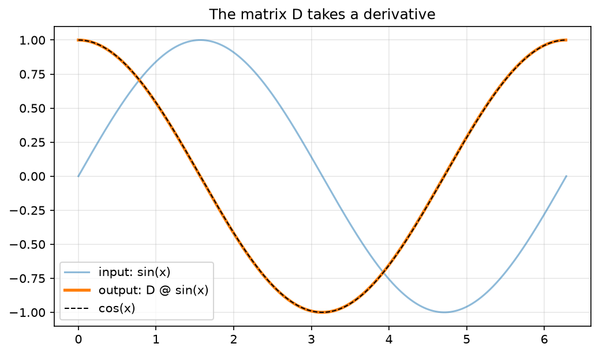
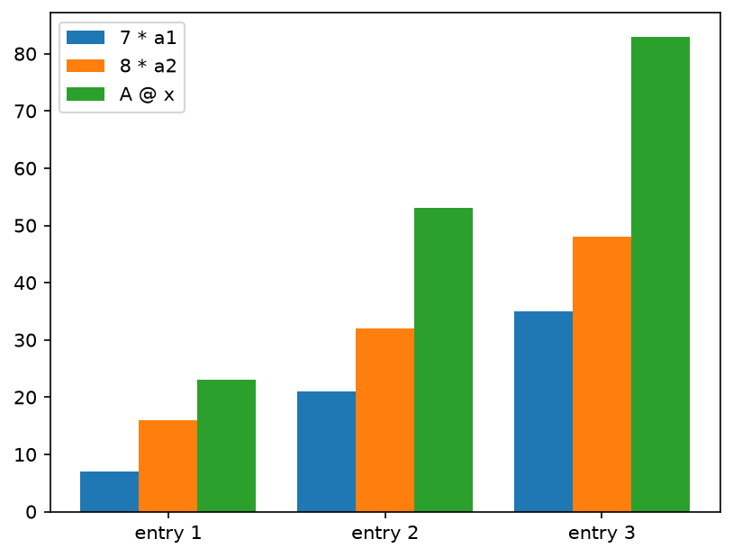
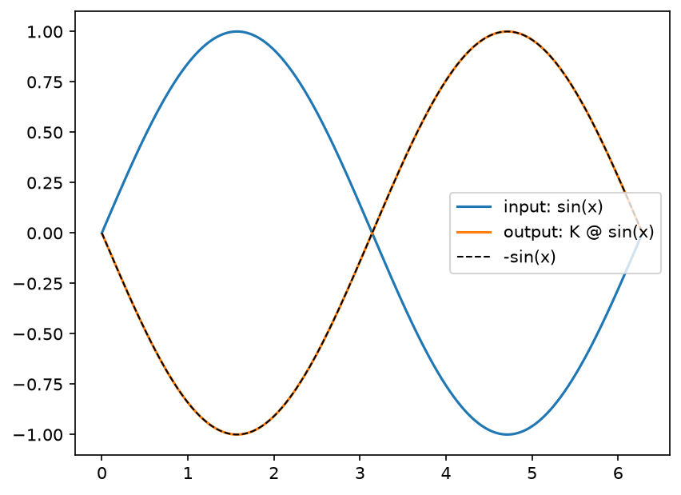
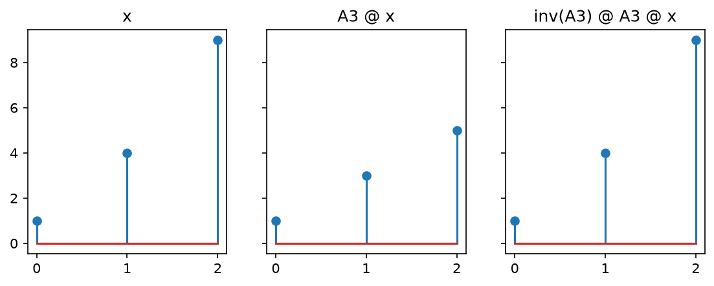
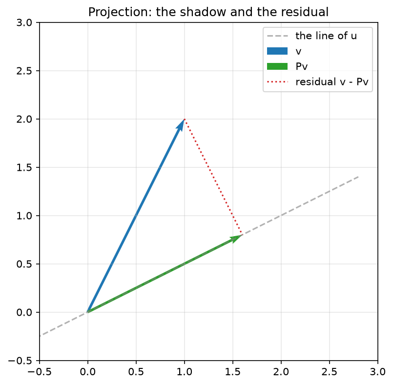

<!-- DRAFT V4 (2026-07-16): regeneration against the ruled-objectives board
     (chapter_notes/clae-objectives-ruled-2026-07-16.md). D-LED: the verb
     that differentiates opens the verb story (utility first for the
     post-calculus reader); rotations CUT to the drawer (pay Ch 10);
     composition witnessed by building K from D (backward-compose-forward);
     Claim 2.3 domain fixed (R^n -> R^m) with diagonal + D witnesses;
     transpose moved to its summoning need in the projection unit (F5);
     projection's "closest" promise-tagged to Ch 12 (F3); 2.5 slimmed to
     the two questions + two spaces (C exhibit, rank, diagnosis -> Ch 3);
     standardization keeps its affine job, one-hot/Gelman/X_g -> Ch 12
     stock, Z-building -> Ch 7 (see clae-displaced-stock.md); mean/sigma
     declared practitioner windmills in a footnote (F7); forward refs on
     the 15-chapter plan.
     Companion notebook: clae-code/ch02/ch02.ipynb NEEDS REGENERATION
     (rotation + 2.6 cells out, composition cell in, geometric_effects
     goes 2-panel).
     Words: 5231 prose / 5994 total (auto: tools/wordcount.py)-->

# Chapter 2: Matrices and Linear Transformations

## 2.1 The matrix is a verb

Chapter 1 opened on its first object by touring it through the four lenses. This chapter owes its object the same tour, so here is the matrix, seen four ways before anything happens to it.

\lensmark{data} Through the data lens, a matrix is a dataset. One vector is one record. A dataset is many records stacked, and the stack is a matrix. The Ames data ships as three files, zoning, listing, and sale, joined on a shared `Id` into the single object Chapter 1 called `housing`.

> **Definition 2.1 (data-matrix conventions).** In this book a data matrix $X$ has **rows as samples** and **columns as features**. $X$ is $m \times n$ for $m$ observations of $n$ features. The target vector is $\mathbf{y}$, one entry per sample. A feature column is a vector in $\mathbb{R}^m$; a sample row is a point in $\mathbb{R}^n$.

The convention carries two readings, and both matter. Down the columns, each column is one feature measured across every home, a vector with 1,460 entries. That is the reading Chapter 1 lived in. Across the rows, each row is one home, a single point in feature space. \lensmark{geometric} The point reading draws. Take just two coordinates, living area and sale price, and the first five homes are five points on a plane:

\begin{figure}[!htb]
\centering
\begin{tikzpicture}[scale=2.1]
  \draw[->, gray] (0.6,0.9) -- (3.1,0.9)
    node[below left] {\small GrLivArea (thousand sq ft)};
  \draw[->, gray] (0.9,0.6) -- (0.9,3.4)
    node[above right=-2pt] {\small SalePrice (\$100k)};
  \foreach \x/\y/\n in {1.710/2.085/1, 1.262/1.815/2, 1.786/2.235/3, 1.717/1.400/4, 2.198/2.500/5}
    { \fill (\x,\y) circle (1.1pt); \node[anchor=west] at (\x+0.04,\y) {\small \n}; }
  \foreach \x in {1.0,1.5,2.0} \draw[gray!50] (\x,0.88) -- (\x,0.92) node[below=3pt] {\scriptsize \x};
  \foreach \y in {1.5,2.0,2.5,3.0} \draw[gray!50] (0.88,\y) -- (0.92,\y) node[left=3pt] {\scriptsize \y};
\end{tikzpicture}
\caption{The row reading of a data matrix. The first five homes as points in living-area-and-price space, redrawn from Chapter 1.}
\end{figure}

Houses 1 through 5, plotted as points. Every row of the table is a point like these, in eighty dimensions instead of two, and the whole dataset is a cloud of 1,460 of them. One object, two readings: columns are the vectors of Chapter 1, rows are points in feature space.

\lensmark{algebraic} Through the algebraic lens, a matrix is a rectangular array of numbers, $m$ rows by $n$ columns, written $A$ with entries $A_{ij}$, row index first. The pencil rules for it are this chapter's subject. \lensmark{computational} And through the computational lens it is a two-dimensional array with a shape. Listing 2.1 asks the assembled table for its shape and pulls one record and one feature, one read in each direction.

**Listing 2.1 (the container, measured)**

```python
print(housing.shape)
row_2 = housing.loc[2]         # a point in feature space
col_gr = housing['GrLivArea']  # a vector in R^1460
```

```text
(1460, 80)
```

Some features, neighborhood and roof style among them, are words rather than numbers. They become vectors when the estimation part builds its design matrices. And all of this, the container, is the smaller half of what a matrix is. Multiply a matrix by a vector and the matrix does something to it. A matrix is a verb, and this chapter is about learning to read the verb.

### The verb that differentiates

The preface witnessed the first verb this book ever showed me, and now it gets built properly. A derivative, on a grid, is a matrix. Sample a function $f$ at points a distance $h$ apart, collect the samples in a vector $\mathbf{x}$ with $x_i = f(t_i)$, and build the matrix $D$ that takes differences of neighbors and divides by $h$:

\begin{align}
D = \frac{1}{h}\begin{bmatrix} -1 & 1 & & \\ & -1 & 1 & \\ & & \ddots & \ddots \\ & & & -1 \end{bmatrix}
\end{align}

\lensmark{algebraic} Do the symbolic computation before any code runs. Entry $i$ of $D\mathbf{x}$ is a linear combination of two neighboring samples, weights $-1/h$ and $1/h$:

\begin{align}
(D\mathbf{x})_i \;=\; \frac{-\,x_i + x_{i+1}}{h} \;=\; \frac{f(t_i + h) - f(t_i)}{h}
\end{align}

Look at the right-hand side. It is the difference quotient from the first week of calculus, the expression whose $h \to 0$ limit *defines* the derivative. The matrix is not approximating some formula that resembles differentiation. Row by row, it *is* differentiation, held at a finite step. Tighten the grid and the verb converges to the calculus.

\lensmark{computational} Listing 2.2 constructs $D$ on a thousand-point grid over $[0, 2\pi]$.

**Listing 2.2 (building the derivative-taker)**

```python
import numpy as np

n = 1000
x = np.linspace(0, 2*np.pi, n)
h = x[1] - x[0]
D = (np.eye(n, k=1) - np.eye(n)) / h   # forward difference
```

Listing 2.3 feeds $D$ a sampled sine and measures the worst error against the true derivative, the cosine.

**Listing 2.3 (the verb, tested on a sine)**

```python
err = np.abs(D @ np.sin(x) - np.cos(x))[:-1].max()
print(f'max |D @ sin - cos|: {err:.4f}')
```

```text
max |D @ sin - cos|: 0.0031
```

Wrong in the third decimal, and the error shrinks as the grid tightens. Nothing happened except scaling and adding. The matrix took the derivative. Listing 2.4 plots the input, the output, and the truth; Figure 2.2 is its output.

**Listing 2.4 (drawing the derivative)**

```python
import matplotlib.pyplot as plt

plt.plot(x, np.sin(x), label='input: sin(x)')
plt.plot(x[:-1], (D @ np.sin(x))[:-1], label='output: D @ sin(x)')
plt.plot(x, np.cos(x), 'k--', lw=1, label='cos(x)')
plt.legend(); plt.show()
```



> **Figure 2.2.** The input `sin(x)`, the output `D @ sin(x)`, and `cos(x)` dashed on top of it. The output sits on the cosine to within the width of the line.

## 2.2 What made it possible

Why could a matrix differentiate? Because differentiation is *linear*, and you have known that since your first calculus course without ever hearing the word used this way. The derivative of a sum is the sum of the derivatives, and constants pull out:

\begin{align}
(a f + g)' = a f' + g'
\end{align}

That pair of facts is the whole entrance requirement. Any operation that respects scaling and adding can be caught in a matrix, and only those operations can.

> **Definition 2.2 (linear transformation).** A function $T$ from vectors to vectors is a **linear transformation** when $T(c\mathbf{x} + d\mathbf{y}) = c\,T(\mathbf{x}) + d\,T(\mathbf{y})$ for all vectors $\mathbf{x}, \mathbf{y}$ and weights $c, d$.

In words, a linear transformation never disturbs a linear combination. Transform the inputs and the recipe carries over untouched. \lensmark{algebraic} Work one qualifying example and one failure, small enough to check at a desk. The doubling map $T(\mathbf{x}) = 2\mathbf{x}$ qualifies:

\begin{align}
T(c\mathbf{x} + d\mathbf{y}) = 2\,(c\mathbf{x} + d\mathbf{y}) = c\,(2\mathbf{x}) + d\,(2\mathbf{y}) = c\,T(\mathbf{x}) + d\,T(\mathbf{y})
\end{align}

Squaring every entry does not. Test it on $\mathbf{x} = (1, 2)$ with $c = 2$, $d = 0$:

\begin{align}
T(2\mathbf{x}) = T(2, 4) = (4, 16), \qquad\quad 2\,T(\mathbf{x}) = 2\,(1, 4) = (2, 8)
\end{align}

Double the input and the output quadruples. The recipe did not survive, so squaring is out. Differencing qualifies, by the calculus facts above, and the machine agrees on sampled vectors: $D(a\mathbf{x} + \mathbf{y}) = a\,D\mathbf{x} + D\mathbf{y}$ to the last bit, because every entry of $D\mathbf{x}$ is a linear combination and combinations pass through combinations. Shifting every entry by one fails too, more quietly. It moves the origin, and Section 2.6 will have to answer for that.

Here is the fact this chapter stands on, and it deserves its box early.

> **Claim 2.3 (matrices are the linear transformations).** Every $m \times n$ matrix gives a linear transformation from $\mathbb{R}^n$ to $\mathbb{R}^m$ via $T(\mathbf{x}) = A\mathbf{x}$, and every linear transformation from $\mathbb{R}^n$ to $\mathbb{R}^m$ is given by exactly one such matrix: the matrix whose $j$-th column is $T(\mathbf{e}_j)$, the image of the $j$-th standard basis vector. **The columns of $A$ are where the basis vectors land.**
>
> Witness it on the stretch map that doubles the first axis and halves the second. It sends $\mathbf{e}_1 = (1, 0)$ to $(2, 0)$ and $\mathbf{e}_2 = (0, 1)$ to $(0, \tfrac{1}{2})$. Stack the two landing spots as columns and the matrix is built, no algebra spent. The one-breath reason it always works: every $\mathbf{x}$ is a recipe in the standard basis with its own entries as the weights, and a linear $T$ carries the recipe onto the landed vectors $T(\mathbf{e}_j)$.[^landing]

[^landing]: The breath, written out. Chapter 1 showed $\mathbf{x} = x_1\mathbf{e}_1 + \cdots + x_n\mathbf{e}_n$. Apply $T$ and linearity gives $T(\mathbf{x}) = x_1 T(\mathbf{e}_1) + \cdots + x_n T(\mathbf{e}_n)$, a linear combination of the fixed vectors $T(\mathbf{e}_j)$ with weights $x_j$. Stack those fixed vectors as the columns of $A$ and the right-hand side is $A\mathbf{x}$ by definition of the product. Conversely $\mathbf{x} \mapsto A\mathbf{x}$ is linear because combinations pass through it slotwise.

\lensmark{geometric} The witness, drawn:

\begin{figure}[!htb]
\centering
\begin{tikzpicture}[scale=1.4]
  \draw[gray!40, ->] (-0.4,0) -- (2.6,0);
  \draw[gray!40, ->] (0,-0.3) -- (0,1.5);
  \draw[gray!30] (0,0) rectangle (1,1);
  \draw[->, very thick] (0,0) -- (1,0) node[below] {$\mathbf{e}_1$};
  \draw[->, very thick] (0,0) -- (0,1) node[left] {$\mathbf{e}_2$};
  \draw[gray!60, dashed] (0,0) rectangle (2,0.5);
  \draw[->, very thick, gray] (0,0) -- (2,0);
  \node[gray, below] at (2.05,-0.05) {$(2, 0)$};
  \draw[->, very thick, gray] (0,0) -- (0,0.5);
  \node[gray, left] at (-0.08,0.62) {$(0, \tfrac{1}{2})$};
  \node at (3.6,0.8) {$S = \begin{bmatrix} 2 & 0 \\ 0 & \tfrac{1}{2} \end{bmatrix}$};
\end{tikzpicture}
\caption{The columns are where the basis vectors land. The stretch map sends $\mathbf{e}_1$ to $(2,0)$ and $\mathbf{e}_2$ to $(0,\frac{1}{2})$, and stacking the landings as columns builds the diagonal matrix $S$. The unit square lands on the dashed rectangle.}
\end{figure}

Two landings, two columns, and the transformation is fully known. That is the content of the claim. To know a linear transformation completely you need to know it on $n$ inputs only, the basis, because everything else is recipes. $D$'s landings tell the same story with utility attached. $D$ sends the spike $\mathbf{e}_j$ to a dipole, $(\mathbf{e}_{j-1} - \mathbf{e}_j)/h$, which is exactly column $j$ of $D$, and differentiation-on-a-grid is nothing but those dipoles combined by the recipe. And the multiplication $A\mathbf{x}$ is not a new operation at all. It is Chapter 1's one move, a linear combination of $A$'s columns, with $\mathbf{x}$ as the recipe. The matrix is not storing its columns. It is waiting to combine them.

## 2.3 One product, two views

The matrix-vector product reads two ways, just as the data matrix did, and you should be fluent in both.

> **Definition 2.4 (matrix-vector product, both views).** For an $m \times n$ matrix $A$ with columns $\mathbf{a}_1, \ldots, \mathbf{a}_n$ and rows $\mathbf{r}_1, \ldots, \mathbf{r}_m$, the product $A\mathbf{x}$ reads two ways. **By columns**, it is the linear combination $x_1\mathbf{a}_1 + \cdots + x_n\mathbf{a}_n$. **By rows**, its $i$-th entry is the dot product $\mathbf{r}_i \cdot \mathbf{x}$.

\lensmark{algebraic} Work one product both ways. Take the $3 \times 2$ matrix and input

\begin{align}
A = \begin{bmatrix} 1 & 2 \\ 3 & 4 \\ 5 & 6 \end{bmatrix}, \qquad \mathbf{x} = \begin{bmatrix} 7 \\ 8 \end{bmatrix}
\end{align}

By rows, each output entry is a dot product, one at a time:

\begin{align}
(1, 2)\cdot(7, 8) = 23, \qquad (3, 4)\cdot(7, 8) = 53, \qquad (5, 6)\cdot(7, 8) = 83
\end{align}

By columns, the output is a single linear combination, formed all at once:

\begin{align}
7\begin{bmatrix} 1 \\ 3 \\ 5 \end{bmatrix} + 8\begin{bmatrix} 2 \\ 4 \\ 6 \end{bmatrix}
= \begin{bmatrix} 7 \\ 21 \\ 35 \end{bmatrix} + \begin{bmatrix} 16 \\ 32 \\ 48 \end{bmatrix}
= \begin{bmatrix} 23 \\ 53 \\ 83 \end{bmatrix}
\end{align}

Same sixteen multiplications, same answer, different story.

> **Claim 2.5 (the two views agree).** The row view and the column view compute the same vector.
>
> The one-breath reason: entry $i$ of the column view is $\sum_j x_j A_{ij}$, entry $i$ of the row view is $\sum_j A_{ij} x_j$, and the sums are identical term by term.

\lensmark{computational} Listing 2.5 writes each view as its own function, following the definition exactly.

**Listing 2.5 (the two views, defined)**

```python
def by_rows(A: np.ndarray, x: np.ndarray) -> np.ndarray:
    return np.array([row @ x for row in A])

def by_cols(A: np.ndarray, x: np.ndarray) -> np.ndarray:
    return sum(x[j] * A[:, j] for j in range(A.shape[1]))
```

Listing 2.6 checks both against NumPy's `@` on the worked example.

**Listing 2.6 (the two views, run)**

```python
A = np.array([[1, 2], [3, 4], [5, 6]])
x = np.array([7, 8])
print('A @ x      :', A @ x)
print('row view   :', by_rows(A, x))
print('column view:', by_cols(A, x))
```

```text
A @ x      : [23 53 83]
row view   : [23 53 83]
column view: [23 53 83]
```

The row view is how you compute by hand, one entry at a time. The column view is how you understand. The output lives in the span of the columns, always, and that fact runs the rest of the book.[^memory] Most first courses teach the row view only. This book needs you holding both.

[^memory]: The two views even have a memory address. NumPy stores arrays row-major, so walking a row is walking contiguous memory. Pandas stores DataFrames as column blocks, so pulling a feature column is the cheap direction. Your two mental pictures of a data matrix disagree about physical layout, and each library picked a side.

The column view also draws. Listing 2.7 charts the two scaled columns and their sum, entry by entry; Figure 2.4 is its output.

**Listing 2.7 (the two views, drawn)**

```python
a1, a2 = A[:, 0], A[:, 1]
pos = np.arange(3)
parts = [('7 * a1', 7 * a1), ('8 * a2', 8 * a2),
         ('A @ x', A @ x)]
for k, (name, vec) in enumerate(parts):
    plt.bar(pos + 0.27 * k, vec, width=0.27, label=name)
plt.xticks(pos + 0.27, ['entry 1', 'entry 2', 'entry 3'])
plt.legend()
```



> **Figure 2.4.** The column view drawn: seven of the first column plus eight of the second lands exactly on `A @ x`, entry by entry.

### Composition

Multiplying two matrices answers a natural question. What single action equals doing $B$, then doing $A$?

> **Definition 2.6 (matrix-matrix product).** The product $AB$ is the matrix whose $j$-th column is $A$ applied to the $j$-th column of $B$. It is built precisely so that $(AB)\mathbf{x} = A(B\mathbf{x})$ for every $\mathbf{x}$: the matrix of the composed transformation.

> **Claim 2.7 (composition works).** With $AB$ as defined, $(AB)\mathbf{x} = A(B\mathbf{x})$ for all $\mathbf{x}$, and matrix multiplication is associative.
>
> The one-breath reason: $B\mathbf{x}$ is a combination of $B$'s columns with recipe $\mathbf{x}$. Apply $A$, and linearity carries the recipe onto the vectors $A\mathbf{b}_j$, which are the columns of $AB$. Associativity is inherited from function composition, which never cared about parentheses.[^doublesum]

[^doublesum]: Exercise 4 writes the double sum out once for $2 \times 2$ matrices,
$\sum_k A_{ik} \left( \sum_j B_{kj} x_j \right) = \sum_j \left( \sum_k A_{ik} B_{kj} \right) x_j$,
and after that you may trust the functions.

Composition is why order matters and why $AB \neq BA$ in general. And the composition this book cares about first is one you have already met by name. What is differencing, twice? Alongside the forward difference $D_f$, whose entry $i$ reads $(x_{i+1} - x_i)/h$, build the backward difference $D_b$, whose entry $i$ reads $(x_i - x_{i-1})/h$. Compose them, and the middle terms interlock:

\begin{align}
(D_b D_f\,\mathbf{x})_i
= \frac{(D_f\mathbf{x})_i - (D_f\mathbf{x})_{i-1}}{h}
= \frac{x_{i+1} - 2x_i + x_{i-1}}{h^2}
\end{align}

The stencil $1, -2, 1$ down the diagonals, divided by $h^2$. That composed matrix is the **second difference matrix** $K$, the discrete second derivative, and the hero of the tradition this book grew from.[^provenance] Listing 2.8 builds both factors, composes them, checks the composition against the stencil written directly, and applies $K$ to a sampled sine.

**Listing 2.8 (differencing twice, composed and tested)**

```python
Df = (np.eye(n, k=1) - np.eye(n)) / h    # forward
Db = (np.eye(n) - np.eye(n, k=-1)) / h   # backward
K_composed = Db @ Df
K_stencil  = (np.eye(n, k=1) - 2*np.eye(n) + np.eye(n, k=-1)) / h**2

interior = np.abs(K_composed - K_stencil)[1:-1, :].max()
err2 = np.abs((K_composed @ np.sin(x) + np.sin(x))[1:-1]).max()
print(f'composition vs stencil, interior rows: {interior:.1e}')
print(f'max |K @ sin + sin|: {err2:.6f}')
```

```text
composition vs stencil, interior rows: 0.0e+00
max |K @ sin + sin|: 0.000003
```

The composition and the stencil agree exactly away from the boundary rows, where one-sided differences run out of neighbors. And $K$ applied to a sine returns the negative of the sine, to six decimal places, which is to say $K$ knows that the second derivative of $\sin$ is $-\sin$. Two verbs, one composition, and the object Chapter 4 has been waiting for.

[^provenance]: The second difference matrix is the hero of Gilbert Strang's *Computational Science and Engineering*, which builds half of applied mathematics out of it. It is also where this book started. The author first met it in an independent research project in Jussi Eloranta's quantum chemistry lab at CSUN, where the Schrödinger equation for a particle in a box collapses into an eigenproblem for exactly this matrix. See Joshua Cook, *Computational Methods in Molecular Quantum Mechanics*, Leanpub, 2016.

Seeing it beats trusting a printout. Listing 2.9 plots the sine in, $K$'s output, and the negative sine dashed on top; Figure 2.5 is its output.

**Listing 2.9 (the composition, drawn)**

```python
Ks = (K_composed @ np.sin(x))[1:-1]
plt.plot(x, np.sin(x), label='input: sin(x)')
plt.plot(x[1:-1], Ks, label='output: K @ sin(x)')
plt.plot(x, -np.sin(x), 'k--', lw=1, label='-sin(x)')
plt.legend()
```



> **Figure 2.5.** The second difference of a sine lands on the negative sine to within the width of the line. Differentiate twice by multiplying once.

### The identity and the undo

Two named matrices round out the toolkit.

> **Definition 2.8 (identity matrix).** The **identity** $I$ has ones on the diagonal and zeros elsewhere. It is the verb that does nothing, $I\mathbf{x} = \mathbf{x}$. Check it with Claim 2.3: it sends every $\mathbf{e}_j$ to itself, so its columns are the standard basis.

> **Definition 2.9 (inverse).** A square matrix $A$ is **invertible** when there is a matrix $A^{-1}$ with $A^{-1}A = I$, an undo. Applying $A$ and then $A^{-1}$ is the verb that does nothing.

The difference matrix makes the inverse concrete. What undoes taking differences? Taking running sums. \lensmark{algebraic} Work the $3 \times 3$ case by hand first. Difference the vector $(1, 4, 9)$, then running-sum the result:

\begin{align}
\begin{bmatrix} 1 \\ 4 \\ 9 \end{bmatrix}
\;\xrightarrow{\ \text{differences}\ }\;
\begin{bmatrix} 1 \\ 3 \\ 5 \end{bmatrix}
\;\xrightarrow{\ \text{running sums}\ }\;
\begin{bmatrix} 1 \\ 1+3 \\ 1+3+5 \end{bmatrix}
= \begin{bmatrix} 1 \\ 4 \\ 9 \end{bmatrix}
\end{align}

The original vector came back. Every intermediate term entered once with each sign and canceled.

> **Claim 2.10 (the inverse of differencing is summing).** The inverse of the first-difference matrix is the lower triangle of ones, the running-sum matrix.
>
> The one-breath reason is the word telescoping. The $i$-th running sum of the differences of $\mathbf{x}$ collapses to $x_i$, as the hand computation above just showed.

\lensmark{computational} Listing 2.10 asks NumPy for the inverse and applies it.

**Listing 2.10 (differencing, undone)**

```python
A3 = np.array([[1, 0, 0], [-1, 1, 0], [0, -1, 1]])  # difference
print(np.linalg.inv(A3))                            # running sums
b = np.array([1, 3, 5])
print('x = inv(A3) @ (1,3,5):', np.linalg.inv(A3) @ b)
```

```text
[[1. 0. 0.]
 [1. 1. 0.]
 [1. 1. 1.]]
x = inv(A3) @ (1,3,5): [1. 4. 9.]
```

Differentiation and integration, inverse verbs, and you have known that since calculus. Here it is again as two matrices multiplying to the identity. The fundamental theorem of calculus makes a cameo as a pair of triangles.

Listing 2.11 draws the roundtrip, one panel per stage; Figure 2.6 is its output.

**Listing 2.11 (the roundtrip, drawn)**

```python
x3 = np.array([1., 4, 9])
S3 = np.linalg.inv(A3)                 # running sums
stages = [('x', x3), ('A3 @ x', A3 @ x3),
          ('inv(A3) @ A3 @ x', S3 @ A3 @ x3)]
fig, axes = plt.subplots(1, 3, figsize=(9, 3), sharey=True)
for ax, (name, v) in zip(axes, stages):
    ax.stem(v)
    ax.set_title(name)
```



> **Figure 2.6.** A vector, its differences, and the running sums of those differences. The third panel is the first panel, recovered.

## 2.4 The stretch and the shadow

\lensmark{geometric} To read a verb you watch what it does, and the probe this book uses is the preface's unit circle. Feed every direction in the catalog through the matrix and see where the catalog lands.

The first verb to watch is one Claim 2.3 already built. A **diagonal matrix** stretches each axis by its own factor, and the diagonal entries are the factors. It is the plainest verb there is, and it is nowhere near a toy. Standardizing a dataset is multiplication by a diagonal matrix (Section 2.6), and Chapter 4 will take a well-behaved matrix apart into a diagonal heart wearing a change of basis. The second verb is the one the whole book is aimed at. Listing 2.12 builds the circle and both matrices, and verifies each fate numerically before the drawing.

**Listing 2.12 (two verbs, verified)**

```python
t = np.linspace(0, 2*np.pi, 100)
circle = np.vstack([np.cos(t), np.sin(t)])
S = np.diag([2.0, 0.5])
u = np.array([2.0, 1.0])
P = np.outer(u, u) / (u @ u)   # projection onto u
ell = S @ circle
seg = P @ circle
off_line = np.abs(u[1]*seg[0] - u[0]*seg[1]).max()
print('ellipse half-axes:', ell[0].max(), ell[1].max())
print('projected circle off the u-line by:', off_line)
```

```text
ellipse half-axes: 2.0 0.5
projected circle off the u-line by: 2.220446049250313e-16
```

The stretch doubled one half-axis and halved the other, and the projection left the circle nowhere off $\mathbf{u}$'s line. Figure 2.7 draws both fates.

\begin{figure}[!htb]
\centering
\begin{tikzpicture}[scale=1.15]
  \begin{scope}[shift={(0,0)}]
    \draw[gray!50] (0,0) circle (1);
    \draw[thick] (0,0) ellipse (2 and 0.5);
    \draw[gray!40, ->] (-2.3,0) -- (2.4,0);
    \draw[gray!40, ->] (0,-1.3) -- (0,1.35);
    \node[anchor=north] at (0,-1.45) {\small the stretch: circle $\to$ ellipse};
  \end{scope}
  \begin{scope}[shift={(6.2,0)}]
    \draw[gray!50] (0,0) circle (1);
    \draw[gray!40, ->] (-1.5,0) -- (1.7,0);
    \draw[gray!40, ->] (0,-1.3) -- (0,1.35);
    \draw[gray!60] (-1.15,-0.575) -- (1.5,0.75);
    \draw[line width=2pt] (-0.894,-0.447) -- (0.894,0.447);
    \draw[->, thick] (0,0) -- (0.894,0.447) node[below right] {$\mathbf{u}$};
    \node[anchor=north] at (0,-1.45) {\small the projection: circle $\to$ segment};
  \end{scope}
\end{tikzpicture}
\caption{The unit circle under two verbs, drawn. The stretch turns the circle into an ellipse, doubling one axis and halving the other. The projection flattens the whole circle onto a segment of $\mathbf{u}$'s line, a first look at information kept and information discarded.}
\end{figure}

The stretch distorts but destroys nothing, and an inverse diagonal undoes it. The projection is different in kind. It flattens the whole circle onto a segment, and flattening forgets. That verb, the forgetful one, is the one this book runs on, so it arrives per the creed: picture first, pencil second, formula last.

\lensmark{geometric} The picture is a shadow. Stand a vector $\mathbf{v}$ near a line and drop it straight onto the line, perpendicularly, the way the noon sun drops a stick onto the ground. The landing point is $\mathbf{v}$'s shadow on the line.

\lensmark{algebraic} The pencil work needs no formula, just the preface's dot product. Project $\mathbf{v} = (3, 4)$ onto the line of $\mathbf{u} = (2, 1)$. Score $\mathbf{v}$ against $\mathbf{u}$, calibrate by $\mathbf{u}$'s own score, and stretch $\mathbf{u}$ by the result:

\begin{align}
\mathbf{u} \cdot \mathbf{v} = 6 + 4 = 10, \qquad
\mathbf{u} \cdot \mathbf{u} = 5, \qquad
\frac{10}{5}\,\mathbf{u} = (4, 2)
\end{align}

The leftover is the residual, and it comes out perpendicular:

\begin{align}
\mathbf{v} - (4, 2) = (-1, 2), \qquad
(-1, 2) \cdot (2, 1) = -2 + 2 = 0
\end{align}

\lensmark{geometric} Integer arithmetic throughout, and it draws:

\begin{figure}[!htb]
\centering
\begin{tikzpicture}[scale=0.85]
  \draw[gray!60, thick] (-1.0,-0.5) -- (5.0,2.5);
  \node[gray, anchor=west] at (4.0,1.75) {\scriptsize the line of $\mathbf{u}$};
  \draw[->, very thick] (0,0) -- (3,4) node[above] {$\mathbf{v} = (3,4)$};
  \draw[->, very thick] (0,0) -- (4,2) node[below right] {$P\mathbf{v} = (4,2)$};
  \draw[dashed, thick] (3,4) -- (4,2) node[midway, above right] {$\mathbf{v} - P\mathbf{v}$};
  \draw (3.82,2.36) -- (3.64,2.45) -- (3.73,2.63);
\end{tikzpicture}
\caption{Projection by hand. The shadow $(4, 2)$ lies on the line of $\mathbf{u}$, and the residual $(-1, 2)$ runs perpendicularly from the shadow up to $\mathbf{v}$.}
\end{figure}

The shadow lies on the line. The residual runs perpendicularly from the shadow up to $\mathbf{v}$. Only now, with the picture seen and the numbers worked, does the formula arrive, and it needs one piece of notation first, summoned exactly when it is needed.

> **Definition 2.11 (transpose).** The **transpose** $A^\mathsf{T}$ swaps rows for columns, $(A^\mathsf{T})_{ij} = A_{ji}$. For a column vector $\mathbf{u}$, the transpose $\mathbf{u}^\mathsf{T}$ is the same numbers laid on their side, so that $\mathbf{u}^\mathsf{T}\mathbf{v}$ is the dot product written in matrix clothes and $\mathbf{u}\mathbf{u}^\mathsf{T}$ is the outer product from the preface's third way. Its deeper meaning waits for Chapter 7.

> **Definition 2.12 (orthogonal projection onto a line).** The **projection** onto the line of a nonzero vector $\mathbf{u}$ sends each vector to its shadow, $P\mathbf{v} = \dfrac{\mathbf{u} \cdot \mathbf{v}}{\mathbf{u} \cdot \mathbf{u}}\,\mathbf{u}$, with matrix $P = \dfrac{\mathbf{u}\mathbf{u}^\mathsf{T}}{\mathbf{u}^\mathsf{T}\mathbf{u}}$: score, calibrate, stretch. Chapter 12 will prove the shadow is the *closest* point of the line. This chapter proves the two properties below.

The hand computation above already previewed both.

> **Claim 2.13 (what makes a projection a projection).** $P^2 = P$ (projecting twice is projecting once), and for every $\mathbf{v}$ the residual $\mathbf{v} - P\mathbf{v}$ is orthogonal to $\mathbf{u}$.
>
> The one-breath reason: $\mathbf{u}^\mathsf{T}\mathbf{u}$ is a scalar, so the inner factors of $P^2$ collapse and $P^2 = P$. And the residual's dot product with $\mathbf{u}$ cancels exactly, as the worked example just showed at desk scale.[^projalgebra]

[^projalgebra]: The two cancellations in symbols:
$P^2 = \dfrac{\mathbf{u}(\mathbf{u}^\mathsf{T}\mathbf{u})\mathbf{u}^\mathsf{T}}{(\mathbf{u}^\mathsf{T}\mathbf{u})^2} = \dfrac{\mathbf{u}\mathbf{u}^\mathsf{T}}{\mathbf{u}^\mathsf{T}\mathbf{u}} = P$,
and
$\mathbf{u}^\mathsf{T}(\mathbf{v} - P\mathbf{v}) = \mathbf{u}^\mathsf{T}\mathbf{v} - \dfrac{(\mathbf{u}^\mathsf{T}\mathbf{u})(\mathbf{u}^\mathsf{T}\mathbf{v})}{\mathbf{u}^\mathsf{T}\mathbf{u}} = 0$.

\lensmark{computational} Listing 2.13 checks both properties at machine precision.

**Listing 2.13 (the projection properties, measured)**

```python
print('P @ P == P?  max diff:', np.abs(P @ P - P).max())
v = np.array([1.0, 2.0])
print('residual . u =', (v - P @ v) @ u)
```

```text
P @ P == P?  max diff: 1.1102230246251565e-16
residual . u = -2.220446049250313e-16
```

Listing 2.14 renders the projection picture with the machine's numbers; Figure 2.9 is its output.

**Listing 2.14 (the shadow, drawn at scale)**

```python
def arrow(vec: np.ndarray, color: str, label: str) -> None:
    plt.quiver(0, 0, vec[0], vec[1], angles='xy', scale_units='xy',
               scale=1, color=color, label=label)

arrow(v, 'tab:blue', 'v')
arrow(P @ v, 'tab:green', 'Pv')
plt.plot(*zip(v, P @ v), 'k--', lw=1)
plt.legend(); plt.show()
```



> **Figure 2.9.** The vector `v`, its shadow `Pv` on the line of `u`, and the residual `v - Pv` running perpendicularly between them.

Look at Figure 2.9 for a moment longer than it seems to deserve. A vector, its shadow inside a subspace, and a perpendicular residual. That is the drawing the preface promised as this book's destination, and it is the entire geometry of least squares in Chapter 12. The directions PCA hunts for in Chapter 11 are the lines that catch the most shadow. The stretch builds intuition. The shadow is load-bearing.

## 2.5 Running the verb backwards

Every question so far ran forward. Given $\mathbf{x}$, compute $A\mathbf{x}$. Estimation runs the other way. Given the output $\mathbf{b}$, what input produced it? The equation $A\mathbf{x} = \mathbf{b}$ asks, in column language, which recipe of $A$'s columns makes $\mathbf{b}$, and inside it hide the two standing questions this book first met at Chapter 1's membership solve.

**Existence.** Is there any solution at all? In column language, a recipe exists exactly when $\mathbf{b}$ lies in the span of the columns, and that span has waited since Chapter 1 for its permanent name.

> **Definition 2.14 (column space).** The **column space** of a matrix $A$ is the span of its columns, everything the verb $A\mathbf{x}$ can output over every input. For a data matrix, it is the complete inventory of predictions the features can make.

Chapter 1 ended its span section on the houses with exactly this object, unnamed. The span of `GrLivArea` and `OverallQual` is everything a two-weight model can predict, and whether the true price column lives inside it is an existence question with money attached.

**Uniqueness.** If a solution exists, is it the only one? Uniqueness is the license from Chapter 1. When the answer is one of a kind, any method that finds a candidate and verifies it has done the whole job.

You have in fact already run this pair once. The membership question of Chapter 1, is $(4, 7)$ in the span of $(2, 1)$ and $(1, 3)$, was the system

\begin{align}
\begin{bmatrix} 2 & 1 \\ 1 & 3 \end{bmatrix}\begin{bmatrix} c \\ d \end{bmatrix} = \begin{bmatrix} 4 \\ 7 \end{bmatrix},
\qquad\quad
\begin{aligned} 2c + d &= 4 \\ c + 3d &= 7 \end{aligned}
\quad\Longrightarrow\quad c = 1,\; d = 2
\end{align}

Existence held, elimination found the candidate, the check verified it, and independence of the two columns made it unique. Solving a system is finding the recipe. You knew the maneuver before it had a matrix wrapped around it.

Uniqueness has its own space, the mirror of the column space. Some matrices crush. They send nonzero vectors to zero, and whatever gets crushed can be added to any solution for free, killing uniqueness. The set of everything a matrix crushes deserves a name.

> **Definition 2.15 (null space).** The **null space** of $A$ is the set of all vectors it sends to zero, every $\mathbf{x}$ with $A\mathbf{x} = \mathbf{0}$.

> **Claim 2.16 (the null space is a subspace).** For any matrix $A$, the null space of $A$ is a subspace.
>
> The one-breath reason, the same three checks as Chapter 1's span claim. $A\mathbf{0} = \mathbf{0}$ puts the origin in. $A(c\mathbf{x}) = cA\mathbf{x} = \mathbf{0}$ keeps scaling in. $A(\mathbf{x} + \mathbf{y}) = \mathbf{0} + \mathbf{0}$ keeps addition in.

> **Claim 2.17 (invertibility and the null space).** A square matrix is invertible exactly when its null space is $\{\mathbf{0}\}$.
>
> The one-breath reason, in the language of the two questions: a nonzero crushed vector kills uniqueness, because adding it to any solution gives another solution with the same output. A trivial null space means the columns are independent, $n$ independent columns in $\mathbb{R}^n$ span everything, and existence and uniqueness both hold for every target. That assignment of recipe to target is the inverse.

Reach and crush, the column space and the null space, are two sides of one accounting, and Chapter 3 does the bookkeeping in full: a matrix that crushes, exhibited; all three solution outcomes, diagnosed and drawn; and the count that balances the ledger, rank against nullity, the first installment of the subject's fundamental theorem. One more pair of names points past it. When a system has more equations than unknowns it is **overdetermined**. Generally nothing satisfies every equation, and the best move is to get close; that regime is least squares, Chapter 12. When it has fewer independent directions than coordinates, the data is secretly lower-dimensional, and the game is finding the directions that matter; that regime is principal component analysis, Chapter 11. The two regimes of estimation are the two ways $A\mathbf{x} = \mathbf{b}$ can fail to be square.

## 2.6 Standardization is a transformation

The features of a data matrix arrive in whatever units the world measured them in. `GrLivArea` ranges over hundreds of square feet. `OverallQual` runs over the integers one through ten. Any model that combines them, and every linear model does nothing else, is silently adding square feet to quality points, and no comparison across their weights means anything until the columns share a scale. Putting them on one scale is itself a transformation, and reading it with this chapter's eyes is the point of this section.

**Standardization** does it in two moves, column by column. Subtract the mean, then divide by the standard deviation:[^windmill-stats]

\begin{align}
z = \frac{x - \mu}{\sigma}
\end{align}

[^windmill-stats]: Mean and standard deviation are used here as a practitioner's windmills, assumed at working strength the way elimination is. Part II rebuilds both from scratch, and Chapter 7 will do to $\sigma$ what this chapter did to the derivative: put it inside the algebra.

Every standardized column is centered at zero with standard deviation one, so a step of one in any of them means the same thing, one standard deviation of that feature.

**Honesty box.** Standardization is not a linear transformation, and this book will not pretend otherwise. The scaling half is honestly linear. Dividing each column by its $\sigma$ is multiplication by a diagonal matrix, Section 2.4's stretch pointed at data. But the centering half shifts every vector by a constant, and a shift moves the origin. That violates the quietest consequence of Definition 2.2, that every linear transformation sends $\mathbf{0}$ to $\mathbf{0}$ (set $c = d = 0$). The name for linear-plus-shift is **affine**. This is the one place in the chapter we bend the rules, we do it knowingly, and Chapter 7 will center everything in sight anyway, because covariance lives in deviations from the mean.

\lensmark{computational} Listing 2.15 standardizes the complete numeric columns and makes the transformation prove itself.

**Listing 2.15 (standardizing the numerics, with proof)**

```python
mu = X.mean().to_numpy()
sigma = X.std(ddof=0).to_numpy()
Z = (X.to_numpy(float) - mu) / sigma
print('column means after:', np.abs(Z.mean(axis=0)).max())
print('column stds after :', np.abs(Z.std(axis=0) - 1).max())
```

```text
column means after: 3.567435540277722e-14
column stds after : 2.220446049250313e-16
```

Thirty-three numeric features, all centered at zero to fourteen decimal places, all with standard deviation one to machine precision. The verification is the point. A transformation claims to put every column on one scale, so make it prove it. Listing 2.16 plots four features on both scales; Figure 2.10 is its output.

**Listing 2.16 (before and after, drawn)**

```python
fig, (raw, std) = plt.subplots(1, 2, figsize=(10, 4))
for col in ['LotArea', 'GrLivArea', 'OverallQual', 'YearBuilt']:
    raw.hist(X[col], bins=40, alpha=0.5, label=col)
    std.hist(Z[:, list(X.columns).index(col)], bins=40, alpha=0.5)
raw.legend(); raw.set_title('raw'); std.set_title('standardized')
plt.show()
```


> **Figure 2.10.** Four Ames features before and after standardization. Raw, LotArea's scale makes the others invisible. Standardized, all four occupy one comparable range.

The standardized matrix $Z$ waits here for Chapter 7, which takes dot products between its columns and calls them covariances. The rest of the design-matrix craft, turning word-features into indicator vectors and putting numerics and indicators in one currency, is estimation-part work and arrives with Chapter 12, where its trap, a dependence hiding in the indicators, gets sprung and disarmed in this chapter's vocabulary.

## 2.7 Summary and exercises

A matrix is a container and a verb, and the verb story ran in the creed's order. First it worked: $D$ took a derivative, row by row the difference quotient (Section 2.1). Then the property that made it possible got its name, linearity, and Claim 2.3 turned the name into a complete characterization: the columns are where the basis vectors land. The product reads two ways, by rows to compute and by columns to understand. Composition is multiplication, witnessed by differencing twice into $K$. The identity does nothing, the inverse undoes (telescoping), the diagonal stretches, and the projection casts shadows, idempotent with an orthogonal residual (Claim 2.13), load-bearing for Chapters 11 and 12. Running the verb backwards splits into the standing pair: existence lives in the column space (Definition 2.14), uniqueness dies in a nontrivial null space (Claims 2.16, 2.17). Standardization is the stretch pointed at data plus a disclosed shift.

Chapter 3 runs the verb backwards in earnest: solving, with the license as a working method, elimination as a factorization, and the ledger of reach and crush balanced. And $K$ is packed and waiting for Chapter 4, carrying a set of directions it refuses to tangle.

**Exercises**

1. *(pencil)* Compute `A3 @ x` for `x = (1, 4, 9)` both ways: rows as dot products, columns as a combination. Confirm you recover `(1, 3, 5)`.
2. *(pencil)* The shift matrix sends $\mathbf{e}_1 \to \mathbf{e}_2$, $\mathbf{e}_2 \to \mathbf{e}_3$, and $\mathbf{e}_3 \to \mathbf{0}$. Use Claim 2.3 to write it without any algebra, then say what it does to a sampled signal.
3. *(keyboard)* Build the forward-difference matrix `D` for `n = 10_000` and measure `max |D @ sin - cos|` again. The grid tightened tenfold. What happened to the error, and why does the symbolic computation of Section 2.1 predict it?
4. *(pencil)* Write out $(AB)\mathbf{x}$ and $A(B\mathbf{x})$ as double sums for $2 \times 2$ matrices and confirm they match, completing the argument of Claim 2.7. Once is enough.
5. *(pencil, then keyboard)* Compose the forward difference with itself, $D_f D_f$, by hand on a 4-vector. Compare the stencil you get to $K$'s, and explain the shift. Check yourself in code.
6. *(pencil)* Show that $P = \mathbf{u}\mathbf{u}^\mathsf{T}/(\mathbf{u}^\mathsf{T}\mathbf{u})$ is symmetric ($P^\mathsf{T} = P$), the property Claim 2.13 did not use. One line, using $(\mathbf{u}\mathbf{u}^\mathsf{T})^\mathsf{T} = \mathbf{u}\mathbf{u}^\mathsf{T}$.
7. *(pencil)* Project $(1, 5)$ onto the line of $(2, 1)$ by hand: score, calibrate, stretch, in an align of your own. Then verify the residual is orthogonal, and sketch the three arrows.
8. *(pencil)* Find a nonzero vector in the null space of $\begin{bmatrix} 1 & 1 \\ 1 & 1 \end{bmatrix}$, and describe the whole null space in one sentence. Which standing question does it kill, and for which targets does the other one fail?
9. *(keyboard)* Standardize `GrLivArea` and `OverallQual` by hand with Listing 2.15's two moves, and confirm each column's mean and standard deviation. Then write the scaling half as an explicit diagonal matrix acting on the centered columns.
10. *(keyboard, bridge → Ch 4)* Apply `K` to a sampled sine, `np.sin(3 * x)`, and to a random vector of the same length. Compare each output to its input. Which one came back as a scaled copy of itself, and by what factor? You have just met an eigenvector, and Chapter 4 makes it official.
