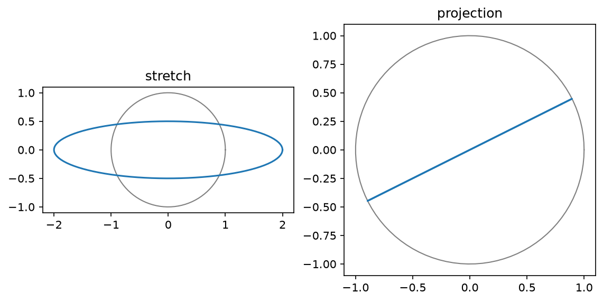

<!-- DRAFT V3 (2026-07-13): the ordered-rewrite pass, in sequence AFTER
     preface v7 and ch01 V3 land, inheriting them. Deltas from V2: the
     opening runs The Method's tour on the matrix (all four lenses,
     algebraic beat added); COLUMN SPACE is now defined HERE (Definition
     2.15, since ch01 V3 leaves it unnamed per notes 47-50), null-space
     boxes renumbered 2.16-2.18; the projection unit reordered to the
     creed (picture -> pencil -> formula last); existence/uniqueness tied
     to Chapter 1's standing pair. All V2 policy work retained (split
     listings, TikZ, boxed claims, worked aligns).
     Companion notebook: clae-code/ch02/ch02.ipynb NEEDS A SYNC PASS to
     the new listing splits (outputs unchanged).
     Words: 5904 prose / 6777 total (auto: tools/wordcount.py)-->

# Chapter 2: Matrices and Linear Transformations

## 2.1 The matrix is a verb

Chapter 1 opened on its first object by touring it through the four lenses. This chapter owes its object the same tour, so here is the matrix, seen four ways before anything happens to it.

\lensmark{data} Through the data lens, a matrix is a dataset. One vector is one record. A dataset is many records stacked, and the stack is a matrix. The Ames data ships as three files, zoning, listing, and sale, joined on a shared `Id` into the single object Chapter 1 called `housing`.

> **Definition 2.1 (data-matrix conventions).** In this book a data matrix $X$ has **rows as samples** and **columns as features**: $X$ is $m \times n$ for $m$ observations of $n$ features. The target vector is $\mathbf{y}$, one entry per sample. A feature column is a vector in $\mathbb{R}^m$; a sample row is a point in $\mathbb{R}^n$.

The convention carries two readings, and both matter. Down the columns, each column is one feature measured across every home, a vector with 1,460 entries. That is the reading Chapter 1 lived in. Across the rows, each row is one home, a single point in feature space. \lensmark{geometric} The point reading draws. Take just two coordinates, living area and sale price, and the first five homes are five points on a plane:

\begin{center}
\begin{tikzpicture}[scale=1.0]
  \draw[->, gray] (0.6,0.9) -- (3.1,0.9) node[below left] {\scriptsize GrLivArea (thousand sq ft)};
  \draw[->, gray] (0.9,0.6) -- (0.9,3.4) node[above right=-2pt] {\scriptsize SalePrice (\$100k)};
  \foreach \x/\y/\n in {1.710/2.085/1, 1.262/1.815/2, 1.786/2.235/3, 1.717/1.400/4, 2.198/2.500/5}
    { \fill (\x,\y) circle (1.8pt); \node[anchor=west] at (\x+0.05,\y) {\scriptsize \n}; }
  \foreach \x in {1.0,1.5,2.0} \draw[gray!50] (\x,0.87) -- (\x,0.93) node[below=4pt] {\tiny \x};
  \foreach \y in {1.5,2.0,2.5,3.0} \draw[gray!50] (0.87,\y) -- (0.93,\y) node[left=4pt] {\tiny \y};
\end{tikzpicture}
\end{center}

Houses 1 through 5, plotted as points. Every row of the table is a point like these, in eighty dimensions instead of two, and the whole dataset is a cloud of 1,460 of them. One object, two readings: columns are the vectors of Chapter 1, rows are points in feature space.

\lensmark{algebraic} Through the algebraic lens, a matrix is a rectangular array of numbers, $m$ rows by $n$ columns, written $A$ with entries $A_{ij}$, row index first. The pencil rules for it are this chapter's subject. \lensmark{computational} And through the computational lens it is a two-dimensional array with a shape. **Listing 2.1 (the container, measured)** asks the assembled table for its shape and pulls one record and one feature, one read in each direction.

```python
print(housing.shape)
row_2  = housing.loc[2]            # one home: a point in feature space
col_gr = housing['GrLivArea']      # one feature: a vector in R^1460
```

```text
(1460, 80)
```

Some features, neighborhood and roof style among them, are words rather than numbers; they become vectors in Section 2.5. And all of this, the container, is the smaller half of what a matrix is. Multiply a matrix by a vector and the matrix does something to it. It stretches it, turns it, flattens it, differentiates it. A matrix is a verb, and this chapter is about learning to read the verb.

The actions in question are exactly the ones that honor the two closure clauses of Chapter 1's Definition 1.4.

> **Definition 2.2 (linear transformation).** A function $T$ from vectors to vectors is a **linear transformation** when $T(c\mathbf{x} + d\mathbf{y}) = c\,T(\mathbf{x}) + d\,T(\mathbf{y})$ for all vectors $\mathbf{x}, \mathbf{y}$ and weights $c, d$.

In words, a linear transformation never disturbs a linear combination. Transform the inputs and the recipe carries over untouched. \lensmark{algebraic} Work one qualifying example and one failure, small enough to check at a desk. The doubling map $T(\mathbf{x}) = 2\mathbf{x}$ qualifies:

\begin{align}
T(c\mathbf{x} + d\mathbf{y}) = 2\,(c\mathbf{x} + d\mathbf{y}) = c\,(2\mathbf{x}) + d\,(2\mathbf{y}) = c\,T(\mathbf{x}) + d\,T(\mathbf{y})
\end{align}

Squaring every entry does not. Test it on $\mathbf{x} = (1, 2)$ with $c = 2$, $d = 0$:

\begin{align}
T(2\mathbf{x}) = T(2, 4) = (4, 16), \qquad\quad 2\,T(\mathbf{x}) = 2\,(1, 4) = (2, 8)
\end{align}

Double the input and the output quadruples. The recipe did not survive, so squaring is out. Rotation about the origin qualifies, and so does the derivative-taker you are about to meet. Shifting every entry by one fails too, more quietly; it moves the origin, and Section 2.5 will have to answer for that.

Here is the fact this chapter stands on, and it deserves its box early.

> **Claim 2.3 (matrices are the linear transformations).** Every matrix gives a linear transformation via $T(\mathbf{x}) = A\mathbf{x}$, and every linear transformation on $\mathbb{R}^n$ is given by exactly one matrix: the matrix whose $j$-th column is $T(\mathbf{e}_j)$, the image of the $j$-th standard basis vector. **The columns of $A$ are where the basis vectors land.**
>
> Witness it on the ninety-degree rotation. It sends $\mathbf{e}_1 = (1, 0)$ straight up to $(0, 1)$ and sends $\mathbf{e}_2 = (0, 1)$ left to $(-1, 0)$. Stack the two landing spots as columns and the matrix is built, no algebra spent. The one-breath reason it always works: every $\mathbf{x}$ is a recipe in the standard basis with its own entries as the weights, and a linear $T$ carries the recipe onto the landed vectors $T(\mathbf{e}_j)$.[^landing]

[^landing]: The breath, written out. Chapter 1 showed $\mathbf{x} = x_1\mathbf{e}_1 + \cdots + x_n\mathbf{e}_n$. Apply $T$ and linearity gives $T(\mathbf{x}) = x_1 T(\mathbf{e}_1) + \cdots + x_n T(\mathbf{e}_n)$, a linear combination of the fixed vectors $T(\mathbf{e}_j)$ with weights $x_j$. Stack those fixed vectors as the columns of $A$ and the right-hand side is $A\mathbf{x}$ by definition of the product. Conversely $\mathbf{x} \mapsto A\mathbf{x}$ is linear because combinations pass through it slotwise.

\lensmark{geometric} The witness, drawn:

\begin{center}
\begin{tikzpicture}[scale=1.5]
  \draw[gray!40, ->] (-1.5,0) -- (1.6,0);
  \draw[gray!40, ->] (0,-0.4) -- (0,1.6);
  \draw[->, very thick] (0,0) -- (1,0) node[below right] {$\mathbf{e}_1$};
  \draw[->, very thick] (0,0) -- (0,1) node[above right] {$\mathbf{e}_2$};
  \draw[->, very thick, gray] (0,0) -- (0,0.96);
  \node[gray, anchor=south west] at (0.04,1.06) {$T(\mathbf{e}_1) = (0,1)$};
  \draw[->, very thick, gray] (0,0) -- (-0.96,0);
  \node[gray, anchor=south east] at (-0.5,0.06) {$T(\mathbf{e}_2) = (-1,0)$};
  \draw[gray, dashed, ->] (0.9,0.25) arc (10:80:0.9);
  \node at (2.9,0.8) {$A = \begin{bmatrix} 0 & -1 \\ 1 & 0 \end{bmatrix}$};
\end{tikzpicture}
\end{center}

Two arrows land, two columns are written, and the transformation is fully known. That is the content of the claim. To know a linear transformation completely you need to know it on $n$ inputs only, the basis, because everything else is recipes. And the multiplication $A\mathbf{x}$ is not a new operation at all; it is Chapter 1's one move, a linear combination of $A$'s columns, with $\mathbf{x}$ as the recipe. The matrix is not storing its columns. It is waiting to combine them.

### The verb that differentiates

An enormous claim deserves a real exhibit, so here is the one that made the matrix a verb for me. A derivative, on a grid, is a matrix. Sample a function $f$ at points a distance $h$ apart, collect the samples in a vector $\mathbf{x}$ with $x_i = f(t_i)$, and build the matrix $D$ that takes differences of neighbors and divides by $h$:

\begin{align}
D = \frac{1}{h}\begin{bmatrix} -1 & 1 & & \\ & -1 & 1 & \\ & & \ddots & \ddots \\ & & & -1 \end{bmatrix}
\end{align}

\lensmark{algebraic} Do the symbolic computation before any code runs. Entry $i$ of $D\mathbf{x}$ is a linear combination of two neighboring samples, weights $-1/h$ and $1/h$:

\begin{align}
(D\mathbf{x})_i \;=\; \frac{-\,x_i + x_{i+1}}{h} \;=\; \frac{f(t_i + h) - f(t_i)}{h}
\end{align}

Look at the right-hand side. It is the difference quotient from the first week of calculus, the thing whose $h \to 0$ limit *defines* the derivative. The matrix is not approximating some formula that resembles differentiation. Row by row, it *is* differentiation, held at a finite step. Tighten the grid and the verb converges to the calculus.

\lensmark{computational} **Listing 2.2 (building the derivative-taker)** constructs $D$ on a thousand-point grid over $[0, 2\pi]$.

```python
import numpy as np

n = 1000
x = np.linspace(0, 2*np.pi, n)
h = x[1] - x[0]
D = (np.eye(n, k=1) - np.eye(n)) / h   # forward difference
```

**Listing 2.3 (the verb, tested on a sine)** feeds $D$ a sampled sine and measures the worst error against the true derivative, the cosine.

```python
err = np.abs(D @ np.sin(x) - np.cos(x))[:-1].max()
print(f'max |D @ sin - cos|: {err:.4f}')
```

```text
max |D @ sin - cos|: 0.0031
```

Wrong in the third decimal, and the error shrinks as the grid tightens. Nothing happened except scaling and adding. The matrix took the derivative. **Listing 2.4 (drawing the derivative)** plots the input, the output, and the truth; Figure 2.1 is its output.

```python
import matplotlib.pyplot as plt

plt.plot(x, np.sin(x), label='input: sin(x)')
plt.plot(x[:-1], (D @ np.sin(x))[:-1], label='output: D @ sin(x)')
plt.plot(x, np.cos(x), 'k--', lw=1, label='cos(x)')
plt.legend(); plt.show()
```


> **Figure 2.1.** The input `sin(x)`, the output `D @ sin(x)`, and `cos(x)` dashed on top of it. The output sits on the cosine to within the width of the line.

Apply the idea twice and you get the **second difference matrix** $K$, with $1, -2, 1$ down its diagonals, the discrete second derivative.[^provenance] **Listing 2.5 (the second difference matrix, built and tested)** constructs $K$ and applies it to the same sine.

```python
K = (np.eye(n, k=1) - 2*np.eye(n) + np.eye(n, k=-1)) / h**2
err2 = np.abs((K @ np.sin(x) + np.sin(x))[1:-1]).max()
print(f'max |K @ sin + sin|: {err2:.6f}')
```

```text
max |K @ sin + sin|: 0.000003
```

$K$ applied to a sine returns the negative of the sine, to six decimal places, which is to say $K$ knows that the second derivative of $\sin$ is $-\sin$. $K$ reappears in Chapter 3.

[^provenance]: The second difference matrix is the hero of Gilbert Strang's *Computational Science and Engineering*, which builds half of applied mathematics out of it. It is also where this book started. The author first met it in an independent research project in Jussi Eloranta's quantum chemistry lab at CSUN, where the Schrödinger equation for a particle in a box collapses into an eigenproblem for exactly this matrix. See Joshua Cook, *Computational Methods in Molecular Quantum Mechanics*, Leanpub, 2016.

## 2.2 One product, two views

The matrix-vector product reads two ways, just as the data matrix did, and you should be fluent in both.

> **Definition 2.4 (matrix-vector product, both views).** For an $m \times n$ matrix $A$ with columns $\mathbf{a}_1, \ldots, \mathbf{a}_n$ and rows $\mathbf{r}_1, \ldots, \mathbf{r}_m$, the product $A\mathbf{x}$ is: **by columns**, the linear combination $x_1\mathbf{a}_1 + \cdots + x_n\mathbf{a}_n$; **by rows**, the vector whose $i$-th entry is the dot product $\mathbf{r}_i \cdot \mathbf{x}$.

\lensmark{algebraic} Work one product both ways. Take the $3 \times 2$ matrix and input

\begin{align}
A = \begin{bmatrix} 1 & 2 \\ 3 & 4 \\ 5 & 6 \end{bmatrix}, \qquad \mathbf{x} = \begin{bmatrix} 7 \\ 8 \end{bmatrix}
\end{align}

By rows, each output entry is a dot product, one at a time:

\begin{align}
(1, 2)\cdot(7, 8) = 23, \qquad (3, 4)\cdot(7, 8) = 53, \qquad (5, 6)\cdot(7, 8) = 83
\end{align}

By columns, the output is a single linear combination, formed all at once:

\begin{align}
7\begin{bmatrix} 1 \\ 3 \\ 5 \end{bmatrix} + 8\begin{bmatrix} 2 \\ 4 \\ 6 \end{bmatrix}
= \begin{bmatrix} 7 \\ 21 \\ 35 \end{bmatrix} + \begin{bmatrix} 16 \\ 32 \\ 48 \end{bmatrix}
= \begin{bmatrix} 23 \\ 53 \\ 83 \end{bmatrix}
\end{align}

Same sixteen multiplications, same answer, different story.

> **Claim 2.5 (the two views agree).** The row view and the column view compute the same vector.
>
> The one-breath reason: entry $i$ of the column view is $\sum_j x_j A_{ij}$, entry $i$ of the row view is $\sum_j A_{ij} x_j$, and the sums are identical term by term.

\lensmark{computational} **Listing 2.6 (the two views, defined)** writes each view as its own function, following the definition exactly.

```python
def by_rows(A: np.ndarray, x: np.ndarray) -> np.ndarray:
    return np.array([row @ x for row in A])

def by_cols(A: np.ndarray, x: np.ndarray) -> np.ndarray:
    return sum(x[j] * A[:, j] for j in range(A.shape[1]))
```

**Listing 2.7 (the two views, run)** checks both against NumPy's `@` on the worked example.

```python
A = np.array([[1, 2], [3, 4], [5, 6]])
x = np.array([7, 8])
print('A @ x      :', A @ x)
print('row view   :', by_rows(A, x))
print('column view:', by_cols(A, x))
```

```text
A @ x      : [23 53 83]
row view   : [23 53 83]
column view: [23 53 83]
```

The row view is how you compute by hand, one entry at a time. The column view is how you understand. The output lives in the span of the columns, always, and that fact runs the rest of the book.[^memory] Most first courses teach the row view only. This book needs you holding both.

[^memory]: The two views even have a memory address. NumPy stores arrays row-major, so walking a row is walking contiguous memory; pandas stores DataFrames as column blocks, so pulling a feature column is the cheap direction. Your two mental pictures of a data matrix disagree about physical layout, and each library picked a side.

### Composition

Multiplying two matrices answers a natural question. What single action equals doing $B$, then doing $A$?

> **Definition 2.6 (matrix-matrix product).** The product $AB$ is the matrix whose $j$-th column is $A$ applied to the $j$-th column of $B$. It is built precisely so that $(AB)\mathbf{x} = A(B\mathbf{x})$ for every $\mathbf{x}$: the matrix of the composed transformation.

> **Claim 2.7 (composition works).** With $AB$ as defined, $(AB)\mathbf{x} = A(B\mathbf{x})$ for all $\mathbf{x}$, and matrix multiplication is associative.
>
> The one-breath reason: $B\mathbf{x}$ is a combination of $B$'s columns with recipe $\mathbf{x}$; apply $A$ and linearity carries the recipe onto the vectors $A\mathbf{b}_j$, which are the columns of $AB$. Associativity is inherited from function composition, which never cared about parentheses.[^doublesum]

[^doublesum]: Exercise 4 writes the double sum out once for $2 \times 2$ matrices,
$\sum_k A_{ik} \left( \sum_j B_{kj} x_j \right) = \sum_j \left( \sum_k A_{ik} B_{kj} \right) x_j$,
and after that you may trust the functions.

Composition is why order matters and why $AB \neq BA$ in general. Rotate then stretch is a different verb than stretch then rotate. \lensmark{geometric} And composition is where a high school memory pays off. The rotation by angle $t$ is fully known the moment you know where the two basis vectors land, and Claim 2.3 turns the landing spots into columns:

\begin{center}
\begin{tikzpicture}[scale=1.5]
  \draw[gray!40, ->] (-0.5,0) -- (1.6,0);
  \draw[gray!40, ->] (0,-0.3) -- (0,1.6);
  \draw[gray!60] (1,0) arc (0:90:1);
  \draw[->, very thick] (0,0) -- (1,0) node[below right] {$\mathbf{e}_1$};
  \draw[->, very thick] (0,0) -- (0,1) node[above left] {$\mathbf{e}_2$};
  \draw[->, very thick, gray] (0,0) -- (0.766,0.643);
  \node[gray, anchor=west] at (0.80,0.64) {$(\cos t, \sin t)$};
  \draw[->, very thick, gray] (0,0) -- (-0.643,0.766);
  \node[gray, anchor=south] at (-0.60,0.80) {$(-\sin t, \cos t)$};
  \draw[gray, dashed, ->] (0.55,0.1) arc (10:35:0.55);
  \node at (3.1,0.8) {$R(t) = \begin{bmatrix} \cos t & -\sin t \\ \sin t & \cos t \end{bmatrix}$};
\end{tikzpicture}
\end{center}

> **Claim 2.8 (rotations compose by adding angles).** $R(a)\,R(b) = R(a+b)$.
>
> Witnessed computationally below at one pair of angles; exercise 5 completes the argument by direct multiplication, and the entries that fall out are the angle-sum identities.[^trig]

[^trig]: Multiply $R(a)R(b)$ out by hand and the entries are $\cos a \cos b - \sin a \sin b$ and $\sin a \cos b + \cos a \sin b$: the angle-sum identities. The trig identity sheet you memorized in high school is one matrix multiplication. If a teacher ever showed you how the whole sheet unfolds from the angle-sum formulas, they were doing linear algebra to you early.

\lensmark{computational} **Listing 2.8 (the rotation matrix, defined)** builds $R(t)$ from its two columns.

```python
def R(t: float) -> np.ndarray:
    return np.array([[np.cos(t), -np.sin(t)],
                     [np.sin(t),  np.cos(t)]])
```

**Listing 2.9 (two rotations are one rotation)** measures the difference between rotating twice and rotating once by the sum.

```python
a, b = 0.7, 0.4
print('max |R(a) @ R(b) - R(a+b)|:', np.abs(R(a) @ R(b) - R(a + b)).max())
```

```text
max |R(a) @ R(b) - R(a+b)|: 1.6653345369377348e-16
```

Zero to machine precision. Two rotations are one rotation, and the machine knew it before you multiplied anything.

### The identity, the transpose, and the undo

Three named matrices round out the toolkit.

> **Definition 2.9 (identity matrix).** The **identity** $I$ has ones on the diagonal and zeros elsewhere; it is the verb that does nothing, $I\mathbf{x} = \mathbf{x}$. Check it with Claim 2.3: it sends every $\mathbf{e}_j$ to itself, so its columns are the standard basis.

> **Definition 2.10 (transpose).** The **transpose** $A^\mathsf{T}$ swaps rows for columns: $(A^\mathsf{T})_{ij} = A_{ji}$. Its deeper meaning waits for the dot product's return in Chapter 6; for now it is notation you will see constantly.

> **Definition 2.11 (inverse).** A square matrix $A$ is **invertible** when there is a matrix $A^{-1}$ with $A^{-1}A = I$: an undo. Applying $A$ and then $A^{-1}$ is the verb that does nothing.

The difference matrix makes the inverse concrete. What undoes taking differences? Taking running sums. \lensmark{algebraic} Work the $3 \times 3$ case by hand first. Difference the vector $(1, 4, 9)$, then running-sum the result:

\begin{align}
\begin{bmatrix} 1 \\ 4 \\ 9 \end{bmatrix}
\;\xrightarrow{\ \text{differences}\ }\;
\begin{bmatrix} 1 \\ 3 \\ 5 \end{bmatrix}
\;\xrightarrow{\ \text{running sums}\ }\;
\begin{bmatrix} 1 \\ 1+3 \\ 1+3+5 \end{bmatrix}
= \begin{bmatrix} 1 \\ 4 \\ 9 \end{bmatrix}
\end{align}

The original vector came back. Every intermediate term entered once with each sign and canceled.

> **Claim 2.12 (the inverse of differencing is summing).** The inverse of the first-difference matrix is the lower triangle of ones, the running-sum matrix.
>
> The one-breath reason is the word telescoping: the $i$-th running sum of the differences of $\mathbf{x}$ collapses to $x_i$, as the hand computation above just showed.

\lensmark{computational} **Listing 2.10 (differencing, undone)** asks NumPy for the inverse and applies it.

```python
A3 = np.array([[1, 0, 0], [-1, 1, 0], [0, -1, 1]])  # difference
print(np.linalg.inv(A3))                            # running sums
b = np.array([1, 3, 5])
print('x = inv(A3) @ (1,3,5):', np.linalg.inv(A3) @ b)
```

```text
[[1. 0. 0.]
 [1. 1. 0.]
 [1. 1. 1.]]
x = inv(A3) @ (1,3,5): [1. 4. 9.]
```

Differentiation and integration, inverse verbs, and you have known that since calculus. Here it is again as two matrices multiplying to the identity. The fundamental theorem of calculus makes a cameo as a pair of triangles.

## 2.3 Geometric effects: rotate, scale, project

\lensmark{geometric} To read a verb you watch what it does. Feed the same input, the unit circle from Chapter 1, to three matrices and compare the outputs. **Listing 2.11 (three verbs, defined)** builds the circle and the three matrices.

```python
t = np.linspace(0, 2*np.pi, 100)
circle = np.vstack([np.cos(t), np.sin(t)])
u = np.array([2.0, 1.0])
P = np.outer(u, u) / (u @ u)               # projection onto u's line
S = np.diag([2.0, 0.5])                    # scaling
# R(0.5) from Listing 2.8                   # rotation
```

**Listing 2.12 (three verbs, watched)** applies each matrix to every point of the circle and draws the three outputs; Figure 2.2 is its output.

```python
fig, axes = plt.subplots(1, 3, figsize=(12, 4))
for ax, M, name in [(axes[0], R(0.5), 'rotation'),
                    (axes[1], S, 'scaling'),
                    (axes[2], P, 'projection')]:
    out = M @ circle
    ax.plot(*circle, color='gray', lw=1)
    ax.plot(*out); ax.set_title(name); ax.set_aspect('equal')
plt.show()
```



> **Figure 2.2.** The unit circle under three verbs. Rotation turns it in place. Scaling stretches it into an ellipse, doubling one axis and halving the other. Projection flattens it onto a line.

Rotation preserves magnitudes and directions' spacing; it moves points without distorting anything. Scaling stretches each axis by its own factor; the diagonal entries are the factors. Both are useful, and both are warmups. The third panel is the one this book runs on, and per the creed it arrives picture first, pencil second, formula last.

\lensmark{geometric} The picture is a shadow. Stand a vector $\mathbf{v}$ near a line and drop it straight onto the line, perpendicularly, the way the noon sun drops a stick onto the ground. The landing point is the closest point of the line to $\mathbf{v}$.

\lensmark{algebraic} The pencil work needs no formula, just the dot product from Chapter 1. Project $\mathbf{v} = (3, 4)$ onto the line of $\mathbf{u} = (2, 1)$. Score $\mathbf{v}$ against $\mathbf{u}$, calibrate by $\mathbf{u}$'s own score, and stretch $\mathbf{u}$ by the result:

\begin{align}
\mathbf{u} \cdot \mathbf{v} = 6 + 4 = 10, \qquad
\mathbf{u} \cdot \mathbf{u} = 5, \qquad
\frac{10}{5}\,\mathbf{u} = (4, 2)
\end{align}

The leftover is the residual, and it comes out perpendicular:

\begin{align}
\mathbf{v} - (4, 2) = (-1, 2), \qquad
(-1, 2) \cdot (2, 1) = -2 + 2 = 0
\end{align}

\lensmark{geometric} Integer arithmetic throughout, and it draws:

\begin{center}
\begin{tikzpicture}[scale=0.85]
  \draw[gray!60, thick] (-1.0,-0.5) -- (5.0,2.5);
  \node[gray, anchor=west] at (4.0,1.75) {\scriptsize the line of $\mathbf{u}$};
  \draw[->, very thick] (0,0) -- (3,4) node[above] {$\mathbf{v} = (3,4)$};
  \draw[->, very thick] (0,0) -- (4,2) node[below right] {$P\mathbf{v} = (4,2)$};
  \draw[dashed, thick] (3,4) -- (4,2) node[midway, above right] {$\mathbf{v} - P\mathbf{v}$};
  \draw (3.82,2.36) -- (3.64,2.45) -- (3.73,2.63);
\end{tikzpicture}
\end{center}

The shadow lies on the line. The residual runs perpendicularly from the shadow up to $\mathbf{v}$. Only now, with the picture seen and the numbers worked, does the formula arrive, and it is nothing but the pencil recipe packed into a matrix.

> **Definition 2.13 (orthogonal projection onto a line).** The **projection** onto the line of a nonzero vector $\mathbf{u}$ sends each vector to its closest point on that line, its shadow. Its matrix is $P = \dfrac{\mathbf{u}\mathbf{u}^\mathsf{T}}{\mathbf{u}^\mathsf{T}\mathbf{u}}$, so that $P\mathbf{v} = \dfrac{\mathbf{u} \cdot \mathbf{v}}{\mathbf{u} \cdot \mathbf{u}}\,\mathbf{u}$: score, calibrate, stretch.

The hand computation above already previewed both halves of the claim.

> **Claim 2.14 (what makes a projection a projection).** $P^2 = P$ (projecting twice is projecting once), and for every $\mathbf{v}$ the residual $\mathbf{v} - P\mathbf{v}$ is orthogonal to $\mathbf{u}$.
>
> The one-breath reason: $\mathbf{u}^\mathsf{T}\mathbf{u}$ is a scalar, so the inner factors of $P^2$ collapse and $P^2 = P$; and the residual's dot product with $\mathbf{u}$ cancels exactly, as the worked example just showed at desk scale.[^projalgebra]

[^projalgebra]: The two cancellations in symbols:
$P^2 = \dfrac{\mathbf{u}(\mathbf{u}^\mathsf{T}\mathbf{u})\mathbf{u}^\mathsf{T}}{(\mathbf{u}^\mathsf{T}\mathbf{u})^2} = \dfrac{\mathbf{u}\mathbf{u}^\mathsf{T}}{\mathbf{u}^\mathsf{T}\mathbf{u}} = P$,
and
$\mathbf{u}^\mathsf{T}(\mathbf{v} - P\mathbf{v}) = \mathbf{u}^\mathsf{T}\mathbf{v} - \dfrac{(\mathbf{u}^\mathsf{T}\mathbf{u})(\mathbf{u}^\mathsf{T}\mathbf{v})}{\mathbf{u}^\mathsf{T}\mathbf{u}} = 0$.

\lensmark{computational} **Listing 2.13 (the projection properties, measured)** checks both properties at machine precision.

```python
print('P @ P == P?  max diff:', np.abs(P @ P - P).max())
v = np.array([1.0, 2.0])
print('residual . u =', (v - P @ v) @ u)
```

```text
P @ P == P?  max diff: 1.1102230246251565e-16
residual . u = -2.220446049250313e-16
```

**Listing 2.14 (the shadow, drawn at scale)** renders the projection picture with the machine's numbers; Figure 2.3 is its output.

```python
plot_vector(v, 'tab:blue', 'v')
plot_vector(P @ v, 'tab:green', 'Pv')
plt.plot(*zip(v, P @ v), 'k--', lw=1)
plt.show()
```


> **Figure 2.3.** The vector `v`, its shadow `Pv` on the line of `u`, and the residual `v - Pv` running perpendicularly between them.

Look at Figure 2.3 for a moment longer than it seems to deserve. A vector, the closest point to it inside a subspace, and a perpendicular residual. That is the drawing the preface promised as this book's destination, and it is the entire geometry of least squares in Chapter 11. The directions PCA hunts for in Chapter 10 are the lines that catch the most shadow. Rotation and scaling build intuition. Projection is load-bearing.

## 2.4 Systems: running the verb backwards

Every question so far ran forward. Given $\mathbf{x}$, compute $A\mathbf{x}$. Estimation runs the other way. Given the output $\mathbf{b}$, what input produced it? The equation $A\mathbf{x} = \mathbf{b}$ asks, in column language, which recipe of $A$'s columns makes $\mathbf{b}$. Two questions hide inside it, and they are the standing pair this book first met at Chapter 1's membership solve.

**Existence.** Is there any solution at all? In column language, a recipe exists exactly when $\mathbf{b}$ lies in the span of the columns, and that span has waited since Chapter 1 for its permanent name.

> **Definition 2.15 (column space).** The **column space** of a matrix $A$ is the span of its columns: everything the verb $A\mathbf{x}$ can output, over every input. For a data matrix, it is the complete inventory of predictions the features can make.

Chapter 1 ended its span section on the houses with exactly this object, unnamed: the span of `GrLivArea` and `OverallQual` is everything the two-weight claim can predict, and the true price column is not in it. Existence fails at housing scale, which is why estimation exists.

**Uniqueness.** If a solution exists, is it the only one? Uniqueness is the license from Chapter 1: when the answer is one of a kind, any method that finds a candidate and verifies it has done the whole job.

You have in fact already run this pair once. The membership question of Chapter 1, is $(4, 7)$ in the span of $(2, 1)$ and $(1, 3)$, was the system

\begin{align}
\begin{bmatrix} 2 & 1 \\ 1 & 3 \end{bmatrix}\begin{bmatrix} c \\ d \end{bmatrix} = \begin{bmatrix} 4 \\ 7 \end{bmatrix},
\qquad\quad
\begin{aligned} 2c + d &= 4 \\ c + 3d &= 7 \end{aligned}
\quad\Longrightarrow\quad c = 1,\; d = 2
\end{align}

Existence held, elimination found the candidate, the check verified it, and independence of the two columns made it unique. Solving a system is finding the recipe. You knew the maneuver before it had a matrix wrapped around it.

The difference matrix behaves perfectly. Its columns are independent, they span all of three-dimensional space, every $\mathbf{b}$ is reachable, and the recipe is unique: run the sums. For $\mathbf{b} = (1, 3, 5)$ the recipe is $\mathbf{x} = (1, 4, 9)$, as Claim 2.12 computed. One recipe for every target is invertibility, Definition 2.11, seen from the output side.

Now change one entry and watch the behavior collapse. Make the matrix cyclic, so each output entry is a difference and the differences wrap around. \lensmark{computational} **Listing 2.15 (the cyclic difference matrix, and what it destroys)** builds $C$ and feeds it a constant vector.

```python
C = np.array([[1, 0, -1], [-1, 1, 0], [0, -1, 1]])  # cyclic differences
print('C @ (3,3,3):', C @ np.array([3, 3, 3]))
print('rank of A3:', np.linalg.matrix_rank(A3),
      '  rank of C:', np.linalg.matrix_rank(C))
```

```text
C @ (3,3,3): [0 0 0]
rank of A3: 3   rank of C: 2
```

$C$ crushes the vector $(3, 3, 3)$ to zero, and it crushes every constant vector the same way. Shift a sequence by a constant and its wrapped differences never notice. So $C$ cannot be undone. The constant is gone, and no matrix can recover information that was destroyed. The set of everything a matrix crushes deserves a name.

> **Definition 2.16 (null space).** The **null space** of $A$ is the set of all vectors it sends to zero: every $\mathbf{x}$ with $A\mathbf{x} = \mathbf{0}$.

> **Claim 2.17 (the null space is a subspace).** For any matrix $A$, the null space of $A$ is a subspace.
>
> The one-breath reason, the same three checks as Chapter 1's span claim: $A\mathbf{0} = \mathbf{0}$ puts the origin in; $A(c\mathbf{x}) = cA\mathbf{x} = \mathbf{0}$ keeps scaling in; $A(\mathbf{x} + \mathbf{y}) = \mathbf{0} + \mathbf{0}$ keeps addition in.

For our cyclic $C$, the null space is the line of constant vectors, a one-dimensional subspace, and its existence is exactly what broke invertibility.

> **Claim 2.18 (invertibility and the null space).** A square matrix is invertible exactly when its null space is $\{\mathbf{0}\}$.
>
> The one-breath reason, in the language of the two questions: a nonzero crushed vector kills uniqueness, because adding it to any solution gives another solution with the same output. A trivial null space means the columns are independent, $n$ independent columns in $\mathbb{R}^n$ span everything, and existence and uniqueness both hold for every target. That assignment of recipe to target is the inverse.[^accounting]

[^accounting]: Chapter 11 completes the accounting alongside the other two subspaces waiting there, and the rank computed in Listing 2.15 is the reach half of it: 3 of 3 dimensions reached by the difference matrix, 2 of 3 by the cyclic one.

\lensmark{geometric} The geometry says the same thing in one look. $C$'s three columns lie in a common plane, so their span is that plane and not all of space. A target off the plane, $(1, 3, 5)$ for instance, fails existence: no recipe at all. A target on the plane fails uniqueness: infinitely many recipes, because you can slide any constant vector into $\mathbf{x}$ for free. Reach (the column space) and crush (the null space) are two sides of one accounting.

One more pair of names before returning to the data. When a system has more equations than unknowns, more measurements than recipe entries, it is **overdetermined**. Generally nothing satisfies every equation, and the best move is to get close; that regime is least squares, Chapter 11. When it has fewer independent directions than coordinates, the data is secretly lower-dimensional, and the game is finding the directions that matter; that regime is principal component analysis, Chapter 10. The two regimes of estimation are the two ways $A\mathbf{x} = \mathbf{b}$ can fail to be square.

## 2.5 Standardization is a transformation

Return to the weights from Chapter 1: $51.87 per square foot of living area and $17,604 per point of overall quality. Read carelessly, quality matters three hundred times more than size. Read carefully, the comparison is meaningless. GrLivArea ranges over hundreds of square feet, OverallQual over the integers one through ten. Each weight is denominated in its feature's units, and the units differ. The weights are answers to two different questions. To compare them we need the features on one shared scale, and putting them there is itself a transformation.

**Standardization** does it in two moves, column by column. Subtract the mean, then divide by the standard deviation:

\begin{align}
z = \frac{x - \mu}{\sigma}
\end{align}

Every standardized column is centered at zero with standard deviation one, so a step of one in any of them means the same thing: one standard deviation of that feature.

**Honesty box.** Standardization is not a linear transformation, and this book will not pretend otherwise. The scaling half is honestly linear, multiplication by a diagonal matrix. But the centering half shifts every vector by a constant, and a shift moves the origin, which violates the quietest consequence of Definition 2.2: every linear transformation sends $\mathbf{0}$ to $\mathbf{0}$ (set $c = d = 0$). The name for linear-plus-shift is **affine**. This is the one place in the chapter we bend the rules, we do it knowingly, and Chapter 6 will center everything in sight anyway, because covariance lives in deviations from the mean. Standardization is that chapter's front porch.

The word-features from Section 2.1 enter the same machinery by a different door. Give each category its own **indicator column**, a one where the category holds and zeros elsewhere, and a categorical feature becomes a small block of vectors. The move is called **one-hot encoding**. Once a word is a vector, every tool in this book applies to it. Two consequences are planted here and paid off later. Regress a price on an indicator alone and the weight you earn is a group mean, which is Chapter 5's bridge between estimation and expectation. And a full block of indicators always sums to the all-ones vector, a built-in dependence that puts a vector in the null space of any design matrix carrying them all. That trap, and the hygiene for it, is Chapter 11 business, and you now own the vocabulary it will be settled in (Definition 2.16).

Indicators also expose a seam in standardization. An indicator is already on a natural scale, zero or one, a category flip. Divide it by its standard deviation and you wreck the interpretation for no gain. Andrew Gelman's resolution is to leave the indicators alone and move the numerics to meet them. Center each numeric feature and divide by **two** standard deviations, so that a one-unit change in a scaled numeric spans a typical contrast, low to high, the same size of move as flipping an indicator.[^gelman] That gives the book its second convention, and the two leave this chapter side by side. The matrix $Z$ holds the numerics at one standard deviation, mean zero and unit scale, and feeds the covariance work of Chapters 6 and 10. The **Gelman design matrix** $X_g$ holds the numerics at two standard deviations with the indicators raw, and feeds the regressions of Chapter 11, where every coefficient will speak one currency: dollars per typical contrast.

[^gelman]: Andrew Gelman, "Scaling regression inputs by dividing by two standard deviations," *Statistics in Medicine* 27(15), 2008, pp. 2865–2873. The factor of two is not numerology. A binary variable split evenly between its two values has standard deviation one half, so a zero-to-one flip is a two-standard-deviation move. Dividing the numerics by two puts them on the indicator's scale rather than the other way around.

## 2.6 Implementation: a covariance-ready Ames, twice

The companion notebook carries the full pipeline; here are the moves that matter. \lensmark{computational} **Listing 2.16 (standardizing the numerics)** keeps the complete numeric columns and standardizes the matrix in two lines, then makes the transformation prove itself.

```python
mu = X.mean().to_numpy()
sigma = X.std(ddof=0).to_numpy()
Z = (X.to_numpy(float) - mu) / sigma
print('column means after:', np.abs(Z.mean(axis=0)).max())
print('column stds after :', np.abs(Z.std(axis=0) - 1).max())
```

```text
column means after: 3.567435540277722e-14
column stds after : 2.220446049250313e-16
```

Thirty-three numeric features, all centered at zero to fourteen decimal places, all with standard deviation one to machine precision. The verification is the point. A transformation claims to put every column on one scale, so make it prove it. **Listing 2.17 (before and after, drawn)** plots four features on both scales; Figure 2.4 is its output.

```python
fig, (raw, std) = plt.subplots(1, 2, figsize=(10, 4))
for col in ['LotArea', 'GrLivArea', 'OverallQual', 'YearBuilt']:
    raw.hist(X[col], bins=40, alpha=0.5, label=col)
    std.hist(Z[:, list(X.columns).index(col)], bins=40, alpha=0.5)
raw.legend(); raw.set_title('raw'); std.set_title('standardized')
plt.show()
```


> **Figure 2.4.** Four Ames features before and after standardization. Raw, LotArea's scale makes the others invisible; standardized, all four occupy one comparable range.

Now the payoff. **Listing 2.18 (the regression, rerun on shared units)** refits Chapter 1's regression on the standardized features, and the weights come back in one currency, dollars per standard deviation.

```python
w, *_ = np.linalg.lstsq(Zsub, y - y.mean(), rcond=None)
```

```text
weights, dollars per standard deviation:
  GrLivArea  :     29,344
  OverallQual:     45,415
```

The raw weights said living area dominates. The standardized weights say the opposite. One standard deviation of overall quality moves the price about $45,000, half again as much as a standard deviation of living area. Standardization did not change the model; it changed what the weights mean, from dollars per unit to dollars per typical variation, and the story inverted. This is the cheapest important lesson in applied linear algebra. Before you compare weights, ask what units they are wearing.

The second convention gets built in the same breath. **Listing 2.19 (the Gelman design matrix)** scales the numerics by two standard deviations, one-hot encodes the categorical columns, and keeps the indicators raw.

```python
Xg_num = (X.to_numpy(float) - mu) / (2 * sigma)
cats = housing.select_dtypes(exclude='number')
indicators = pd.get_dummies(cats)   # every level, raw 0/1
X_g = np.column_stack([Xg_num, indicators.to_numpy(float)])
```

```text
Z  : (1460, 33)   numerics at 1 sd (covariance-ready)
X_g: (1460, 284)  numerics at 2 sd + indicators raw
```

Thirty-three numeric columns and 251 indicators. The words cost more columns than the numbers. The payoff of the two-standard-deviation move is that a regression can mix the two kinds of feature and the coefficients still compare. **Listing 2.20 (one currency, numerics and words together)** prices against scaled living area, scaled quality, and the raw central-air indicator.

```python
central_air = (housing['CentralAir'] == 'Y').to_numpy(float)
Ades = np.column_stack([np.ones(len(y)), Xg_num[:, g], central_air])
w, *_ = np.linalg.lstsq(Ades, y, rcond=None)
```

```text
intercept        :    160,889
GrLivArea  (2 sd):     59,792
OverallQual(2 sd):     87,300
CentralAir (flip):     21,426
```

Read all three the same way. A typical contrast in this input moves the price by this many dollars. A typical swing in living area is worth about $60,000, in overall quality about $87,000, and having central air about $21,000. One currency, numerics and words alike. That is what $X_g$ is for.

The chapter's exit state is both matrices. $Z$: 1,460 homes, thirty-three standardized features, every column mean-zero and unit-scale, waiting for Chapter 6 to take dot products between its columns and call them covariances. $X_g$: the same homes with their words encoded, every coefficient pre-denominated in dollars per typical contrast, waiting for Chapter 11.

## 2.7 Summary and exercises

A matrix is a container and a verb, and Claim 2.3 is why the verb is knowable. Its columns are where the basis vectors land, so multiplying by it forms a linear combination of the columns with the input as the recipe. Everything else in the chapter was learning to read what the verb does. The collection so far: differencing (a derivative, shown symbolically and at the machine), running sums (its undo, Claim 2.12), rotation (composing by added angles, Claim 2.8), scaling, projection (idempotent with an orthogonal residual, Claim 2.14, and load-bearing for Chapters 10 and 11), and standardization (the affine move that makes weights comparable, bent rules disclosed). Running the verb backwards is a system $A\mathbf{x} = \mathbf{b}$, and it splits into the book's two standing questions: existence ($\mathbf{b}$ in the column space, Definition 2.15) and uniqueness (a trivial null space, Claims 2.17 and 2.18).

Chapter 3 asks the question this chapter set up. Most verbs tangle directions together; a rotation moves every vector off itself. But some directions, for some matrices, come out of the action merely stretched. Those directions are the eigenvectors, and the second difference matrix $K$ is carrying a set of them you already know by name.

**Exercises**

1. *(pencil)* Compute `A3 @ x` for `x = (1, 4, 9)` both ways: rows as dot products, columns as a combination. Confirm you recover `(1, 3, 5)`.
2. *(pencil)* The reflection across the horizontal axis sends $(x_1, x_2)$ to $(x_1, -x_2)$. Use Claim 2.3 to write its matrix without any algebra: where do $\mathbf{e}_1$ and $\mathbf{e}_2$ land? Draw the two landings.
3. *(keyboard)* Build the forward-difference matrix `D` for `n = 10_000` and measure `max |D @ sin - cos|` again. The grid tightened tenfold; what happened to the error, and why does the symbolic computation of Section 2.1 predict it?
4. *(pencil)* Write out $(AB)\mathbf{x}$ and $A(B\mathbf{x})$ as double sums for $2 \times 2$ matrices and confirm they match, completing the argument of Claim 2.7. Once is enough.
5. *(pencil)* Multiply $R(a)R(b)$ symbolically and identify the trig identities that fall out, completing the argument of Claim 2.8.
6. *(pencil)* Show that $P = \mathbf{u}\mathbf{u}^\mathsf{T}/(\mathbf{u}^\mathsf{T}\mathbf{u})$ is symmetric ($P^\mathsf{T} = P$), the property Claim 2.14 did not use. One line, using $(\mathbf{u}\mathbf{u}^\mathsf{T})^\mathsf{T} = \mathbf{u}\mathbf{u}^\mathsf{T}$.
7. *(pencil)* Project $(1, 5)$ onto the line of $(2, 1)$ by hand: dot, normalize, rescale, in an align of your own. Then verify the residual is orthogonal, and sketch the three arrows.
8. *(pencil)* Find a nonzero vector in the null space of `C` other than `(3, 3, 3)`, and describe the whole null space in one sentence.
9. *(keyboard)* Confirm computationally that `C`'s null space is one-dimensional: compute `np.linalg.matrix_rank(C)` and use rank + nullity = number of columns (take the identity on faith until Chapter 11).
10. *(keyboard)* Standardize three Ames features of your choosing and refit the Chapter 1 regression with all three. Which feature moves the price most per standard deviation? Did the raw weights predict that ranking?
11. *(keyboard)* Build `X_g`'s indicator block for `Neighborhood` alone with `pd.get_dummies`, and confirm the block's columns sum to the all-ones vector. You have exhibited the Chapter 11 dummy trap with your own hands; say which definition of this chapter the trap lives in.
12. *(keyboard, bridge → Ch 3)* Apply `K` to a sampled sine, `np.sin(3 * x)`, and to a random vector of the same length. Compare each output to its input: which one came back as a scaled copy of itself, and by what factor? You have just met an eigenvector; Chapter 3 makes it official.
