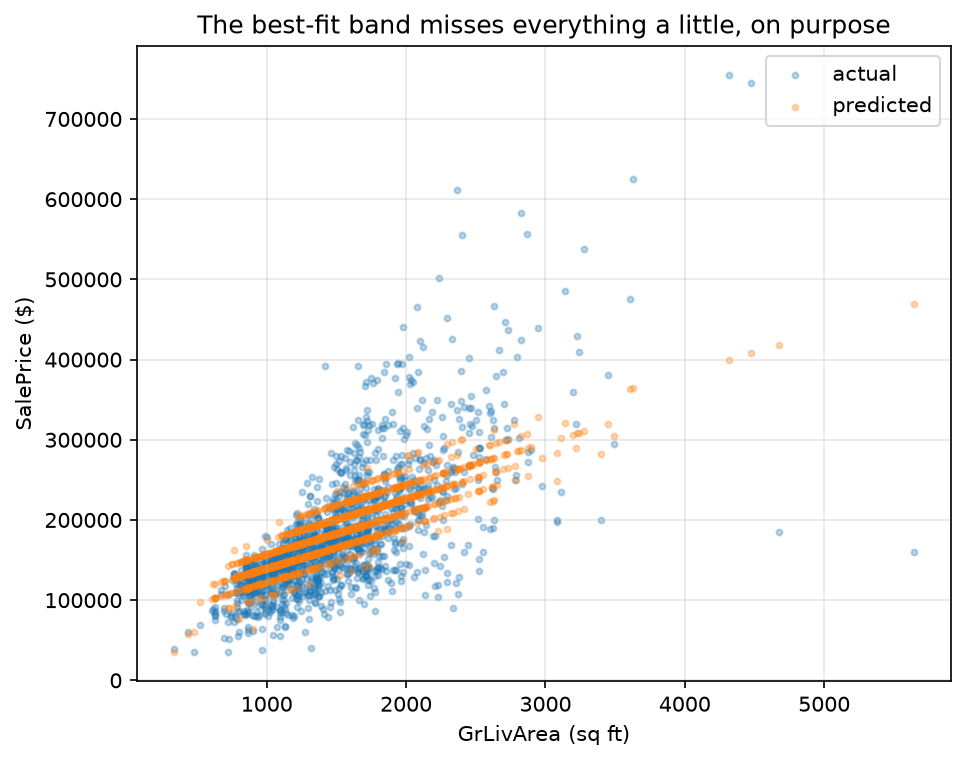

<!-- DRAFT V1 (2026-07-16): net-new chapter per the ruled-objectives board
     (chapter_notes/clae-objectives-ruled-2026-07-16.md, objectives 3a-3g).
     Born in the math-review discussion (chapter_notes/
     clae-chapter-03-solving-conversation.md): the license as a method,
     leaning on existence/uniqueness to SEE simple integer solutions.
     Receives from Ch 2: the cyclic-C crush exhibit, rank, the
     three-outcomes diagnosis. Receives from old Ch 1: the regression
     claim at the door (3g; Josh flagged 3g may split -- carries the
     claim AND the death of exactness). Rank-nullity = first installment
     of the fundamental theorem (full theorem -> Ch 12). LU from course
     L7 territory. Determinant NOT here (windmilled; used at Ch 4).
     Companion notebook: clae-code/ch03/ch03.ipynb TO BE CREATED
     (LU verify, solve residual, two-house exact solve, lstsq, miss
     table, fig_price_vs_sqft).
     Words: 3031 prose / 3486 total (auto: tools/wordcount.py)-->

# Chapter 3: Solving Linear Systems

## 3.0 The equation of Part I

Every road in this book runs through one equation:

\begin{align}
A\mathbf{x} = \mathbf{b}
\end{align}

A matrix acts on an unknown input, a known output sits on the right, and the job is to run the verb backwards. Chapter 2 posed the two standing questions and gave each one its space. Existence: does any solution exist? Yes exactly when $\mathbf{b}$ lies in the column space. Uniqueness: is the solution one of a kind? Yes exactly when the null space is trivial, because anything the matrix crushes can be added to a solution for free. This chapter turns those structural answers into working skill. By its end you can diagnose a system before touching it, see small solutions outright and prove them legitimate, run elimination when seeing fails, read the algorithm itself as a matrix factorization, and hold the machine to the same standard of proof as your own pencil.

## 3.1 Reach, crush, and the ledger

Chapter 2 promised a matrix that crushes, so here it is. Make the difference matrix cyclic, so each output entry is a difference and the differences wrap around. \lensmark{computational} Listing 3.1 builds it and feeds it a constant vector.

**Listing 3.1 (the cyclic difference matrix, and what it destroys)**

```python
import numpy as np

C = np.array([[1, 0, -1], [-1, 1, 0], [0, -1, 1]])  # cyclic differences
print('C @ (3,3,3):', C @ np.array([3, 3, 3]))
```

```text
C @ (3,3,3): [0 0 0]
```

$C$ crushes $(3, 3, 3)$ to zero, and it crushes every constant vector the same way. Shift a sequence by a constant and its wrapped differences never notice. The null space of $C$ is the whole line of constant vectors, so uniqueness is dead on arrival: if $A\mathbf{x} = \mathbf{b}$ has any solution, adding $(1, 1, 1)$ gives another. \lensmark{geometric} Existence is wounded too. $C$'s three columns lie in a common plane, so the column space is that plane and not all of space, and any target off the plane is unreachable.

Reach and crush are not independent failures. They are two entries in one ledger, and the ledger balances. The bookkeeping needs two numbers.

> **Definition 3.1 (rank, nullity).** The **rank** of a matrix is the dimension of its column space, the number of dimensions the verb can reach. The **nullity** is the dimension of its null space, the number of directions the verb crushes.

> **Claim 3.2 (rank and nullity balance the ledger).** For an $m \times n$ matrix, rank $+$ nullity $= n$. Every input dimension either survives into the reach or dies in the crush. None goes missing.
>
> Witness it on $C$: three input dimensions, a plane of reach (rank 2), a line of crush (nullity 1), and $2 + 1 = 3$. The one-breath reason: pick a basis for the null space and extend it to a basis of $\mathbb{R}^n$; the extension vectors map to a basis of the column space, because anything their images failed to reach would trace back to more crush.[^ftla]

[^ftla]: This is the first installment of what Strang calls the fundamental theorem of linear algebra. The full theorem has four subspaces and a pair of right angles between them, and it arrives with the machinery that needs it, in Chapter 12.

\lensmark{computational} The machine keeps this ledger on request. Listing 3.2 audits $C$ against the well-behaved difference matrix from Chapter 2.

**Listing 3.2 (the ledger, audited)**

```python
A3 = np.array([[1, 0, 0], [-1, 1, 0], [0, -1, 1]])  # difference
for name, M in [('A3', A3), ('C ', C)]:
    r = np.linalg.matrix_rank(M)
    print(f'{name}: rank {r}, nullity {M.shape[1] - r}')
```

```text
A3: rank 3, nullity 0
C : rank 2, nullity 1
```

Rank 3 of 3 means full reach and no crush. Rank 2 of 3 means a plane of reach and a line of crush. Everything this chapter does flows from that one audit.

## 3.2 Three outcomes, diagnosed

Cross the two questions and $A\mathbf{x} = \mathbf{b}$ has exactly three possible fates. \lensmark{geometric} Each one draws:

\begin{figure}[!htb]
\centering
\begin{tikzpicture}[scale=0.72]
  \begin{scope}[shift={(0,0)}]
    \fill[gray!12] (-1.5,-0.9) -- (1.7,-0.9) -- (2.5,0.7) -- (-0.7,0.7) -- cycle;
    \draw[->, very thick] (0,0) -- (1.4,0.25) node[right] {$\mathbf{b}$};
    \node[anchor=north] at (0.5,-1.1) {\scriptsize one solution};
    \node[gray, anchor=south] at (0.5,0.75) {\tiny full reach, no crush};
  \end{scope}
  \begin{scope}[shift={(5.6,0)}]
    \fill[gray!12] (-1.5,-0.9) -- (1.7,-0.9) -- (2.5,0.7) -- (-0.7,0.7) -- cycle;
    \draw[->, very thick] (0,0) -- (0.7,1.6) node[above] {$\mathbf{b}$};
    \node[anchor=north] at (0.5,-1.1) {\scriptsize no solution};
    \node[gray, anchor=south] at (0.5,0.75) {\tiny $\mathbf{b}$ off the reach};
  \end{scope}
  \begin{scope}[shift={(11.2,0)}]
    \fill[gray!12] (-1.5,-0.9) -- (1.7,-0.9) -- (2.5,0.7) -- (-0.7,0.7) -- cycle;
    \draw[->, very thick] (0,0) -- (1.4,0.25) node[right] {$\mathbf{b}$};
    \draw[gray, thick, dashed] (-0.9,-0.6) -- (1.1,1.1);
    \node[anchor=north] at (0.5,-1.1) {\scriptsize infinitely many};
    \node[gray, anchor=south] at (0.5,0.75) {\tiny reached, with crush to spare};
  \end{scope}
\end{tikzpicture}
\caption{The three fates of $A\mathbf{x} = \mathbf{b}$. Left, the target is reachable and nothing is crushed, so exactly one recipe exists. Middle, the target lies off the column space and no recipe exists. Right, the target is reachable but the null space (dashed) is nontrivial, so a whole family of recipes reaches it.}
\end{figure}

The diagnosis runs on the audit, before any solving. If $\mathbf{b}$ is outside the column space, stop: no solution, and Chapter 12 will teach you to get close instead. If $\mathbf{b}$ is inside and the nullity is zero, exactly one solution exists, and the hunt is licensed. If $\mathbf{b}$ is inside and the nullity is positive, solutions form a family, one particular solution plus anything from the null space. Run all three on the two matrices in hand. The difference matrix $A_3$ reaches everything and crushes nothing: one solution for every target. The cyclic $C$ with $\mathbf{b} = (1, 3, 5)$: the target is off the plane, no solution. The same $C$ with a target on the plane, say $\mathbf{b} = C(1, 2, 3) = (-2, 1, 1)$: reached, but the constants come free, so $(1, 2, 3) + t(1, 1, 1)$ solves for every $t$.

## 3.3 Seeing solutions: the license as a method

Now to actually find recipes, and the first method is the one Jim opened his course with, the one this book has been carrying since the preface. Uniqueness is a license. When the diagnosis says exactly one solution exists, then *any* way of producing a candidate is legitimate, provided you verify it, because a verified candidate and a unique answer must be the same object. The most poo-pooed method in mathematics is suddenly rigorous. Look at the system until you see the answer.

\lensmark{algebraic} See one. The columns are independent (diagnose first), so the license holds:

\begin{align}
\begin{aligned} x + y &= 5 \\ x - y &= 1 \end{aligned}
\end{align}

Two numbers that sum to 5 and differ by 1. You can *see* $(3, 2)$. Verify: $3 + 2 = 5$, and $3 - 2 = 1$. Done, with full rigor, and nothing was eliminated. The verification is not a courtesy. It is the entire proof, and the license is what makes it sufficient.

See another:

\begin{align}
\begin{aligned} 2x + y &= 7 \\ x + y &= 4 \end{aligned}
\end{align}

The equations differ by exactly $x$, so $x = 3$, and then $y = 1$. Verify: $6 + 1 = 7$, and $3 + 1 = 4$. Done again. Structure, not procedure, produced the answer, and the check made it law.

This is not a party trick. It is how working mathematicians actually treat small systems, and it is the method this book reaches for first everywhere: guess the eigenvector and multiply (Chapter 4 lives on this), guess the inverse and compose, guess the solution and substitute. The reflex to train is diagnose, see, verify. Elimination is for the systems that refuse to be seen.

## 3.4 Elimination, owned

The preface restored elimination as a windmill. This section makes it yours, because from here on the book uses it without narration. The method: subtract multiples of one equation from the others to kill unknowns, march the zeros in below the diagonal, then climb back up. \lensmark{algebraic} The full 3×3, worked in matrix form:

\begin{align}
\begin{bmatrix} 1 & 2 & 1 \\ 2 & 5 & 4 \\ 1 & 3 & 5 \end{bmatrix}
\begin{bmatrix} x \\ y \\ z \end{bmatrix}
= \begin{bmatrix} 5 \\ 13 \\ 12 \end{bmatrix}
\end{align}

Row 2 minus twice row 1, and row 3 minus row 1, kill the first column below the pivot. Then row 3 minus the new row 2 kills the second:

\begin{align}
\begin{bmatrix} 1 & 2 & 1 \\ 2 & 5 & 4 \\ 1 & 3 & 5 \end{bmatrix}
\;\longrightarrow\;
\begin{bmatrix} 1 & 2 & 1 \\ 0 & 1 & 2 \\ 0 & 1 & 4 \end{bmatrix}
\;\longrightarrow\;
\begin{bmatrix} 1 & 2 & 1 \\ 0 & 1 & 2 \\ 0 & 0 & 2 \end{bmatrix},
\qquad
\mathbf{b} \longrightarrow \begin{bmatrix} 5 \\ 3 \\ 4 \end{bmatrix}
\end{align}

Triangular, so back substitution climbs: $2z = 4$ gives $z = 2$; then $y = 3 - 2(2) = -1$; then $x = 5 - 2(-1) - 2 = 5$. And per Section 3.3's discipline, verify the candidate against the original system: $5 + 2(-1) + 2 = 5$, and $2(5) + 5(-1) + 4(2) = 13$, and $5 + 3(-1) + 5(2) = 12$. All three hold. The recipe is $(5, -1, 2)$, and the diagnosis (three independent columns, rank 3) says it is the only one.

## 3.5 The algorithm is a factorization

Here is the payoff Chapter 2 set up, and it is the reason this chapter sits after the matrix and not before it. Every move elimination made was itself a linear transformation, so by Claim 2.3 every move is a matrix. "Row 2 minus twice row 1" is the identity with a $-2$ planted below the diagonal. Elimination is not a procedure that happens *to* matrices. It *is* matrices, composed.

Run the bookkeeping. Each elimination step is a matrix multiplying $A$ from the left, and undoing the whole sequence collects the multipliers, exactly the numbers you used, into a lower triangle $L$. What remains after elimination is the upper triangle $U$. The record reads:

> **Claim 3.3 (elimination is a factorization).** When elimination runs without row exchanges, it factors the matrix: $A = LU$, with $U$ the triangle elimination produced and $L$ the lower triangle holding the multipliers, ones on its diagonal.[^pivot]
>
> Witness it on the worked example. The multipliers were $2$, $1$, and $1$:
>
> $$L = \begin{bmatrix} 1 & 0 & 0 \\ 2 & 1 & 0 \\ 1 & 1 & 1 \end{bmatrix}, \quad U = \begin{bmatrix} 1 & 2 & 1 \\ 0 & 1 & 2 \\ 0 & 0 & 2 \end{bmatrix}, \quad LU = \begin{bmatrix} 1 & 2 & 1 \\ 2 & 5 & 4 \\ 1 & 3 & 5 \end{bmatrix} = A$$
>
> The one-breath reason: each step is invertible (add back what you subtracted), and the product of the undo-steps is lower triangular with the multipliers sitting where they acted.

[^pivot]: When a zero lands in a pivot position, elimination swaps rows first, and the honest factorization is $PA = LU$ with $P$ a permutation matrix. Production code pivots even when it does not strictly have to, for numerical stability, which is why the machine's $L$ and $U$ for this very matrix look different from ours and multiply back to a row-swapped $A$. Same theorem, defensive driving.

\lensmark{computational} Listing 3.3 multiplies the hand factorization back together.

**Listing 3.3 (the record, verified)**

```python
A = np.array([[1., 2, 1], [2, 5, 4], [1, 3, 5]])
L = np.array([[1., 0, 0], [2, 1, 0], [1, 1, 1]])
U = np.array([[1., 2, 1], [0, 1, 2], [0, 0, 2]])
print('max |L @ U - A|:', np.abs(L @ U - A).max())
```

```text
max |L @ U - A|: 0.0
```

Why care that the algorithm is a factorization? Because the factorization is reusable. Solving $A\mathbf{x} = \mathbf{b}$ through $LU$ is two triangular solves, one forward and one back, and when a second target $\mathbf{b}'$ arrives, the expensive part, the elimination, is already done and stored. That observation is worth more in practice than any single solve, and it is precisely what the machine does on your behalf.

## 3.6 The machine, verified

`np.linalg.solve` is the production solver, and underneath it is LAPACK running exactly the factorization of Section 3.5, pivots and all. This book's epistemology does not exempt the machine. A solver returns a candidate, and candidates get verified. The verification even has a name, the **residual**, the vector $\mathbf{b} - A\hat{\mathbf{x}}$ that measures how far the returned answer is from doing its job. Listing 3.4 solves the worked system and holds the answer to the standard of Section 3.3.

**Listing 3.4 (solve, then verify the machine)**

```python
b = np.array([5., 13, 12])
x_hat = np.linalg.solve(A, b)
print('x_hat   :', x_hat)
print('residual:', np.abs(b - A @ x_hat).max())
```

```text
x_hat   : [ 5. -1.  2.]
residual: 0.0
```

The machine found the same $(5, -1, 2)$ the pencil did, and the residual certifies it. Make the residual check a habit. It costs one multiplication, it catches everything from a mistyped matrix to a genuinely ill-behaved system, and it is the license's discipline applied to code: never trust a candidate you have not verified, no matter who produced it.

## 3.7 The door

\lensmark{data} Everything in this chapter has been square: as many equations as unknowns. Data is not square, and this section walks to the edge of the square world and looks over. The claim of estimation, met here for the first time in full, is that a linear combination of feature columns lands near the price column:

\begin{align}
\texttt{SalePrice} \;\approx\; w_1 \cdot \texttt{GrLivArea} \;+\; w_2 \cdot \texttt{OverallQual}
\end{align}

Read the right-hand side against Chapter 1's Definition 1.2. Two feature vectors, scaled by unknown weights, added. Finding weights is solving a system whose matrix has 1,460 rows, one per house, and two columns.

Start square, because square is what we can do. Keep only the first two houses, and the claim becomes an exact system, two equations in two unknowns:

\begin{align}
\begin{bmatrix} 1710 & 7 \\ 1262 & 6 \end{bmatrix}
\begin{bmatrix} w_1 \\ w_2 \end{bmatrix}
= \begin{bmatrix} 208{,}500 \\ 181{,}500 \end{bmatrix}
\end{align}

Two independent columns, rank 2, one solution. Listing 3.5 solves and verifies it.

**Listing 3.5 (two houses, priced exactly)**

```python
A2 = np.array([[1710., 7], [1262., 6]])
b2 = np.array([208500., 181500.])
w = np.linalg.solve(A2, b2)
print('w       :', np.round(w, 2))
print('residual:', np.abs(b2 - A2 @ w).max())
```

```text
w       : [  -13.67 33126.23]
residual: 0.0
```

The residual is zero. Both houses are priced perfectly. And the weights are absurd. This model pays you $13.67 for every square foot you add to your house, then bills you $33,126 per quality point to make the arithmetic come out. The system did exactly what solving does, threaded the recipe through both targets without error, and in doing so it contorted itself around the noise in two data points. An exact fit is not a good model. It is a memorization.

Now let the third house knock. House 3 has 1,786 square feet at quality 7, and it sold for \$223,500. The exact model predicts $-13.67 \cdot 1786 + 33{,}126.23 \cdot 7 = 207{,}461$, a miss of \$16,039. Append its row to the system and there are three equations, two unknowns, and a target vector that no longer lies in the column space of the 3×2 matrix. Existence has failed. No pair of weights prices all three houses, and it only gets worse from there: the full claim stacks 1,460 equations onto the same two unknowns.

This is not a defect in the houses. It is the standing condition of data, and it has a name from Chapter 2: the system is **overdetermined**. The machine will still hand you weights if you ask properly. Asked for the *best* weights over all 1,460 houses at once, `np.linalg.lstsq` returns about \$51.87 per square foot and \$17,604 per quality point, sane numbers, priced to miss every house a little instead of fitting two houses perfectly. Figure 3.2 shows the whole market against that model.



> **Figure 3.2.** Actual sale price against living area for all 1,460 homes, with the two-feature best-fit predictions overlaid. The predictions form a tight band, and the market scatters around it. No line threads every point; the band misses everything a little, on purpose.

But notice what just happened to the words. *Best* weights. Miss *a little*. Nothing in Part I defines best or little. Those words need a way to measure how wrong a miss is and a reason to prefer one distribution of misses over another, and that is probability's department. The door out of this chapter opens onto Part II, and the question walking through it is the preface's question with a sharpened edge. Of all the linear combinations available, which one is the estimate, and what exactly makes it best? Chapter 12 answers with the drawing. Everything between here and there is learning to say *best* precisely.

## 3.8 Summary and exercises

The equation is $A\mathbf{x} = \mathbf{b}$, and the two standing questions have spaces and now numbers: rank measures reach, nullity measures crush, and the ledger balances (Claim 3.2, the fundamental theorem's first installment). Diagnosis precedes solving, and the three fates are one, none, or a family. When uniqueness holds, the license is a method: see a candidate, verify it, done. When seeing fails, elimination is the systematic fallback, and elimination is not just a procedure but a factorization, $A = LU$ (Claim 3.3), reusable across targets. The machine runs the same factorization and gets held to the same standard: solve, then check the residual. And the square world ends at the door: real data is overdetermined, exact fits memorize noise (a negative price per square foot, fit perfectly), and *best* is a word Part I cannot define.

**Exercises**

1. *(pencil)* Diagnose before solving: for the cyclic matrix $C$ and target $(2, -1, -1)$, decide existence and uniqueness from rank and nullity, then exhibit either the family of solutions or the obstruction.
2. *(pencil)* See it: $x + y = 10$ and $x - y = 4$. Write the answer down without eliminating, then verify. State what licenses the method.
3. *(pencil)* See this one too: $3x + y = 10$, $x + y = 6$. What structural feature hands you $x$ immediately?
4. *(pencil)* Eliminate the system $x + y + z = 6$, $x + 2y + z = 8$, $x + y + 3z = 10$ in matrix form, watching the zeros arrive. Back-substitute, then verify your candidate against all three original equations.
5. *(pencil)* Collect your multipliers from exercise 4 into $L$, write down your $U$, and confirm $LU$ rebuilds the matrix by hand.
6. *(keyboard)* Verify exercise 5's factorization in code, then solve the same system with `np.linalg.solve` and print the residual.
7. *(keyboard)* Ask `scipy.linalg.lu` for the factorization of Section 3.4's matrix and compare its $L$ and $U$ to ours. They differ. Read the permutation matrix $P$ and explain why (the footnote to Claim 3.3 is the hint).
8. *(pencil)* A $4 \times 4$ matrix has rank 2. State its nullity, describe the solution set of $A\mathbf{x} = \mathbf{b}$ when $\mathbf{b}$ is reachable, and name the fate when it is not.
9. *(keyboard)* Pick two different houses from the Ames data, solve the 2×2 system exactly, and report the weights. Are yours absurd too? Price a third house with them and measure the miss.
10. *(keyboard, bridge → Ch 12)* Run `np.linalg.lstsq` on the full 1,460×2 system and confirm the sane weights. Compute the residual vector's largest and smallest entries. Chapter 12 earns the sense in which these weights are best; write one sentence guessing what gets minimized.
11. *(pencil, bridge → Ch 4)* The eigenvector equation is $A\mathbf{x} = \lambda\mathbf{x}$, which rearranges to $(A - \lambda I)\mathbf{x} = \mathbf{0}$. Say which of this chapter's spaces $\mathbf{x}$ must live in, and why $\lambda$ must be chosen to make that space nontrivial. You have just set up the next chapter.
