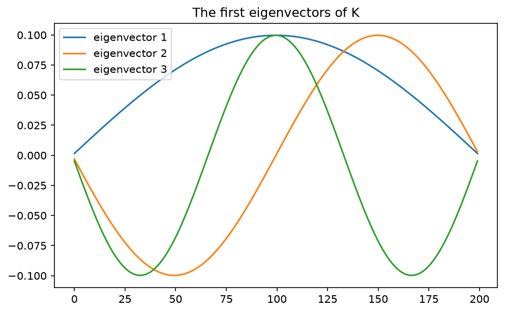

<!-- DRAFT V1 (2026-07-16): net-new chapter per the ruled-objectives board
     (chapter_notes/clae-objectives-ruled-2026-07-16.md, objectives 4a-4f).
     Eigen as Ch 3's machinery pointed at A - lambda I; determinant used
     as a WINDMILL (drawer footnote, never taught); the license's home
     turf (verify any claimed eigenpair by multiply-and-check); K's
     eigenvectors-are-sines theorem verified at machine precision
     (agreement 1.0 to ten decimals, eigenvalue formula exact); power
     method = guess-and-check made an algorithm; orbitals payoff (preface
     + Ch 1 spells promise PAID). Source: Cook, Computational Methods in
     Molecular Quantum Mechanics (2015) for the sines theorem + race;
     symmetric-matrix orthogonality teased to Ch 10/11 only.
     Companion notebook: clae-code/ch04/ch04.ipynb TO BE CREATED
     (eigenpair checks, diagonalization, K eigenvector figure, power
     method figure).
     Words: 2592 prose / 3045 total (auto: tools/wordcount.py)-->

# Chapter 4: Eigenvalues, Eigenvectors, and Diagonalization

## 4.0 The directions a verb cannot tangle

Most verbs tangle directions. Feed a matrix a vector and the output generally points somewhere new, a mix of everything the columns could reach. But for some matrices, some directions come out of the action pointing exactly where they went in, merely stretched. Chapter 2's exit caught $K$ refusing to tangle a sine. This chapter is about those directions, because a direction a verb cannot tangle is a direction along which the verb is just a number, and trading a matrix for a few numbers is the best bargain in the subject.

> **Definition 4.1 (eigenvector, eigenvalue).** A nonzero vector $\mathbf{v}$ is an **eigenvector** of a square matrix $A$ when $A\mathbf{v} = \lambda\mathbf{v}$ for some number $\lambda$, the **eigenvalue**. The pair $(\lambda, \mathbf{v})$ is an eigenpair: a direction the verb preserves, and the stretch it applies there.

\lensmark{geometric} The picture is two arrows and a verdict:

\begin{figure}[!htb]
\centering
\begin{tikzpicture}[scale=1.1]
  \draw[gray!40, ->] (-0.5,0) -- (3.4,0);
  \draw[gray!40, ->] (0,-0.5) -- (0,3.0);
  \draw[->, very thick] (0,0) -- (1,1) node[below right] {$\mathbf{v}$};
  \draw[->, very thick, gray] (0,0) -- (3,3) node[above right] {$A\mathbf{v} = 3\mathbf{v}$};
  \draw[->, very thick] (0,0) -- (1.4,0.2) node[below] {$\mathbf{w}$};
  \draw[->, very thick, gray] (0,0) -- (2.2,1.4);
  \node[gray, right] at (2.25,1.35) {$A\mathbf{w}$, tangled};
\end{tikzpicture}
\caption{The eigenvector $\mathbf{v}$ comes out of the verb on its own line, stretched by 3. The ordinary vector $\mathbf{w}$ comes out pointing somewhere new.}
\end{figure}

\lensmark{algebraic} And the verification is the cheapest check in the book, which is no accident. Take

\begin{align}
A = \begin{bmatrix} 2 & 1 \\ 1 & 2 \end{bmatrix}
\end{align}

and the two claimed eigenpairs $(3, (1, 1))$ and $(1, (1, -1))$. Multiply and look:

\begin{align}
A\begin{bmatrix} 1 \\ 1 \end{bmatrix} = \begin{bmatrix} 3 \\ 3 \end{bmatrix} = 3\begin{bmatrix} 1 \\ 1 \end{bmatrix},
\qquad\quad
A\begin{bmatrix} 1 \\ -1 \end{bmatrix} = \begin{bmatrix} 1 \\ -1 \end{bmatrix} = 1\begin{bmatrix} 1 \\ -1 \end{bmatrix}
\end{align}

Both hold, so both pairs are proven, and notice what just happened. Nobody derived anything. A candidate was claimed, one multiplication checked it, and the check settles the matter completely, because the eigenvector equation is its own verification. This chapter is the home turf of Chapter 3's license. Eigenpairs are found however they are found, by symmetry, by physics, by iteration, by a library, and then one multiply-and-check makes them law.

## 4.1 Finding them: Chapter 3's machinery, new target

Where do candidates come from when nobody hands them to you? Rearrange the definition and the answer is a chapter you have already read:

\begin{align}
A\mathbf{v} = \lambda\mathbf{v}
\quad\Longleftrightarrow\quad
(A - \lambda I)\,\mathbf{v} = \mathbf{0}
\end{align}

An eigenvector is a nonzero vector that $A - \lambda I$ crushes. It lives in the null space of $A - \lambda I$, and it exists only when that null space is nontrivial.

> **Claim 4.2 (eigenvalues are the crush points).** $\lambda$ is an eigenvalue of $A$ exactly when the null space of $A - \lambda I$ is nontrivial, and the eigenvectors for $\lambda$ are that null space's nonzero members.
>
> The one-breath reason: the rearrangement above is an equivalence, read in both directions.

So the hunt has two stages. Find the special values of $\lambda$ where $A - \lambda I$ crushes, then hand each one to Chapter 3, which knows exactly how to describe a null space. For the first stage there is a classical device: a square matrix crushes exactly when its determinant is zero, so the eigenvalues are the roots of $\det(A - \lambda I) = 0$.[^drawer] Run it on the small example:

\begin{align}
\det\begin{bmatrix} 2 - \lambda & 1 \\ 1 & 2 - \lambda \end{bmatrix}
= (2 - \lambda)^2 - 1
= \lambda^2 - 4\lambda + 3
= (\lambda - 1)(\lambda - 3)
\end{align}

Roots at $\lambda = 1$ and $\lambda = 3$, the two stretches we verified by hand. Then stage two, once per root: $A - 3I$ has rows $(-1, 1)$ and $(1, -1)$, and you can *see* its null space, the line of $(1, 1)$. Diagnose, see, verify. The whole apparatus of Chapter 3, pointed at a moving target.

[^drawer]: The preface promised the determinants would stay in the drawer until they earned their keep. This is the drawer opening, briefly, for the one job where the determinant is the honest tool: it is a single number that vanishes exactly when a square matrix crushes, and you already know how to compute it for the small cases from your first course. It is used here as a windmill, the way elimination is, and it goes back in the drawer when this section ends. On anything bigger than a hand example, nobody finds eigenvalues this way; Section 4.4 and the library both do something smarter.

## 4.2 Diagonalization: the matrix in its best basis

Collect what the small example produced. Two eigenvectors, $(1, 1)$ and $(1, -1)$, independent, so by Chapter 1 they are a basis of $\mathbb{R}^2$. Write any input in that basis and watch what $A$ does to the recipe: each basis vector merely stretches, so the recipe passes through untouched while its two weights get multiplied by 3 and 1. In its own eigenbasis, $A$ is not a tangle of rows and columns. It is two numbers.

> **Claim 4.3 (diagonalization).** If an $n \times n$ matrix $A$ has $n$ independent eigenvectors, stack them as the columns of $X$ and their eigenvalues into the diagonal matrix $\Lambda$. Then
>
> $$A = X \Lambda X^{-1},$$
>
> and the three factors read as a change of basis: $X^{-1}$ translates the input into eigen-coordinates, $\Lambda$ stretches each coordinate by its eigenvalue, and $X$ translates back.
>
> The one-breath reason: $AX = X\Lambda$ column by column is nothing but the $n$ eigenpair equations $A\mathbf{v}_j = \lambda_j \mathbf{v}_j$ laid side by side, and independence makes $X$ invertible.

\lensmark{algebraic} On the example, with Chapter 1's coordinates doing the work:

\begin{align}
X = \begin{bmatrix} 1 & 1 \\ 1 & -1 \end{bmatrix}, \qquad
\Lambda = \begin{bmatrix} 3 & 0 \\ 0 & 1 \end{bmatrix}, \qquad
X \Lambda X^{-1} = \begin{bmatrix} 2 & 1 \\ 1 & 2 \end{bmatrix} = A
\end{align}

The payoff is leverage over repetition. Applying $A$ five times means five matrix products, unless you work in the eigenbasis, where it means raising two numbers to the fifth power:

\begin{align}
A^5 = X \Lambda^5 X^{-1}
= X \begin{bmatrix} 243 & 0 \\ 0 & 1 \end{bmatrix} X^{-1}
= \begin{bmatrix} 122 & 121 \\ 121 & 122 \end{bmatrix}
\end{align}

\lensmark{computational} Listing 4.1 verifies both the factorization and the power shortcut against direct computation.

**Listing 4.1 (diagonalization, verified twice)**

```python
import numpy as np

A = np.array([[2., 1], [1, 2]])
X = np.array([[1., 1], [1, -1]])
Lam = np.diag([3., 1])
Xinv = np.linalg.inv(X)

print('max |X Lam Xinv - A|  :', np.abs(X @ Lam @ Xinv - A).max())
A5_eig = X @ np.diag([3.**5, 1.]) @ Xinv
diff5 = np.abs(A5_eig - np.linalg.matrix_power(A, 5)).max()
print('max |A^5 (eig) - A^5| :', diff5)
```

```text
max |X Lam Xinv - A|  : 0.0
max |A^5 (eig) - A^5| : 0.0
```

Dynamics, powers, exponentials, stability: everything repetitive about a matrix becomes arithmetic on its eigenvalues, which is why the eigen decomposition is the working physicist's first move and the working data scientist's second. The first move on *data* needs one more ingredient, randomness, and the covariance matrices of Part II are exactly the square symmetric matrices this machinery loves most. Chapters 10 and 11 collect that debt.

## 4.3 The waves room: K's eigenvectors are sines

Now the theorem this book has been walking toward since the preface's physics classroom. Chapter 2 composed differencing with itself into $K$, the second difference matrix, and $K$ ended that chapter refusing to tangle a sine. Here is the full statement.

> **Claim 4.4 (the eigenvectors of the second difference matrix are sines).** For the $n \times n$ matrix $-h^2 K$, with the stencil $-1, 2, -1$ and fixed ends, the eigenpairs are, for $k = 1, \ldots, n$,
>
> $$\lambda_k = 2 - 2\cos\!\left(\frac{k\pi}{n+1}\right), \qquad
> (\mathbf{v}_k)_j = \sin\!\left(\frac{jk\pi}{n+1}\right).$$
>
> Witness it by the license: substitute the sampled sine into the stencil and the trig addition formulas collapse the three terms into a multiple of the middle one.[^sinesproof] The machine's witness is Listing 4.2, and it is exact to the last digit the hardware carries.

[^sinesproof]: The one-page argument writes $\sin((j\pm1)\theta) = \sin(j\theta)\cos(\theta) \pm \cos(j\theta)\sin(\theta)$, adds the two neighbors, and watches the cosine terms cancel: $-\sin((j-1)\theta) + 2\sin(j\theta) - \sin((j+1)\theta) = (2 - 2\cos\theta)\sin(j\theta)$ with $\theta = k\pi/(n+1)$. The fixed ends are why the sine family fits: $\sin(0) = \sin((n+1)\theta) = 0$ at exactly the two phantom points beyond the matrix. Complete treatment: Strang, *Computational Science and Engineering*, ch. 1, or Cook, *Computational Methods in Molecular Quantum Mechanics*, Leanpub, 2016.

\lensmark{computational} Listing 4.2 asks LAPACK for the eigenpairs of $-h^2K$ and confronts them with the formulas.

**Listing 4.2 (the sines, confronted)**

```python
n = 200
x = np.linspace(0, 2*np.pi, n)
h = x[1] - x[0]
K = (np.eye(n, k=1) - 2*np.eye(n) + np.eye(n, k=-1)) / h**2

vals, vecs = np.linalg.eigh(-K * h * h)
order = np.argsort(vals)
vals, vecs = vals[order], vecs[:, order]

j = np.arange(1, n + 1)
for k in (1, 3):
    formula = 2 - 2*np.cos(k*np.pi/(n + 1))
    sine = np.sin(j*k*np.pi/(n + 1)); sine /= np.linalg.norm(sine)
    agree = abs(sine @ vecs[:, k - 1])
    print(f'k={k}: lambda {vals[k-1]:.10f}'
          f' vs formula {formula:.10f}')
    print(f'      sine agreement {agree:.10f}')
```

```text
k=1: lambda 0.0002442861 vs formula 0.0002442861
      sine agreement 1.0000000000
k=3: lambda 0.0021982170 vs formula 0.0021982170
      sine agreement 1.0000000000
```

Agreement 1 to ten decimal places, eigenvalues matching the formula digit for digit. Listing 4.3 draws the first three eigenvectors; Figure 4.2 is its output, and you have seen these curves before.

**Listing 4.3 (the eigenvectors, drawn)**

```python
import matplotlib.pyplot as plt

for k in range(3):
    plt.plot(vecs[:, k], label=f'eigenvector {k + 1}')
plt.legend(); plt.title('The first eigenvectors of K')
plt.show()
```



> **Figure 4.2.** The first three eigenvectors of the second difference matrix, as returned by LAPACK with no trigonometry anywhere in the code. They are sampled sine waves: one arch, two arches, three arches.

Stop and take in what this means. The matrix was built out of nothing but the arithmetic of neighboring differences. No trigonometry went in. And the directions it cannot tangle come out as the fundamental and the overtones of a vibrating string, which is why the preface's waves course and Jim's linear algebra course kept saying the same word. A basis of sinusoids is not a modeling choice in that physics. It is the eigenbasis of the second difference, and the Fourier series the waves course expanded everything into was diagonalization wearing lab clothes. The question the waves room asked, which combination of sinusoids is this signal, is Chapter 1's coordinates question, asked in $K$'s best basis.[^race]

[^race]: The 2015 paper behind this section raced the analytic formulas above against LAPACK's general-purpose eigensolver across matrix sizes. The expectation was that knowing the answer in closed form would win at every size. It did not; around $n = 100$ the tuned library overtook the formula evaluation, a lesson in respecting four decades of Fortran that this book has been teaching since its first timing race.

## 4.4 The power method: guess-and-check made an algorithm

The determinant found eigenvalues for a $2 \times 2$. Nobody finds them that way at scale, and the honest scalable idea is one this book has been practicing all along: guess, then improve the guess by checking it against the matrix. Start from any vector and just keep applying $A$. Every application stretches the input's eigen-components by their eigenvalues, so the component with the largest eigenvalue grows fastest, and the iterate swings toward its direction. Normalize as you go, and the sequence converges to the dominant eigenvector, with the stretch it experiences converging to the dominant eigenvalue. Listing 4.4 runs it on the small example, starting from a deliberately bad guess.

**Listing 4.4 (the power method)**

```python
v = np.array([1., 0.])                 # a bad guess on purpose
for _ in range(20):
    w = A @ v
    v = w / np.linalg.norm(w)
lam = v @ A @ v
print('direction:', np.round(v, 6))
print('stretch  :', round(lam, 8))
```

```text
direction: [0.707107 0.707107]
stretch  : 3.0
```

Twenty multiplications, and the bad guess has become $(1, 1)/\sqrt{2}$ with eigenvalue 3, which one final multiply-and-check certifies as an eigenpair. That is guess-and-check graduated into an algorithm: the guess is free, the improvement is one application of the verb, and the license's verification is the stopping rule. Serious eigensolvers, LAPACK's included, are descendants of this idea with better manners, and Chapter 11 will meet its most famous industrial application, the iteration that once ranked the entire web.

## 4.5 The orbitals: a promise paid

The preface made a promise that has been standing since its physics act: electron orbitals are a basis. Here is the payment, in this chapter's vocabulary.

Quantum mechanics asks a linear question. The states of a confined particle are the eigenvectors of an operator, the Hamiltonian, and the energies it can hold are the eigenvalues. For the particle in a box, the textbook first case, the Hamiltonian is built from the second derivative, and you now know precisely what happens when the second derivative is discretized: it becomes $K$, and its eigenvectors are sines. The quantum states of a particle in a box are the standing waves of Figure 4.2, and their allowed energies follow the eigenvalue formula of Claim 4.4. That is not an analogy. It is the same matrix; the author's first research project was watching the Schrödinger equation collapse into exactly the eigenproblem Listing 4.2 solves.

The hydrogen atom asks the same question with a rounder box. Its Hamiltonian's eigenvectors are the orbitals of every chemistry classroom, built from Laguerre polynomials dressed in spherical harmonics, and they form a basis of the atom's state space.[^singer] Every electron configuration is a linear combination of orbitals, which is to say: the atom has coordinates, and chemistry is bookkeeping in the atom's eigenbasis. Which combination of basis states is this electron. The preface's question, in its fourth costume, and this time the basis came from an eigenproblem.

[^singer]: The whole story, told through one atom: Stephanie Frank Singer, *Linearity, Symmetry, and Prediction in the Hydrogen Atom*, Springer, 2005. The preface read it off syllabus; this chapter is where it cashes.

## 4.6 Summary and exercises

An eigenpair is a direction the verb cannot tangle and the stretch it applies there (Definition 4.1), and its defining equation is its own verification, which makes this chapter the license's home turf. Eigenvalues are the crush points of $A - \lambda I$ (Claim 4.2), found by the determinant windmill at hand scale and by iteration at real scale. With a full set of independent eigenvectors, the matrix diagonalizes, $A = X\Lambda X^{-1}$ (Claim 4.3), a change of basis into coordinates where the verb is just numbers, and repetition becomes arithmetic. The second difference matrix's eigenvectors are sines (Claim 4.4), exactly, which is the waves room, the Fourier series, and the particle in a box all speaking at once. The power method turns guess-and-check into the seed of every industrial eigensolver. And the orbitals promise is paid: the atom has an eigenbasis, and matter does its accounting in it.

Part I ends here, with one loose thread left deliberately hanging: the eigen machinery loves square symmetric matrices best, and the most important square symmetric matrix in data science has not been built yet. It is made of randomness, and Part II starts building it.

**Exercises**

1. *(pencil)* Verify by multiply-and-check that $(5, (1, 2))$ is an eigenpair of $\begin{bmatrix} 1 & 2 \\ 4 & 3 \end{bmatrix}$. Then find the other eigenvalue with the determinant windmill and see its eigenvector from the null space.
2. *(pencil)* The matrix $\begin{bmatrix} 3 & 0 \\ 0 & 7 \end{bmatrix}$ is already diagonal. Write its eigenpairs down without computing anything, and say what Claim 4.3's $X$ is.
3. *(pencil)* Diagonalize $A = \begin{bmatrix} 2 & 1 \\ 1 & 2 \end{bmatrix}$ from this chapter's worked pairs and compute $A^{10}$ by the eigenvalue shortcut. What number dominates, and why?
4. *(pencil)* Show that if $\mathbf{v}$ is an eigenvector of $A$ with eigenvalue $\lambda$, then it is an eigenvector of $A^2$ and of $A + 5I$. With which eigenvalues?
5. *(keyboard)* Rerun Listing 4.2 at $n = 500$ and check the eigenvalue formula at $k = 10$. Then plot eigenvector 10 and count its arches.
6. *(keyboard)* Run the power method on the matrix of exercise 1 from three different starting guesses, printing the stretch estimate each iteration. How many iterations to six digits, and does the start matter?
7. *(pencil)* The power method fails on one matrix in this chapter's exercises when started from an unlucky vector. Find the failure mode by writing the starting guess in the eigenbasis.
8. *(keyboard, bridge → Ch 10)* For $A = \begin{bmatrix} 2 & 1 \\ 1 & 2 \end{bmatrix}$, compute the dot product of its two eigenvectors. They are orthogonal. Symmetric matrices always do this, and it is the single most consequential fact in Part III; Chapter 10 builds on it. Verify the same property numerically for a random symmetric matrix.
9. *(pencil, bridge → Ch 5)* The average of $n$ numbers is a linear combination with equal weights $1/n$. Part II makes the weights probabilities. Write the averaging operation on $\mathbb{R}^3$ as a matrix, and find one eigenvector you can see, with its eigenvalue.
