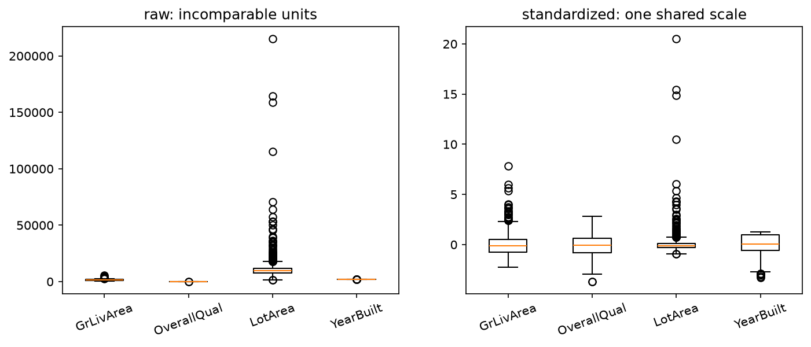

# Chapter 5: Random Vectors and Probability Spaces

Here is what this chapter does. Part I built a complete algebra of vectors and operators and posed the solving question; it ran on small exact examples because nothing more was needed. This chapter brings the data. It introduces the dataset this book lives with, gives the matrix its second identity, the dataset, with the same care Chapter 2 gave the operator, and then builds the mathematical object that data forces on us: the random variable. The payoff is the one Chapter 1 planted in its final section. A random variable is a function, a function is a vector, and every piece of Part I's machinery applies to randomness unchanged. By the chapter's end, the standing questions get asked of real numbers for the first time, and existence fails, on evidence, which is precisely why the rest of the book exists.

## 5.1 The dataset

\lensmark{data} The **Ames housing data** holds 1,460 home sales from Ames, Iowa, assembled by Dean De Cock from the county assessor's office.[^decock] Each sale carries eighty features, square footage, overall quality, roof style, neighborhood, alongside each home's actual sale price. It is the running dataset of the rest of this book, and every estimation idea between here and Chapter 15 gets tried against these houses.

[^decock]: Dean De Cock, "Ames, Iowa: Alternative to the Boston Housing Data as an End of Semester Regression Project," *Journal of Statistics Education* 19(3), 2011. He assembled it to replace the worn-out Boston housing dataset. The data itself is a download away: the [Kaggle House Prices competition](https://www.kaggle.com/c/house-prices-advanced-regression-techniques/data) ships it as csv files, and the companion repository carries the copy this book uses.

Listing 5.1 joins the three shipped files into one table.

**Listing 5.1 (assembling the houses)**

```python
import pandas as pd

zoning  = pd.read_csv('data/zoning.csv')
listing = pd.read_csv('data/listing.csv')
sale    = pd.read_csv('data/sale.csv')
housing = pd.merge(zoning, listing, on='Id')
housing = pd.merge(housing, sale, on='Id').set_index('Id')
```

Through the data lens, a feature is a vector.[^observations] `GrLivArea`, the above-ground living area, is a column of 1,460 numbers, one per home, a vector in $\mathbb{R}^{1460}$. `OverallQual`, the assessor's one-to-ten quality rating, is another. And `SalePrice`, what a buyer actually paid, is a third. Each of these columns is what a statistician calls measurements of a **random variable**. More on that in Part II; for now the name is a placed flag. \lensmark{geometric} The rows read the other way. Each home is a point whose coordinates are its features, and two of those coordinates already draw:

[^observations]: This is Chapter 1's machinery arriving intact, exactly as promised. Nothing about the algebra changes because the entries came from a county assessor instead of a formula; what changes is what the vectors are *about*, and that is this chapter's subject.

## 5.2 The matrix as data

\lensmark{data} Through the data lens, a matrix is a dataset. One vector is one record. A dataset is many records stacked, and the stack is a matrix. The Ames data ships as three files, zoning, listing, and sale, joined on a shared `Id` into the single object Listing 5.1 just assembled.

> **Definition 5.1 (data-matrix conventions).** In this book a data matrix $X$ has **rows as samples** and **columns as features**. $X$ is $m \times n$ for $m$ observations of $n$ features. The target vector is $\mathbf{y}$, one entry per sample. A feature column is a vector in $\mathbb{R}^m$, one random variable's worth of measurements; a sample row is a point in $\mathbb{R}^n$.

The convention carries two readings, and both matter. Down the columns, each column is one feature measured across every home, a vector with 1,460 entries. That is the reading Part I lived in. Across the rows, each row is one home, a single point in feature space. \lensmark{geometric} The point reading draws. Take just two coordinates, living area and sale price, and the first five homes are five points on a plane, in two dimensions, where Chapter 1 established that a point and a vector are the same object:

\begin{figure}[!htb]
\centering
\begin{tikzpicture}[scale=2.1]
  \draw[->, gray] (0.6,0.9) -- (3.1,0.9)
    node[below left] {\small GrLivArea (thousand sq ft)};
  \draw[->, gray] (0.9,0.6) -- (0.9,3.4)
    node[above right=-2pt] {\small SalePrice (\$100k)};
  \foreach \x/\y/\n in {1.710/2.085/1, 1.262/1.815/2, 1.786/2.235/3, 1.717/1.400/4, 2.198/2.500/5}
    { \fill (\x,\y) circle (1.1pt); \node[anchor=west] at (\x+0.04,\y) {\small \n}; }
  \foreach \x in {1.0,1.5,2.0} \draw[gray!50] (\x,0.88) -- (\x,0.92) node[below=3pt] {\scriptsize \x};
  \foreach \y in {1.5,2.0,2.5,3.0} \draw[gray!50] (0.88,\y) -- (0.92,\y) node[left=3pt] {\scriptsize \y};
\end{tikzpicture}
\caption{The row reading of a data matrix. The first five homes as points in living-area-and-price space, the geometric reading of a data row.}
\end{figure}

Houses 1 through 5, plotted as points. Every row of the table is a point like these, in eighty dimensions instead of two, and the whole dataset is a cloud of 1,460 of them. One object, two readings: columns are the vectors of Chapter 1, rows are points in feature space.

\lensmark{algebraic} Through the algebraic lens, a matrix is a rectangular array of numbers, $m$ rows by $n$ columns, written $A$ with entries $A_{ij}$, row index first. Chapter 2 built its operator identity; this chapter is its data identity. \lensmark{computational} And through the computational lens it is a two-dimensional array with a shape. Listing 5.2 asks the assembled table for its shape and pulls one record and one feature, one read in each direction.

**Listing 5.2 (the container, measured)**

```python
print(housing.shape)
row_2 = housing.loc[2]         # a point in feature space
col_gr = housing['GrLivArea']  # a vector in R^1460
```

```text
(1460, 80)
```

Some features, neighborhood and roof style among them, are words rather than numbers. They become vectors when the estimation part builds its design matrices.

The data identity puts Chapter 2's bookkeeping operation to daily work. 
A data matrix and its transpose (Definition 2.3) are the two readings made into two objects, samples-by-features and features-by-samples, and `housing.T` is how the machine flips between them. Chapter 7 will put the flip to structural work, building covariance out of $Z^\mathsf{T}Z$.

## 5.3 Randomness, and why data needs it

Look back at the five plotted homes. House 3 and house 1 have nearly the same living area and the same quality rating, and they sold for different prices. No amount of feature bookkeeping explains the gap, because the gap is not in the features. Two houses alike in everything a table records still differ in a thousand things it does not: the year's mortgage rates, the neighbor's yard, the buyer's morning. Measurement varies for reasons outside the measurement, and the mathematical name for modeling that variation honestly is probability.

The formal object is small, and the working version is all this book needs.

> **Definition 5.2 (probability space, working version).** A **probability space** is a set $\Omega$ of possible outcomes, the **sample space**, together with a **probability** $P$ that assigns to events (subsets of $\Omega$) a number in $[0, 1]$, with $P(\Omega) = 1$ and probabilities of mutually exclusive events adding.[^kolmogorov]

[^kolmogorov]: The full apparatus, due to Kolmogorov, restricts which subsets count as events ($\sigma$-algebras) and demands additivity over countable collections. Every space in this book is tame enough that the working version never misleads; see Chapter 6's references for the complete treatment.

Two examples calibrate the object. A fair die: $\Omega = \{1, 2, 3, 4, 5, 6\}$, each outcome weighted $\tfrac{1}{6}$, and the event "even" gets $P = \tfrac{1}{2}$. And the one this book cares about: a home sale drawn from a market. $\Omega$ is the set of sales that could occur, one outcome is one actual sale with all of its circumstances, and $P$ weights them by how the market behaves. Nobody can write this $\Omega$ down, and nobody needs to. The machinery below only ever touches outcomes through measurements taken on them, and that is the next definition's job.

## 5.4 Random variables are vectors

> **Definition 5.3 (random variable).** A **random variable** is a function from the sample space to the real numbers: $X : \Omega \to \mathbb{R}$. It measures one number on each outcome. A **random vector** collects several measurements into one function $\mathbf{X} : \Omega \to \mathbb{R}^n$, one outcome in, one point of feature space out.

Read that definition against Chapter 1's closing section. A vector in $\mathbb{R}^n$ is a function from indices to numbers. A random variable is a function from outcomes to numbers. The domains differ, the algebra does not, and the consequence deserves a box.

> **Fact 5.1 (random variables form a vector space).** Random variables on a fixed sample space, scaled and added pointwise, $(aX + Y)(\omega) = a\,X(\omega) + Y(\omega)$, satisfy both closure clauses of Definition 1.1. They form a vector space, and every Part I construction, combinations, span, independence in the linear-algebra sense, basis, applies to them verbatim.
>
> The proof is the two closure checks Chapter 1 ran for spans. Scaling a function scales its values; adding two functions adds their values; both results are again functions on $\Omega$. Nothing about closure ever cared what the domain was.

This is why Part I kept insisting that a vector is more than a list. `GrLivArea` on the Ames sample space is a random variable: hand it a sale, it hands you a square footage. `SalePrice` is another. And the object every linear model in this book will ever produce, weights times features summed, is a linear combination of random variables, alive in the vector space of Fact 5.1 before any data is observed. Estimation, from Chapter 12 on, is the search for the right combination in exactly this space.

## 5.5 Columns are realizations

A random variable is a function; data is what you get when you evaluate it. Draw an outcome $\omega_1$ from the market and record $X(\omega_1)$: one number, a **realization**. Draw 1,460 times and stack the results, and the column `GrLivArea` in the assembled table is exactly this, one random variable, realized 1,460 times:

\begin{align}
\texttt{GrLivArea} = \big(X(\omega_1),\, X(\omega_2),\, \ldots,\, X(\omega_{1460})\big)
\end{align}

The data matrix's two readings now both have probabilistic names. Down a column: many realizations of one random variable. Across a row: one realization of the whole random vector, every measurement taken on a single outcome. The convention of Definition 5.1 was built for this moment.

One practical operation belongs here, because it is pure Part I machinery pointed at columns.

The features of a data matrix arrive in whatever units the world measured them in. `GrLivArea` ranges over hundreds of square feet. `OverallQual` runs over the integers one through ten. Any model that combines them, and every linear model does nothing else, is silently adding square feet to quality points, and no comparison across their weights means anything until the columns share a scale. Putting them on one scale is itself a transformation, and reading it with this chapter's eyes is the point of this section.

**Standardization** does it in two moves, column by column. Subtract the mean, then divide by the standard deviation:[^windmill-stats]

\begin{align}
z = \frac{x - \mu}{\sigma}
\end{align}

[^windmill-stats]: Mean and standard deviation are used here as a practitioner's windmills, assumed at working strength the way elimination is. Chapter 6 rebuilds both from scratch, and Chapter 7 puts $\sigma$ inside the algebra.

Every standardized column is centered at zero with standard deviation one, so a step of one in any of them means the same thing, one standard deviation of that feature.

**Honesty box.** Standardization is not a linear transformation, and this book will not pretend otherwise. The scaling half is honestly linear. Dividing each column by its $\sigma$ is multiplication by a diagonal matrix, Chapter 2's diagonal matrix pointed at data. But the centering half shifts every vector by a constant, and a shift moves the origin. That violates the quietest consequence of Definition 2.1 in Chapter 2, that every linear transformation sends $\mathbf{0}$ to $\mathbf{0}$ (set $c = d = 0$). The name for linear-plus-shift is **affine**. This is the one place in Part II we bend the rules quietly, we do it knowingly, and Chapter 7 will center everything in sight anyway, because covariance lives in deviations from the mean.

\lensmark{computational} Listing 5.3 standardizes the complete numeric columns and makes the transformation prove itself.

**Listing 5.3 (standardizing the numerics, with proof)**

```python
mu = X.mean().to_numpy()
sigma = X.std(ddof=0).to_numpy()
Z = (X.to_numpy(float) - mu) / sigma
print('column means after:', np.abs(Z.mean(axis=0)).max())
print('column stds after :', np.abs(Z.std(axis=0) - 1).max())
```

```text
column means after: 3.567435540277722e-14
column stds after : 2.220446049250313e-16
```

Thirty-three numeric features, all centered at zero to fourteen decimal places, all with standard deviation one to machine precision. The verification is the point. A transformation claims to put every column on one scale, so make it prove it. Listing 5.4 plots four features on both scales; Figure 5.2 is its output.

**Listing 5.4 (before and after, drawn)**

```python
fig, (raw, std) = plt.subplots(1, 2, figsize=(10, 4))
for col in ['LotArea', 'GrLivArea', 'OverallQual', 'YearBuilt']:
    raw.hist(X[col], bins=40, alpha=0.5, label=col)
    std.hist(Z[:, list(X.columns).index(col)], bins=40, alpha=0.5)
raw.legend(); raw.set_title('raw'); std.set_title('standardized')
plt.show()
```



> **Figure 5.2.** Four Ames features before and after standardization. Raw, LotArea's scale makes the others invisible. Standardized, all four occupy one comparable range.

The standardized matrix $Z$ waits here for Chapter 7, which takes dot products between its columns and calls them covariances. The rest of the design-matrix craft, turning word-features into indicator vectors and putting numerics and indicators in one currency, is estimation-part work and arrives with Chapter 12, where its trap, a dependence hiding in the indicators, gets sprung and disarmed in this chapter's vocabulary.

## 5.6 The standing questions meet the data

Part I posed two questions of every system and promised evidence. Here it is.

\lensmark{data} Everything in this chapter has been square: as many equations as unknowns. Data is not square, and this section walks to the edge of the square world and looks over. The claim of estimation, met here for the first time in full, is that a linear combination of feature columns lands near the price column:

\begin{align}
\texttt{SalePrice} \;\approx\; w_1 \cdot \texttt{GrLivArea} \;+\; w_2 \cdot \texttt{OverallQual}
\end{align}

Read the right-hand side against Chapter 1's Definition 1.4. Two feature vectors, scaled by unknown weights, added. Finding weights is solving a system whose matrix has 1,460 rows, one per house, and two columns.

Start square, because square is what we can do. Keep only the first two houses, and the claim becomes an exact system, two equations in two unknowns:

\begin{align}
\begin{bmatrix} 1710 & 7 \\ 1262 & 6 \end{bmatrix}
\begin{bmatrix} w_1 \\ w_2 \end{bmatrix}
= \begin{bmatrix} 208{,}500 \\ 181{,}500 \end{bmatrix}
\end{align}

Two independent columns, rank 2, one solution. Listing 5.5 solves and verifies it.

**Listing 5.5 (two houses, priced exactly)**

```python
A2 = np.array([[1710., 7], [1262., 6]])
b2 = np.array([208500., 181500.])
w = np.linalg.solve(A2, b2)
print('w       :', np.round(w, 2))
print('residual:', np.abs(b2 - A2 @ w).max())
```

```text
w       : [  -13.67 33126.23]
residual: 0.0
```

The residual is zero. Both houses are priced perfectly. And the weights are absurd. This model pays you $13.67 for every square foot you add to your house, then bills you $33,126 per quality point to make the arithmetic come out. The system did exactly what solving does, threaded the recipe through both targets without error, and in doing so it contorted itself around the noise in two data points. An exact fit is not a good model. It is a memorization.

Now let the third house knock. House 3 has 1,786 square feet at quality 7, and it sold for \$223,500. The exact model predicts $-13.67 \cdot 1786 + 33{,}126.23 \cdot 7 = 207{,}461$, a miss of \$16,039. Append its row to the system and there are three equations, two unknowns, and a target vector that no longer lies in the column space of the 3×2 matrix. Existence has failed. No pair of weights prices all three houses, and it only gets worse from there: the full claim stacks 1,460 equations onto the same two unknowns.

This is not a defect in the houses. It is the standing condition of data, and it has a name from Chapter 3: the system is **overdetermined**. The machine will still hand you weights if you ask properly. Asked for the *best* weights over all 1,460 houses at once, `np.linalg.lstsq` returns about \$51.87 per square foot and \$17,604 per quality point, sane numbers, priced to miss every house a little instead of fitting two houses perfectly. Listing 5.6 assembles the full table, asks for those weights, and draws the whole market against them; Figure 5.3 is its output.

**Listing 5.6 (the market, drawn)**

```python
import pandas as pd
import matplotlib.pyplot as plt

zoning  = pd.read_csv('data/zoning.csv')
listing = pd.read_csv('data/listing.csv')
sale    = pd.read_csv('data/sale.csv')
housing = pd.merge(zoning, listing, on='Id')
housing = pd.merge(housing, sale, on='Id').set_index('Id')
X = housing[['GrLivArea', 'OverallQual']].to_numpy(float)
y = housing['SalePrice'].to_numpy(float)
w_best, *_ = np.linalg.lstsq(X, y, rcond=None)
print('lstsq w:', np.round(w_best, 2))
plt.scatter(X[:, 0], y, s=8, alpha=0.3, label='actual')
plt.scatter(X[:, 0], X @ w_best, s=8, alpha=0.3,
            label='predicted')
plt.xlabel('GrLivArea (sq ft)')
plt.ylabel('SalePrice ($)')
plt.legend()
```

```text
lstsq w: [   51.87 17604.21]
```


> **Figure 5.3.** Actual sale price against living area for all 1,460 homes, with the two-feature best-fit predictions overlaid. The predictions form a tight band, and the market scatters around it. No line threads every point; the band misses everything a little, on purpose.

But notice what just happened to the words. *Best* weights. Miss *a little*. Nothing in Part I defines best or little. Those words need a way to measure how wrong a miss is and a reason to prefer one distribution of misses over another, and that is probability's department.

The verdict is in, and it is the book's turning point. Existence fails on real data, not by bad luck but structurally: 1,460 equations, two unknowns, and a target column assembled from outcomes no two-feature recipe can thread. The exact question *which combination is right* has no answer. The honest question, *which combination is best*, needs a way to score misses, and scoring misses across realizations of random variables is what expectation, variance, and covariance are for. That is Chapters 6 and 7, and everything in them runs inside the vector space of Fact 5.1.

## 5.7 Summary and exercises

The dataset arrived and the matrix completed its second identity: rows as samples, columns as features (Definition 5.1), the transpose flipping the two readings. Probability entered as the honest model of measurement variation (Definition 5.2), and the random variable, a function from outcomes to numbers (Definition 5.3), turned out to be a vector by Chapter 1's own reading, so the whole of Part I applies to randomness unchanged (Fact 5.1). A data column is one random variable realized many times; a data row is one realization of the random vector. Standardization put every column on one scale with a diagonal matrix and a disclosed shift. And the standing questions met real numbers: existence fails, exactly as Part I warned, and *best* is now officially the book's business.

**Exercises**

1. *(pencil)* For one roll of a fair die, write two random variables: the face value $X$, and $Y = 1$ if the face is even, else $0$. Compute the realization of $3X + 2Y$ on the outcome "the die shows 4."
2. *(pencil)* Prove the two closure checks of Fact 5.1 for the die's random variables explicitly: exhibit $(2X + Y)(\omega)$ for every $\omega$ in $\Omega$ and confirm it is again a function on $\Omega$.
3. *(keyboard)* Assemble the housing table with Listing 5.1 and extract the column `OverallQual`. State, in one sentence each, what this object is through the data lens, the algebraic lens, and the probabilistic lens of Definition 5.3.
4. *(pencil)* A friend claims the row reading and the column reading of the data matrix are the same thing because the numbers are the same. Using Definition 5.1 and Section 5.5's vocabulary, say precisely what differs.
5. *(keyboard)* Standardize `GrLivArea` and `OverallQual` with Listing 5.3's two moves and confirm each column's mean and standard deviation. Then write the scaling half as an explicit diagonal matrix acting on the centered columns, Chapter 2's operator meeting Chapter 5's data.
6. *(keyboard)* Re-run Listing 5.5 with houses 4 and 5 instead of 1 and 2. Are the exact weights sane this time? Price house 1 with them and measure the miss. What does the variability of these answers across house pairs tell you about exact solving on realizations?
7. *(pencil, bridge → Ch 6)* The average of a column of realizations is a single number summarizing a random variable. Write the averaging operation on a vector in $\mathbb{R}^{1460}$ as a matrix-vector product (what shape is the matrix?), and note which Part I object the average therefore is. Chapter 6 gives it its name.
