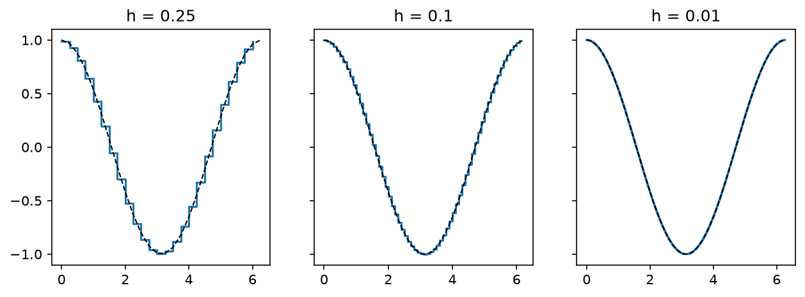

# Preface

Five.

Out of twenty-five.

I was thirty-seven years old taking a night class in linear algebra at Santa Barbara City College. After ten years as a high school geometry teacher, I had decided that if I can teach math, I can do math.

It was the era when every job board sang the ballads of data science, heraldry for a kingdom that wanted mathematicians and would settle for the retrained. I heard the songs. I enrolled. This was the beginning of that quest, me atop my donkey with a newly acquired Pythonic lance. Staring at the 5, I was sure the quest was over, dashed by a windmill named after Strang's ways of seeing matrix multiplication.

The class let out at eight and took our professor, Jim,[^jim] with it. I stayed and worked at this mystic art into which Jim was attempting to initiate us ... Linearity.

[^jim]: Professor Jim Kruidenier 25 year veteran of the SBCC math department, but no one called him Professor Kruidenier or even Professor K, we called him Jim.

I was unhorsed. Spans. Bases. Linear Combinations. I sat in that desk well after the janitor had emptied the trash can, working through everything I had gotten wrong. It was well into the night when I walked to the car to head home.

*[Draft note on your ink #1. The concern that the quixotic opening may distract as the very first thing a reader meets is filed, not yet acted on. This act is held as-is for now.]*

&nbsp;

Years before that night class, back when I was the teacher, I read Paul Lockhart's *A Mathematician's Lament*, a working mathematician's essay on what school does to his subject.[^lockhart] Lockhart's thesis deserves stating in full, because this book is an attempt to act on it. Mathematics, he says, is an art, the art of pattern and imagination, and the most misunderstood subject in the curriculum, because school teaches its paperwork instead. The notation, the procedures, the answer-getting. Everything except the experience of doing the thing.

You have met the paperwork. It is the whole procedure pipeline that carried you through school, algebra to precalculus to calculus, answers at the ends of computations. If a math course ever left you cold, Lockhart's diagnosis says it was probably not the subject. It was the bookkeeping.

His famous figure is musical. Imagine teaching music by making children copy sheet music for a decade, grading their clefs and their stem directions, and never once playing them a song. I recognized my own classroom in the accusation, and I fought it with real geometry and two-column proofs. But the Lament reads differently once you are the student. Staring at that 5, the decade of sheet music was mine.

Here is the part of the story I got lucky on. Jim's classroom was not a bookkeeping class. Jim would wave his hands at a page of subscript-fiddly manipulation and say, derisively, "bookkeeping," and then draw the picture instead. Nobody had played me the song either, until then. This book intends to play the song. Chapter 11 is the symphony.

Jim is a mystic steeped in the ways of Gilbert Strang, and if that name is new to you, it names a tradition. Strang taught linear algebra at MIT for six decades, and his filmed lectures for the course, 18.06, have probably taught this subject to more people than any classroom on earth.[^ocw]

[^ocw]: [MIT OpenCourseWare, 18.06 Linear Algebra](https://ocw.mit.edu/courses/18-06-linear-algebra-spring-2010/). Free, complete, and the closest thing this tradition has to scripture on film.

There have long been two roads through a first course in linear algebra. The old road is not really a road of its own at all. It is the last stretch of the pipeline that carried you through school: algebra into precalculus, precalculus into three semesters of calculus, calculus into differential equations, every course a taller stack of procedures, every answer a number at the end of a computation. Linear algebra, taught on that road, is treated as just another stop. One semester, determinants and cofactor drills, compute your way through, and the truth never quite arrives. When every tool is a computation, every problem gets hammered into a computation-shaped nail.

The audacious road is Sheldon Axler's *Linear Algebra Done Right*, a beautiful second course wearing the title of a first one. It banishes determinants nearly to the last page. But Axler's road is Strang's road wearing a confrontational title, and Strang cut it first.

Start from the columns, build the subspaces, let geometry *and* computation carry the argument, and keep the determinants in the drawer until they earn their keep. Hear the *and*. The old road had computation only. This road refuses to choose between the picture and the machine, and the refusal is the whole difference. Pictures before procedures, actions before formulas, nothing hidden from the congregation. This book is written in that church, and Jim taught from inside it, everything in the open, nothing held back for the initiated.[^jimsite] Strang I know only from the page and the screen. Jim I knew on Tuesday and Thursday nights, chalk in hand.

[^jimsite]: The receipts survive. Jim's course site posted every lecture twice, blank notes and completed notes, plus an archive of every old exam. The domain, mathjimk.com, has since gone dark, but the Internet Archive holds a copy at [web.archive.org/web/20180806081310/http://mathjimk.com/](https://web.archive.org/web/20180806081310/http://mathjimk.com/) (captured August 6, 2018).

That creed is not decoration. It is the book's method, and count what it actually names. *Start from the columns* points at measured numbers, columns of them: one way of looking, call it the **data** lens. *Build the subspaces* is pencil work, symbols with rules you can check at a desk: a second way, the **algebraic** lens. And *let geometry and computation carry the argument* names two more in one breath, the drawing that shows you the truth, the **geometric** lens, and the machine that verifies it at scale, the **computational** lens. Three clauses, four ways of looking, and every chapter of this book uses all four by name.

And the second line of the creed is an ordering. Pictures before procedures, actions before formulas. The geometric lens leads. The machine confirms. The formula arrives last, after you have seen what it is a formula for.

The lenses receive their christening here so the chapters can simply use them. When the book switches lenses, the margin says so. A small tag sits at each switch, geometric, algebraic, computational, or data, and you always know which way of looking is doing the work. No idea is required to visit all four. The book reaches for whichever lens shows the idea best.

First-year algebra teachers will recognize the practice. They call it multiple representations, the plot, the formula, the table, the pattern, and the student who can move among the four owns the function. It is pedagogical genius, poo-pooed by the same gatekeepers who guard the determinant road. This book runs on it anyway.

&nbsp;

My route to higher math was ironically non-linear, given that once there, my path became an obsession with linearity. Before I was a student of Jim's (and an acolyte of Strang's), I had been a teacher of high school geometry in South Los Angeles, some of the toughest classrooms in the country, where the focus was often structure and stability at the expense of rigor.

Geometry is the outlier of high school mathematics, the one course where students are asked to reason rather than compute. The rest of the sequence is a pipeline. Algebra feeds precalculus, precalculus feeds calculus. Every course is a taller stack of procedures, and every answer is a number at the end of a computation. Geometry interrupts the pipeline.

For one year, the question changes from "what is the value" to "why is this true." The answer is an argument you build and defend. Euclid built them the same way: two triangles, side angle side, therefore. Then the pipeline resumes and runs three semesters of calculus deep into the university, and the old road through linear algebra is exactly that pipeline reaching its last stop: geometry's treatment, denied to the one subject that deserves it most.

Linear algebra is where the pipeline can break open for good. The objects come with structure. The statements come with reasons. What a thing is carries more weight than how to evaluate it. Taught on the right road, one semester of it undoes twelve years of answer-getting, and taught on the wrong road it is one more semester of drills; both roads are still open, and most students are marched down the wrong one. This is not an interruption to be endured before the procedures resume. It is the subject the procedures were hiding, and it is the mathematics this book is about. I taught the high school rebellion for ten years, and when I went back to school, the real thing was waiting for me.

[^lockhart]: Paul Lockhart, *A Mathematician's Lament: How School Cheats Us Out of Our Most Fascinating and Imaginative Art Form*, Bellevue Literary Press, 2009. The essay circulated privately from 2002 until Keith Devlin, who wrote the MAA's Devlin's Angle column, published it there in 2008 and talked Lockhart into the book.

&nbsp;

What happened next is the reason this book exists, and the point is not any single idea. The point is **transfer**. Ideas from linear algebra do not stay in linear algebra. They move into the next course, and the next field, and the next job, unchanged, and once you have watched it happen three times you start to suspect what this preface will eventually say outright: once you assume linearity, it is all linear algebra. Here is the transfer happening, in order.

That semester I was also taking waves in physics. Partway through the term the same word surfaced in both rooms. Basis. In Jim's room, the vectors underneath a list of coordinates. In the physics room, the sinusoids underneath a Fourier series, though physics never said the word out loud. I saw it, and I said it. The waves course was asking, without ever asking, which combination of sinusoids is this signal.

Basis was the jewel, and it kept resurfacing. The next year Jim marched us through vector calculus, where the gradient turned out to be a vector living in the same algebra we had just learned. Back on the compute-this track, the new way of seeing sometimes made the computing harder before it made it easier. It is one thing to grind through a curl, and another to grind through it while noticing what it is.

Then came differential equations, and that is where the idea stopped visiting and moved in. Solutions superpose. The solution set is a span wearing a trench coat. The course was asking which combination of solutions fits these conditions, and this time I could hear it asking.

By the time I transferred to Cal State Northridge, partial differential equations felt almost easy, and I could finally say why. Every technique in the course was the same move. Expand the unknown in the right basis, and watch the equation fall apart.[^complex] Off syllabus, the transfer went atomic: electron orbitals are built from a basis too, Laguerre polynomials dressed in spherical harmonics.[^singer] In which combination of basis states does this electron lie.

And the transfer has never stopped. Twenty years on, a colleague building customer archetypes asked me to help a junior teammate working on genetics, and the answer was the happiest sentence a teacher gets to say: it is the same mathematics. The archetypes are principal component analysis; so is the genetics. Basis sets transfer, orthogonality transfers, projection transfers, and estimation transfers, because they were never about waves or customers or genes. They are about linearity, and linearity is everywhere you agree to look for it. When a problem refuses to be linear, take the logarithm and it very often agrees to be linear after all; nine times out of ten that is enough to act on, and the tenth time you probably have a counting problem, Poisson's department, waiting for Part II's tools. Even the calculus you already own is a transfer in disguise: a derivative is a linear operation, a matrix will take one in Chapter 2, and polynomials, the schoolroom's favorite nonlinear objects, are linear combinations of powers, which is why fitting them is Chapter 12's linear problem. The subject does not visit other fields. It is the floor they are built on.

[^complex]: If you want your noodle properly baked, the most natural basis for real oscillations is built from complex exponentials, $e^{i\omega t}$, imaginary numbers doing the honest work behind every real wave. Chapter 14 cashes this in.

[^singer]: The whole story of that basis is told through one atom in Stephanie Frank Singer, *Linearity, Symmetry, and Prediction in the Hydrogen Atom*, Springer, 2005. I read it off syllabus that year, and it sits behind Chapter 4 of this book.

&nbsp;

Strang's chapter 4 is orthogonality, and there is a drawing in it, redrawn here as Figure 0.1. A vector floats just above a subspace, a flat sheet of vectors through the origin. Chapter 1 makes the word precise, and for now the picture is enough. A perpendicular drops from the vector to the nearest point of the sheet. The whole machinery of regression falls out of that one picture.

\begin{figure}[!htb]
\centering
\begin{tikzpicture}[scale=1.15]
  \draw[fill=gray!12, draw=gray!55] (-0.6,-0.4) -- (3.6,-0.4) -- (4.7,0.7) -- (0.5,0.7) -- cycle;
  \node[gray] at (4.0,-0.15) {\small the subspace};
  \coordinate (O) at (0.9,0.05);
  \coordinate (B) at (2.7,2.2);
  \coordinate (P) at (2.83,0.28);
  \draw[->, very thick] (O) -- (B) node[above] {$\mathbf{b}$};
  \draw[->, very thick] (O) -- (P) node[below right] {$\mathbf{p}$};
  \draw[dashed, thick] (B) -- (P) node[midway, right=2pt] {$\mathbf{b}-\mathbf{p}$};
  \draw (2.66,0.30) -- (2.68,0.47) -- (2.85,0.45);
\end{tikzpicture}
\caption{The drawing this book is written toward. A vector $\mathbf{b}$ floats above a subspace, and the perpendicular drop finds the nearest reachable point $\mathbf{p}$. Chapter 11 builds everything in it.}
\end{figure}

That is the picture that converted me, and I can now say what the conversion was. Everything in the pipeline, and all of the windmill review above, lives in a world where the right answer exists and your job is to compute it.

The drawing lives in a different world. The vector $\mathbf{b}$ is not in the sheet, also known as the span, everything the combinations can reach. No combination reaches $\mathbf{b}$. The right answer does not exist, and the question becomes which reachable answer is best. That question has a name, **estimation**, and it is the other subject of this book.

Of course the conversion happened at this drawing. After a lifetime of compute-the-right-answer, the first honest look at best-you-can-do lands like a door opening. This book has one destination, and it is that drawing. You will meet it in Chapter 12.

&nbsp;

At Northridge, Strang got me a second time, and this is where the story turns from seeing to computing. In the math study room on the third floor of the math building, I found his *Computational Science and Engineering*. CSE is Strang with his sleeves rolled up. The book is built around one small matrix, second differences down its diagonal, and out of that one object it assembles a working engineer's share of applied mathematics. It reads as the workshop manual of a tradition, the one that runs from the Fortran libraries at the bottom of the modern stack up through *Numerical Recipes*, and that tradition was about to become my daily work. It is where the matrix became a verb for me.

A derivative, on a grid, is a matrix:

\begin{equation}
D = \frac{1}{h}\begin{bmatrix} -1 & 1 & & \\ & -1 & 1 & \\ & & \ddots & \ddots \\ & & & -1 \end{bmatrix}
\end{equation}

Each row of $D$ takes the difference of two neighboring samples and divides by the step, which is the difference quotient with the limit not yet taken. Chapter 2 makes that sentence precise and earns it. What converted the sentence from a metaphor into my daily work was watching it run. Listing P.1 builds $D$ on a thousand-point grid over $[0, 2\pi]$, feeds it a sampled sine, and measures the worst gap between the output and the true derivative, the cosine.

**Listing P.1 (the matrix that took a derivative)**

```python
import numpy as np

x = np.linspace(0, 2*np.pi, 1000)
h = x[1] - x[0]
# -1 and 1 down the diagonals:
D = (np.eye(1000, k=1) - np.eye(1000)) / h

np.abs(D @ np.sin(x) - np.cos(x))[:-1].max()
```

```text
0.0031
```

Wrong in the third decimal on a thousand points, and tightening the grid shrinks it. The matrix took the derivative. The claim in "tightening the grid shrinks it" deserves eyes, not just a number. Listing P.2 runs the same derivative-taking at three step sizes and draws each output against the true cosine; Figure 0.2 is its output.

**Listing P.2 (the derivative, at three granularities)**

```python
import matplotlib.pyplot as plt

fig, axes = plt.subplots(1, 3, figsize=(10, 3.2), sharey=True)
for ax, h in zip(axes, [0.25, 0.1, 0.01]):
    xs = np.arange(0, 2*np.pi, h)
    d = np.diff(np.sin(xs)) / h    # the rows of D, applied
    ax.step(xs[:-1], d, where='post')
    ax.plot(xs, np.cos(xs), 'k--', lw=1)
    ax.set_title(f'h = {h}')
```



> **Figure 0.2.** The matrix's derivative of a sampled sine at three step sizes, with the true cosine dashed. At $h = 0.25$ it is blocky. At $h = 0.1$ it takes shape. At $h = 0.01$ it is smooth to the eye, and the dashes disappear under it. The matrix is not resembling differentiation. It is converging to it.

I carried that into an independent research project in Jussi Eloranta's quantum chemistry lab,[^eloranta] where the Schrödinger equation for a particle in a box collapsed into a matrix eigenproblem and the eigenvectors came out as sines, the same sines the waves course had been expanding everything into, the transfer closing its own loop:

\begin{figure}[!htb]
\centering
\begin{tikzpicture}[xscale=1.6, yscale=0.5]
  \draw[gray!60] (0,0) -- (0,6.4);
  \draw[gray!60] (3.14,0) -- (3.14,6.4);
  \draw[thick, domain=0:3.14, samples=60] plot (\x, {5.5 + 0.7*sin(\x r)});
  \draw[thick, domain=0:3.14, samples=60] plot (\x, {3.2 + 0.7*sin(2*\x r)});
  \draw[thick, domain=0:3.14, samples=60] plot (\x, {0.9 + 0.7*sin(3*\x r)});
  \node[anchor=west] at (3.3,5.5) {\scriptsize one arch, the ground state};
  \node[anchor=west] at (3.3,3.2) {\scriptsize two arches};
  \node[anchor=west] at (3.3,0.9) {\scriptsize three arches};
\end{tikzpicture}
\caption{The standing waves of a particle in a box, which are the eigenvectors the lab's matrices produced: sines, one arch, then two, then three. Chapter 4 rebuilds these from pure arithmetic.}
\end{figure} The waves room again, years later, now as a theorem.

[^eloranta]: Jussi Eloranta studies superfluid helium with heavy computation at California State University, Northridge; his group's page is at [www.csun.edu/~jeloranta](https://www.csun.edu/~jeloranta/). Which combination of eigenvectors is the ground state. I spent that semester racing my own eigensolvers against LAPACK, the compiled library at the bottom of the numerical stack, and writing up the results.

&nbsp;

The write-up was the end of school and the start of a career in data science, and the career needs only one paragraph here, because its entire content was the two ideas this preface is about. Every job was the transfer, again. A parking-prediction service was a linear model built from scratch in NumPy when the servers could not run anything heavier; customer archetypes, and later genetics, were principal component analysis; defect detection on denim was the same basis hunt in an autoencoder's costume; clinical records, filters, rankings, all of it the night class wearing work clothes. And every job ran on estimation, because no real target ever sat inside the span of what the features could reach, and *best* was always the working question. The tools changed names when they changed buildings. The mathematics never changed at all.

I kept teaching it, at UCLA and then at Caltech, to rooms full of working engineers who had all taken linear algebra once and mostly remembered the bookkeeping, and fifteen years after that night at the city college, those courses grew into the book you are holding, the kind of subject I would argue about with friends over a beer.

&nbsp;

One piece of business remains before Chapter 1, and it brings the preface back to where it started, staring at that quiz. The windmills deserve their names, because you will not fight them in this book. You will use them. What follows is the review, done here rather than assigned as homework in someone else's book, and it is everything Chapter 1 assumes.

*[Draft note on your ink #5. The narration-versus-rigor tension in this act is flagged and filed. This pass makes the review real and keeps the frame, pending your ruling.]*

First, solving a linear system. Elimination subtracts a multiple of one equation from another to kill an unknown, and repeats until the system is triangular:

\begin{equation}
\begin{aligned} x + 2y + z &= 5 \\ 2x + 5y + 4z &= 13 \\ x + 3y + 5z &= 12 \end{aligned}
\qquad\longrightarrow\qquad
\begin{aligned} x + 2y + z &= 5 \\ y + 2z &= 3 \\ 2z &= 4 \end{aligned}
\end{equation}

The same work in matrix form is the version your eye should learn, because the goal of elimination is visible there. Zeros march in below the diagonal:

\begin{equation}
\begin{bmatrix} 1 & 2 & 1 \\ 2 & 5 & 4 \\ 1 & 3 & 5 \end{bmatrix}
\qquad\longrightarrow\qquad
\begin{bmatrix} 1 & 2 & 1 \\ 0 & 1 & 2 \\ 0 & 0 & 2 \end{bmatrix}
\end{equation}

Triangular means solvable by back substitution. Climb down, then carry the answers back up. The bottom row gives $z = 2$. Carry it up, and $y = 3 - 2(2) = -1$. Carry both up, and $x = 5 - 2(-1) - 2 = 5$. Every unknown falls in turn.

Elimination travels with a companion that is not a computation at all, and it is the piece of the review Jim owned outright. He opened his first lecture with two questions about any system of equations, before teaching us to solve a single one. **Existence**: does a solution exist at all? **Uniqueness**: if one exists, is it the only one? It seemed like a strange place to start. It is the perfect place to start, because uniqueness is a license: when the answer is one of a kind, *any* verified candidate is the answer, no matter how you found it. Watch the license work:

\begin{align}
\begin{aligned} x + y &= 5 \\ x - y &= 1 \end{aligned}
\end{align}

Two numbers that sum to 5 and differ by 1. By inspection, $(3, 2)$. Verify: $3 + 2 = 5$ and $3 - 2 = 1$. That verification is not a courtesy; with uniqueness in hand it is the entire proof, and nothing was eliminated. When the numbers are small and the structure shows, this is how working mathematicians actually solve, and this book does it constantly. Existence and uniqueness are the two questions the whole book asks of every model it builds, Chapter 1 gives each one a space to live in, and Chapter 3 turns the pair into a working method. They are Jim's first lecture, running through every page.

Second, matrix multiplication, which Strang teaches three ways, entry by entry, column by column, and as a sum of outer products. The quiz that opened this preface was asking for all three, and all three get their full treatment where they earn their keep, in Chapter 2, where the product means something. Here it is enough that you can compute one: each entry of $AB$ is a row of $A$ against a column of $B$,

\begin{align}
\begin{bmatrix} 1 & 2 \\ 3 & 4 \end{bmatrix}\begin{bmatrix} 5 & 6 \\ 7 & 8 \end{bmatrix} = \begin{bmatrix} 19 & 22 \\ 43 & 50 \end{bmatrix},
\qquad
(AB)_{11} = 1 \cdot 5 + 2 \cdot 7 = 19,
\end{align}

and the other three entries follow the same row-against-column rule.

Third, the determinant, one number computed from a square matrix, because Chapter 4 will need it exactly once and you should not have to relearn the arithmetic there. For $2 \times 2$, cross-multiply and subtract:

\begin{align}
\det\begin{bmatrix} a & b \\ c & d \end{bmatrix} = ad - bc,
\qquad
\det\begin{bmatrix} 2 & 1 \\ 1 & 2 \end{bmatrix} = 4 - 1 = 3
\end{align}

For $3 \times 3$, expand along the top row, alternating signs, each entry times the $2 \times 2$ determinant left when its row and column are struck out:

\begin{align}
\det\begin{bmatrix} 1 & 2 & 0 \\ 0 & 3 & 1 \\ 2 & 0 & 1 \end{bmatrix}
= 1\det\begin{bmatrix} 3 & 1 \\ 0 & 1 \end{bmatrix}
- 2\det\begin{bmatrix} 0 & 1 \\ 2 & 1 \end{bmatrix}
+ 0
= 1(3) - 2(-2) = 7
\end{align}

What the determinant *means* is a story this book deliberately keeps in a drawer, and Chapter 4 explains why when it takes the number out, uses it once, and puts it back. Here you only need the arithmetic.

That is the whole of the machinery this book assumes. Elimination will be used and never taught again; Chapter 3 makes it yours properly. The determinant is a computation until Chapter 4 needs it. The quest in this book begins where that quiz ended, with what the machinery means.

&nbsp;

The last piece of equipment is a measuring instrument. Every vector has a magnitude and a direction, and the pair is easiest to see on the curve that catalogs directions.

\begin{figure}[!htb]
\centering
\begin{tikzpicture}[scale=1.35]
  \draw[gray!60] (0,0) circle (1);
  \draw[gray!40, ->] (-1.35,0) -- (1.6,0);
  \draw[gray!40, ->] (0,-1.2) -- (0,1.5);
  \draw[->, very thick] (0,0) -- (1.05,1.4) node[above right] {$\mathbf{v} = (3,4)$};
  \draw[gray] (0.35,0) arc (0:53:0.35);
  \node[gray] at (0.52,0.22) {\scriptsize $\theta$};
  \fill (0.6,0.8) circle (1.3pt);
  \node[anchor=west] at (0.62,0.66) {\scriptsize $(0.6, 0.8)$};
  \node[gray, anchor=north west] at (0.62,-0.62) {\scriptsize the unit circle};
\end{tikzpicture}
\caption{The unit circle is the catalog of directions. Dividing $\mathbf{v} = (3,4)$ by its magnitude 5 lands on the catalog entry $(0.6, 0.8)$, the same direction at angle $\theta$ from the first axis, magnitude one.}
\end{figure}

The vectors of magnitude one form the unit circle, one vector for every direction there is, drawn in Figure 0.5. Take $\mathbf{v} = (3, 4)$. Its magnitude is the straight-line distance from origin to tip, the hypotenuse of a 3-4-5 right triangle, so 5. Divide the vector by its own magnitude, which is scalar multiplication,[^scalarmult] and you land on the circle:

\begin{equation}
(3, 4) = 5 \cdot (0.6,\, 0.8), \qquad\quad \sqrt{0.6^2 + 0.8^2} = \sqrt{0.36 + 0.64} = 1
\end{equation}

[^scalarmult]: Multiplying a vector by a number; dividing by 5 is multiplying by $\tfrac{1}{5}$. Chapter 1 makes this one of its two fundamental moves.

Magnitude 5, direction $(0.6, 0.8)$. Every nonzero vector factors this way, and the factorization is the whole geometry of a vector.

Directions can agree or disagree, and one small machine measures how much. The **dot product** multiplies two vectors entry by entry and adds the results. Feed it two directions straight off the circle and the score it returns is the cosine of the angle between them, a pure agreement number that never leaves $[-1, 1]$. Worked once, on $(3, 1)$ and $(2, 3)$:

\begin{equation}
(3, 1) \cdot (2, 3) = 6 + 3 = 9, \qquad\quad
\cos\theta = \frac{9}{\sqrt{10}\,\sqrt{13}} \approx 0.789
\end{equation}

Mostly agreeing. One worked score is a fact; a gallery is a feel. Four pairs, four scores, drawn and computed:

\begin{figure}[!htb]
\centering
\begin{tikzpicture}[scale=0.78]
  \begin{scope}[shift={(0,0)}]
    \draw[gray!30] (0,0) circle (1.5);
    \draw[->, very thick] (0,0) -- (1.34,0.67);
    \draw[->, very thick, gray] (0,0) -- (1.11,0.99);
    \node[anchor=north] at (0,-1.8) {\small $\cos\theta = 0.97$};
  \end{scope}
  \begin{scope}[shift={(4.4,0)}]
    \draw[gray!30] (0,0) circle (1.5);
    \draw[->, very thick] (0,0) -- (1.42,0.47);
    \draw[->, very thick, gray] (0,0) -- (0.83,1.25);
    \node[anchor=north] at (0,-1.8) {\small $\cos\theta \approx 0.79$};
  \end{scope}
  \begin{scope}[shift={(8.8,0)}]
    \draw[gray!30] (0,0) circle (1.5);
    \draw[->, very thick] (0,0) -- (1.34,0.67);
    \draw[->, very thick, gray] (0,0) -- (-0.67,1.34);
    \node[anchor=north] at (0,-1.8) {\small $\cos\theta = 0$};
  \end{scope}
  \begin{scope}[shift={(13.2,0)}]
    \draw[gray!30] (0,0) circle (1.5);
    \draw[->, very thick] (0,0) -- (1.34,0.67);
    \draw[->, very thick, gray] (0,0) -- (-1.29,-0.77);
    \node[anchor=north] at (0,-1.8) {\small $\cos\theta \approx -0.99$};
  \end{scope}
\end{tikzpicture}
\caption{The agreement scale, end to end. Near one, nearly the same direction. The worked pair from the text, 0.79. Zero, a right angle, each direction invisible to the other. Near minus one, nearly opposite.}
\end{figure}

The third panel is the score that matters most, and its algebra is one line: $(2, 1) \cdot (-1, 2) = -2 + 2 = 0$. Machine learning calls this number cosine similarity and runs on it daily.

Two scores matter most in this book. Agreement one means the same direction. Agreement zero means a right angle, each direction invisible to the other's measure, and the word for it is **orthogonal**. Hold that word. The drawing this preface built everything toward, the vector floating above the sheet, runs on it: the dropped perpendicular is orthogonality doing its work. And when a later chapter centers two columns of data and computes this same agreement, the number will be called correlation. Chapter 7 does that to house prices.

&nbsp;

You took linear algebra, maybe more than once. You know the words. You may even use them at work, at arm's length, through a library call. And the odds say you were marched down the old road: a semester of determinant drills bolted onto the end of the calculus pipeline, computation without the picture, procedures without the reasons, the one subject built for seeing taught as one more thing to evaluate. You never chose the wrong road. It was the only one on offer. This book exists because the other road is real, it was cut by Strang and taught to me by Jim, and it is not too late to walk it.

Notice what every stop on this road had in common. The waves course asked which combination of sinusoids is this signal. The differential equations asked which combination of solutions fits these conditions. The orbitals asked which combination of basis states is this electron. The lab asked which combination of eigenvectors is the ground state. The career asked which combination of features is this price, which combinations carry this dataset's variation, which blend of prediction and measurement is this position. Fifteen years, one question. Data asks it too, and calls it estimation.

**Of all the linear combinations available, which one is the estimate?** And behind it, sharper, the question Part III exists to answer: when no combination is exactly right, which one is the *best* estimate, and what exactly does *best* mean? This book does not use the word until it can define it.

I think the principles of linearity are the coolest things we have found since Euclid wrote down five postulates and got geometry for them. This book asks for less than Euclid did. Two operations and a promise to stay closed under them. Everything else, fourteen chapters of it, every figure and number produced by code you can run yourself, is what that promise turns out to contain.

The initiation Jim started took me fifteen years. Yours is fourteen chapters, and it starts with one operation.
